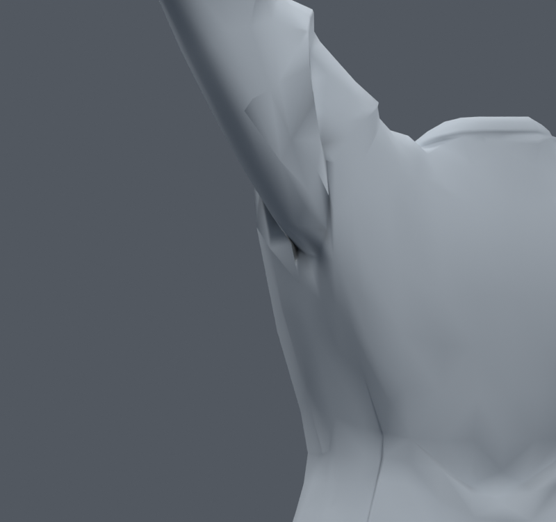
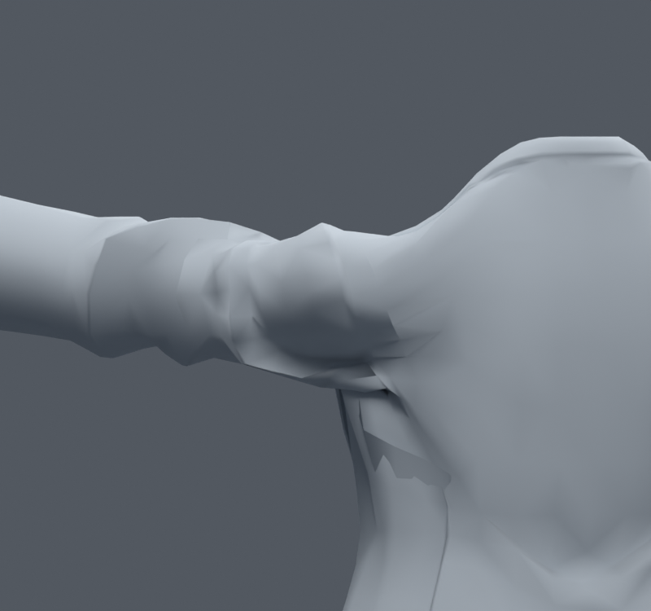
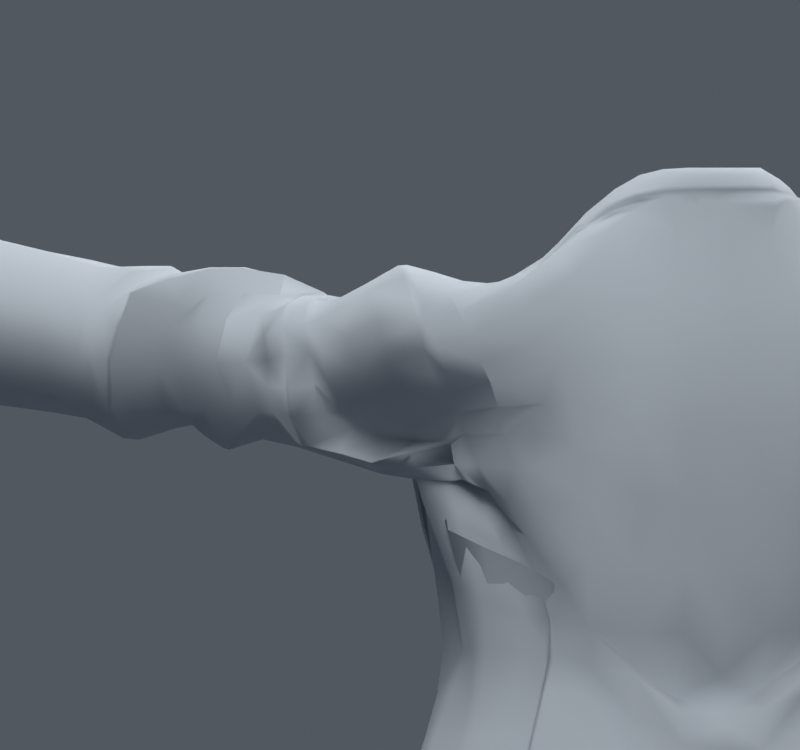

> **기록 시점 안내:** 아래는 해당 단계 당시의 보고서입니다. 후속 결정은 [최신 상태](../../STATUS.md)를 기준으로 읽어주세요. 모델·원본 텍스처·검증 원시 데이터는 이 문서 공유본에 포함하지 않습니다.

# v071 — 기존 표면의 모서리·회전을 보존하는 어깨 목표 시험

v068의 기존 코트에 ARAP 방식의 국소 회전 적합과 전역 위치 풀이를 적용했다. 수정 영역 밖 정점은 고정하고, 안쪽681개 위치는 원래 포즈에 남으려는 완만한 제약을 둔다. 제약 강도0.2/0.02와 앞/옆 올림을 비교했다. 새 메시·면·정점·본·웨이트를 만들지 않고 기존 정점의 수동 Shape Key 목표만 별도 파일에 저장했다.

이전 평균 평활화처럼 주름 세부를 일괄 제거하는 목표 대신 기존 모서리 벡터와 최적 국소 회전의 차이를 줄인다. 정장 주름의 정답이나 의상 시뮬레이션은 아니다. [구현 근거: Libigl](https://libigl.github.io/tutorial/#as-rigid-as-possible).

| 사본 | 최대 목표 이동 | 목표 자세 새/해소 면적 경고 |
|---|---:|---:|
| SIDE_SOFT |22.28mm|29/0|
| SIDE_FREE |28.54mm|47/0|
| FRONT_SOFT |13.95mm|0/5|
| FRONT_FREE |22.93mm|3/5|

이 표는 중립 삼각형 조합을 유지한 목표 진단이다. 후속 v072는 실제 자세 후 삼각형을 평가하므로 수치가 다를 수 있다. BUILD의 energy는 모서리 한쪽 회전 기준 잔차 기록이며, 대칭 ARAP 전체 에너지의 단조 감소 증명으로 사용하지 않는다. 25회 풀이 뒤 역스키닝한 Shape Key가 의도한 목표를 재현하는 오차도 BUILD에 기록했다.

직접 렌더를 열어 확인했다. 옆 올림은 긴 면의 급격한 압축을 해결하지 못해 제외한다. 앞 올림은 뿌리의 연결이 완만해질 가능성이 보여 FRONT_SOFT만 v072의 제한된 방향 보정 시험에 사용한다. FRONT_FREE는 부풀음과 새 경고 때문에 사용하지 않는다. **이 네 파일은 자동 최종본이 아니며 v068에 통합하지 않았다.**

수동 키는 기본값0으로 저장했다. 확인하려면 해당 키를1로 하고 BUILD에 기록한 목표 자세를 사용해야 한다. 자동 구동·임의 회전 검증은 후속 v072에서 진행한다.
