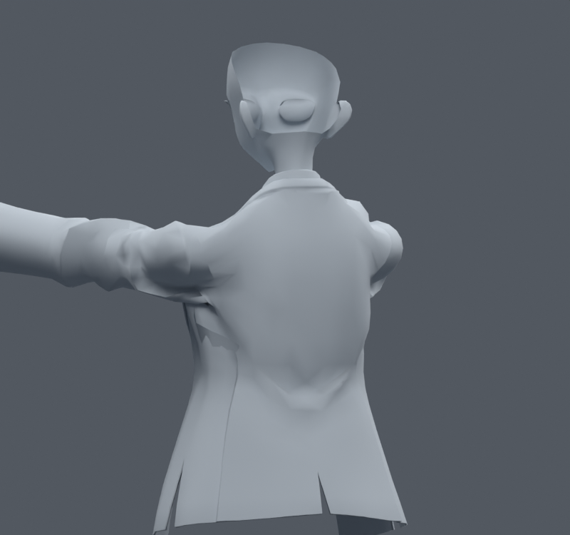
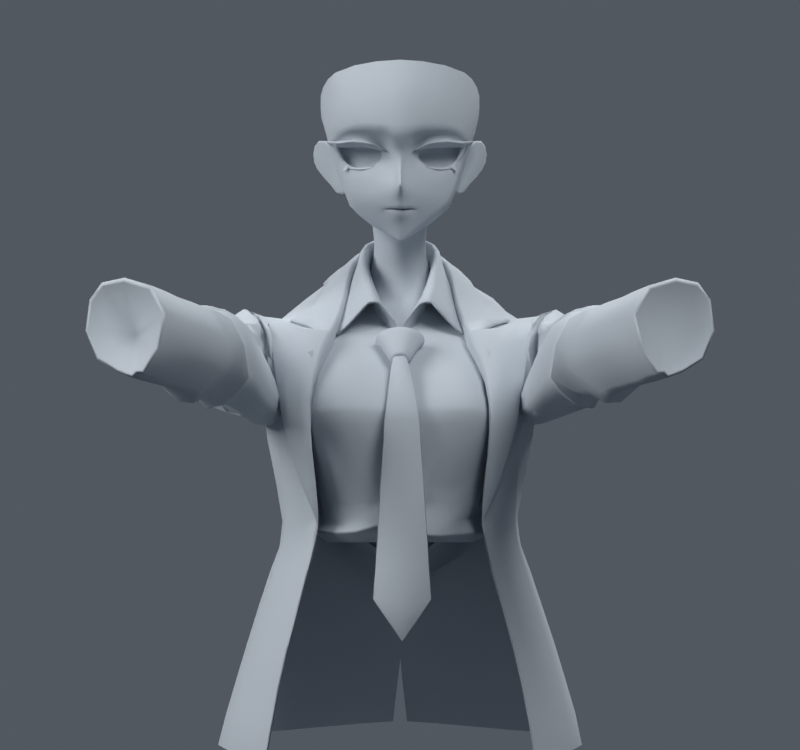

> **기록 시점 안내:** 아래는 해당 단계 당시의 보고서입니다. 후속 결정은 [최신 상태](../../STATUS.md)를 기준으로 읽어주세요. 모델·원본 텍스처·검증 원시 데이터는 이 문서 공유본에 포함하지 않습니다.

# v072 — 앞쪽 어깨 보정을 좁은 회전 범위에서 작동시킨 실험

**통합하지 않는다.** v071 FRONT_SOFT의 기존 정점 이동을 좌우로 나누고, 상완과 쇄골의 회전이 목표 자세 근처일 때만 작동하는 사본 세 개를 만들었다. 새 메시나 본은 없다. 중립 좌표·웨이트·UV·기존 본은 입력 v068과 같고, 별도 셰이프 키 두 개와 Blender 드라이버가 추가된다.

| 사본 | 강도 / 상완 회전 반경 | 실제 110자세 새 면적 경고 / 해소 |
|---|---|---|
| HALF30 | 50% / 30° | 2 / 3 |
| FULL30 | 100% / 30° | 1 / 8 |
| HALF50 | 50% / 50° | 5 / 12 |

FULL30에서 원래 면16518의 네 정점을 원복한 GUARD도 추가했다. 새 난수200개+기본30개에서는 새 경고0·해소8이지만, 실제 키가 작동한 자세는 3개뿐이었다. 전방 들기 각도15개×비틀기7개×쇄골 분담3개의 **315개 집중 격자에서는 새 경고205·해소467**이었다. 난수 검사 하나의 0만 보고 합격시키면 안 되는 사례다. 경고는 원래 면 기준이며 면적비 .2미만 또는3초과다. 경고 수는 외형 품질 점수가 아니다.

직접 렌더를 비교했다. 일부 접힘은 변하지만 어깨 뿌리의 부피와 곡면이 충분히 자연스러워지지 않았고, 목표 인근에서 새 압축이 나타났다. 보정 목표 자체와 주변 변형을 함께 해결해야 한다. 이 키를 손 개선본이나 검수본에 넣지 않는다. 드라이버의 중립0·목표1 및 저장 후 재로드는 확인했지만 Unity 이식이나 실행은 하지 않았다.

재현 자료: `00_trials.py`, `01_guard_grid.py`, `BUILD_*.json`, `CHECK_*.json`, `GUARD.json`. 연구 근거와 ARAP 목표 생성은 [v071](../v071_surface_strain/REVIEW.md), 전체 원인 진단은 [v070](../v070_upper_cause/REVIEW.md) 참고.
