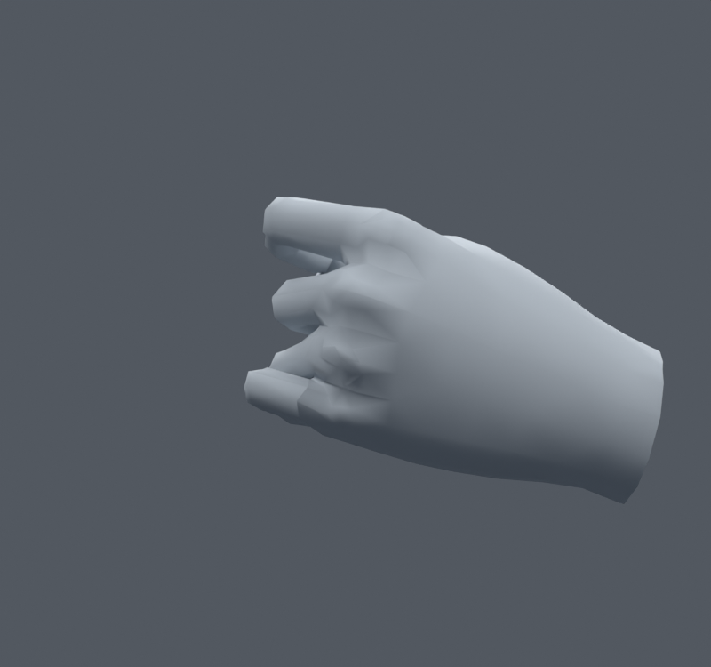
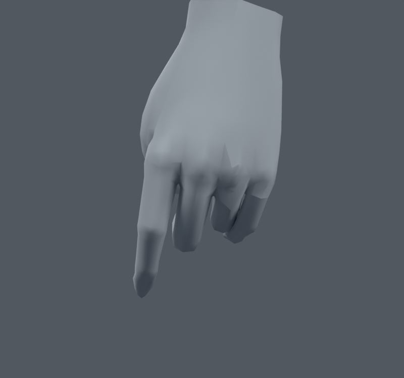

> **기록 시점 안내:** 아래는 해당 단계 당시의 보고서입니다. 후속 결정은 [최신 상태](../../STATUS.md)를 기준으로 읽어주세요. 모델·원본 텍스처·검증 원시 데이터는 이 문서 공유본에 포함하지 않습니다.

# v073 — 손의 마지막 면적 경고를 국소 웨이트로 정리

**손 수정의 선별 후보**다. 입력은 v068이며 왼손의 원래 면12116/12174 주변15raw 정점, 같은 위치 기준8곳만 기존 웨이트를 최대1.0000005%p 조정했다. 새 정점·면·본·메시나 손 형태의 중립 이동은 없다. v068과 좌표·UV·노멀·기존 본 등의 fingerprint가 정확히 같다. 최대4영향, 웨이트 합 오차1.0431e−7이다. 새 셰이프 키나 드라이버를 추가하지 않았다.

첫 Adam 최적화는 .5/1/2%p 제한에서 사실상 움직이지 않아 실패했다. 이를 성공으로 기록하지 않고, 투영 경사와 실제 감소를 확인하는 선 탐색으로 바꿨다. .5%p에서는1경고가 남았고1%p에서는0이 됐다.2/4%p는 더 크게 움직여야 할 이득이 없어 가장 작은 합격 범위를 골랐다. 수정에 쓴 왼손550자세에서 최대 표면 이동은.151874mm다. 모든 가능한 자세에 대한 상한은 아니다.

| 실제 Blender 검사 | v068 → 수정 | 접촉 쌍 변화 |
|---|---|---|
| 기존1100(seed461129) | 면적 경고3 → 0 | raw 누적11496 → 11496; 원래 면쌍 새10·사라짐9 |
| 새1100(seed731117) | 면적 경고2 → 0 | raw 누적11448 → 11449; 원래 면쌍 새8·사라짐6 |

두 표본군은 각각 기본100+난수1000이며 기본 자세는 중복된다. 첫 검사 중 왼손550은 수정에 사용했다. 두 번째 난수1000은 사용하지 않았다. 면적비 .2미만/3초과를 진단했고 실제 변형 후의 삼각형을 사용했다. **접촉 총수가 같다고 접촉 위치까지 같지는 않다.** 손 내부의 자연스러운 맞닿음도 포함하므로 쌍 수만으로 합격/불합격을 판단하지 않는다.

기존 잔여151/221/419자세와 접촉 변화가 큰 새106·기존51자세를 전후 같은 카메라로 렌더하고 직접 비교했다. 약.15mm 범위 수정으로 실루엣 차이는 작고 새로 눈에 띄는 큰 구멍은 보이지 않았다. 손가락 뿌리의 기존 각진 음영과 일부 접촉은 여전히 남는다. 전신·손목을 포함한 후속 최종 검증 결과는 이 후보와 정확히 같은 데이터를 사용한 후속 검수 보고서에서 연결한다.

파일: `bianca_HAND_LOCAL_REVIEW.blend`, SHA `ff75acbb57a8d3ff5cff4b0217860dafb129a250aaf3b6360b826abc15d3a214`. `BUILD.json`, `COMPARE_TRAIN.json`, `COMPARE_FRESH.json`과 단계별 Python/원시JSON을 남겼다. 사용자의 최종 채택이나 Unity 실행 완료를 뜻하지 않는다. v076 노멀 변경과 실패한 어깨 실험은 포함하지 않았다.

후속 [v081 전신·손목 회귀](../v081_continued_review/REVIEW.md)에서 새 경고·코트 관련 새 접촉0, 무릎 동일을 확인했다. 같은 손 웨이트를 [v083 통합 검수본](../v083_review_delivery/START_HERE.md)에 반영했다.
