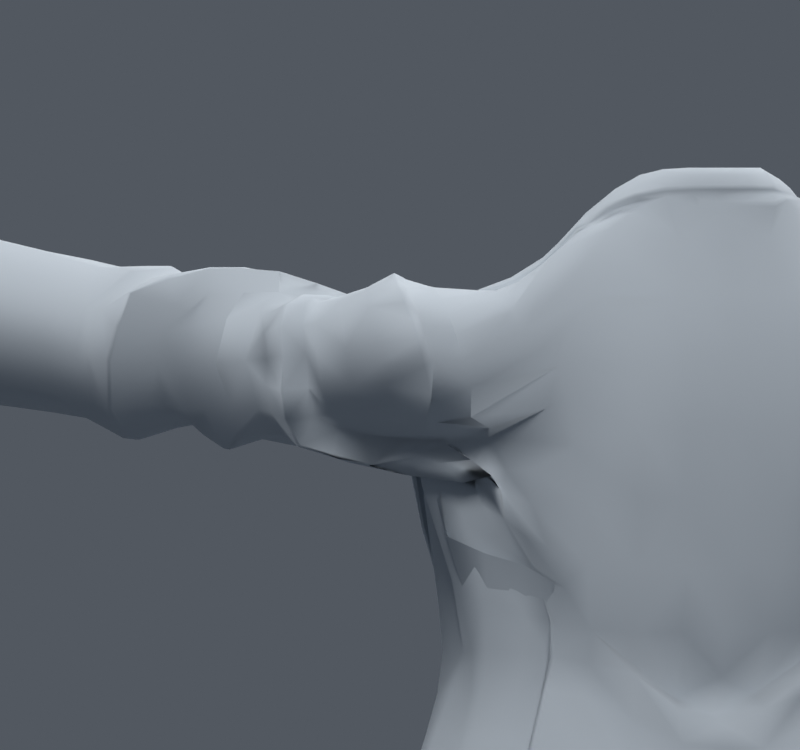
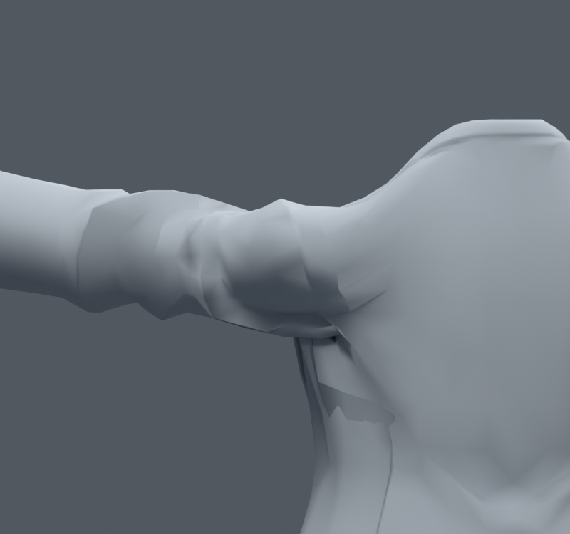
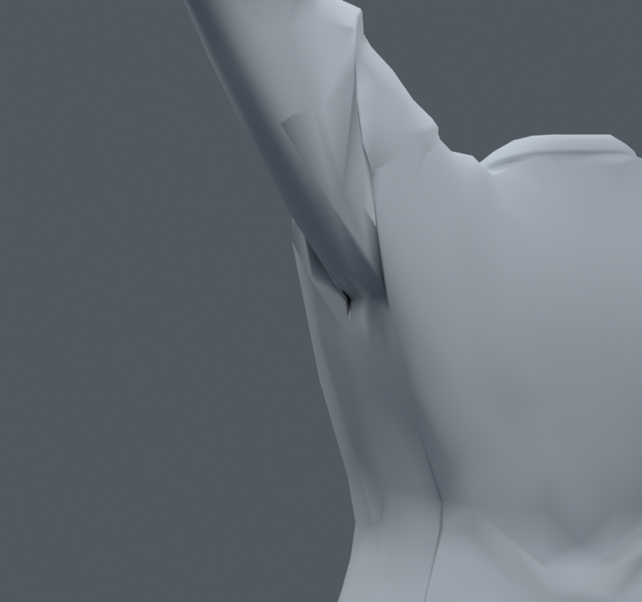
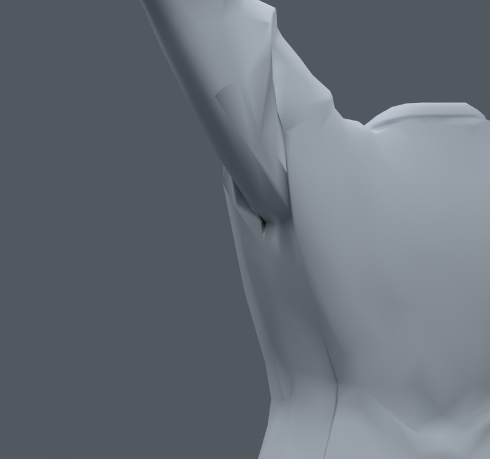

> **기록 시점 안내:** 아래는 해당 단계 당시의 보고서입니다. 후속 결정은 [최신 상태](../../STATUS.md)를 기준으로 읽어주세요. 모델·원본 텍스처·검증 원시 데이터는 이 문서 공유본에 포함하지 않습니다.

# v074 — 어깨의 인접 웨이트 차이를 완만하게 만든 비교

**통합하지 않는다.** v070에서 확인한 큰 웨이트 차이가 원인인지 분리하기 위해, 같은 위치의 코트 정점을 묶어 실제 모서리 이웃끼리 웨이트를 확산했다. 쇄골·상완·몸통 등 기존 본만 사용하며 정점 위치·면·본은 입력 v068과 같다. 옷깃으로 갈수록 영향을 줄이고 최대4웨이트로 정규화했다.

| 사본 | 확산 반복 / 혼합 | 30자세 경고 합계 | 새 경고 / 해소 |
|---|---|---|---|
| 입력 | — | 113 | — |
| DIFF2_25 | 2 / 25% | 120 | 27 / 20 |
| DIFF6_25 | 6 / 25% | 119 | 36 / 30 |
| DIFF15_25 | 15 / 25% | 106 | 31 / 38 |
| DIFF2_50 | 2 / 50% | 121 | 54 / 46 |
| DIFF6_50 | 6 / 50% | 129 | 66 / 50 |
| DIFF15_50 | 15 / 50% | 105 | 51 / 59 |

검사는 앞/옆 들기5각도×비틀기3각도다. 일부 합계가 줄어도 다른 면에 새 압축이 생긴다. 기본 및15회25%/50% 사본의 앞·옆 렌더를 만들고 기본 앞·옆,25% 옆,50% 앞을 직접 비교했다. 앞쪽 면 전환은 조금 완만해지지만 큰 겨드랑이 홈은 남는다. 단순 웨이트 평활화가 실제 소매 곡면을 충분히 고치지 못한다.

검사 불합격 사본을 전신/런타임 합격처럼 표시하지 않는다. `../harmonic_shoulder_v074.py`, `00_trials.py`, `01_render.py`, `QUICK_*.json`에 재현 자료가 있다. 손 v073 개선과는 독립 실험이며 그 손 웨이트를 덮어쓰지 않는다.
