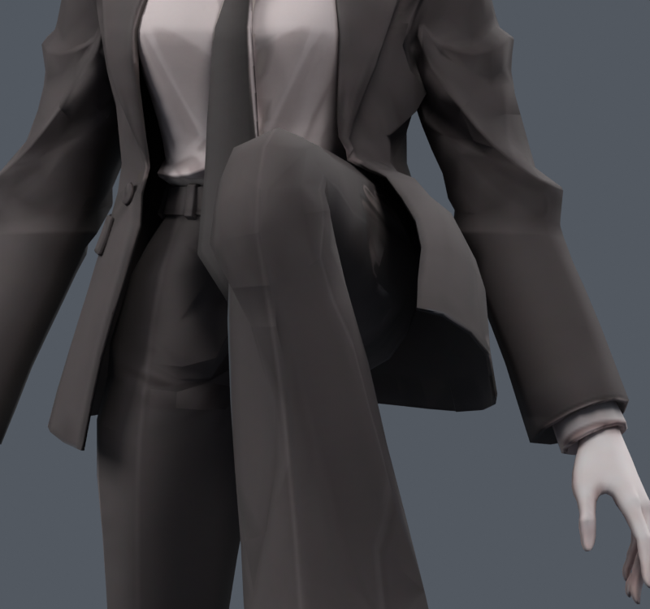
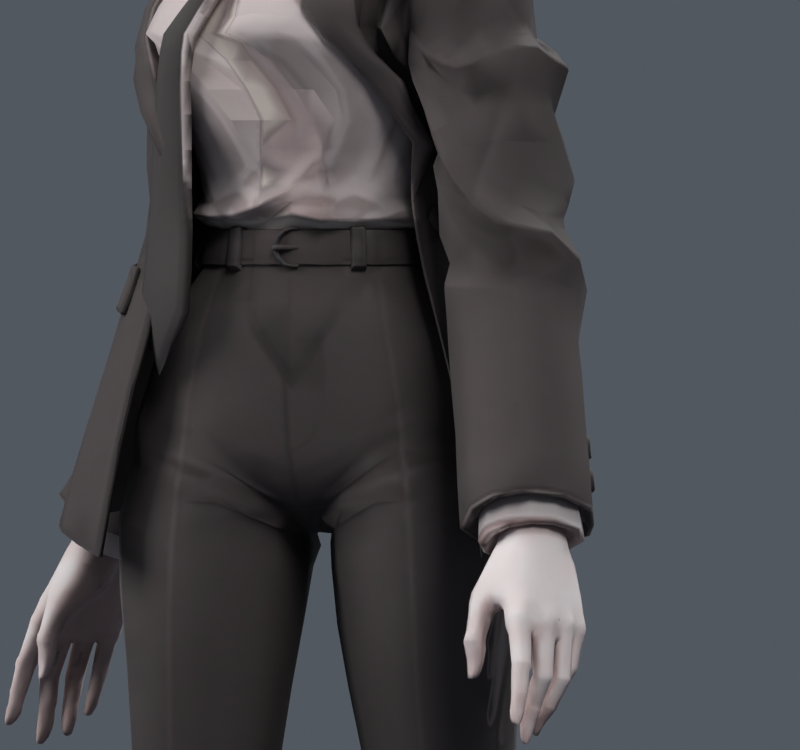

> **기록 시점 안내:** 아래는 해당 단계 당시의 보고서입니다. 후속 결정은 [최신 상태](../../STATUS.md)를 기준으로 읽어주세요. 모델·원본 텍스처·검증 원시 데이터는 이 문서 공유본에 포함하지 않습니다.

# v075 — 코트 앞허리의 잔여 바지 접촉 재검사

**현재 통합하지 않는다.** v073 손 개선 후보의 기존 코트 정점을 조금 옮기고 웨이트를 조정한 별도 사본이다. v026의 왼쪽 앞허리 패치를 현재 연결된 코트에 원래 정점 대응으로 옮겼다. 새 메시·정점·본은 없다. 최종 실제 사본 X2/X3은 해당50raw 정점에 최대2/3mm의 바깥 이동과 기존 spine 영향 일부의 코트 본 이동을 적용한다. 손·무릎은 변경하지 않았다.

먼저 6개 이동 방향×웨이트 강도2개의12조합을39개 자세에서 비교했다. 앉기·다리 들기·고관절 비틀기·몸통 회전·옆굽힘을 포함한다. 이동 방향을 바꾸면 원래 접촉을 줄이는 대신 다른 자세의 접촉이 늘었다. 좌표/웨이트 캐시 검사는 실제 변형 후의 자동 면 분할까지 보장하지 않아 X2/X3 사본을 다시 생성했고, X2는39자세에서 실제 Blender 분할로 재검사했다.

X2 실제 결과는 새 면적 경고0, 코트–바지 원래 면 접촉쌍 새8·사라짐31, 새 코트–소매0이다. 새 접촉은 왼쪽 고관절105°/비틀기−35°,102°/−25°,105°/−25°에 집중됐다. 접촉쌍 숫자는 관통 깊이나 외형 품질과 같지 않다. 왼쪽 다리105°와 몸통 회전의 전후 텍스처 렌더를 직접 보았으나, 전체 코트 실루엣의 뚜렷한 개선은 작았다. 다른 자세로 문제를 옮기는 패치를 자동 채택하지 않는다.

이 단계는 옷자락 물리 실행 검증이 아니다. 코트 본이 존재하는 것과 충돌을 피하며 움직이는 것은 다르다. 국소 패치만으로 모든 앉기·다리 들기를 해결했다고 표시하지 않는다. 재현은 `00_search.py`, `01_build_verify.py`, `../coat_clearance_v075.py` 및 JSON 자료 참고. 전신1377 검사는 이 미채택 X2/X3에서 실행하지 않았다.
