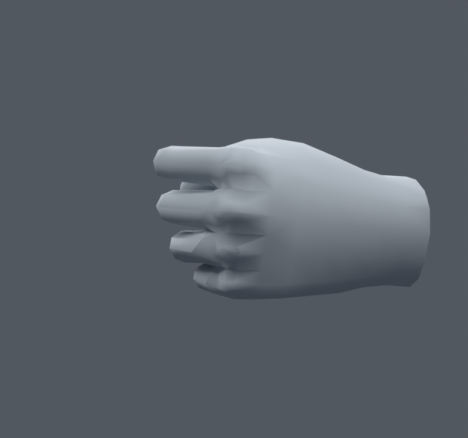
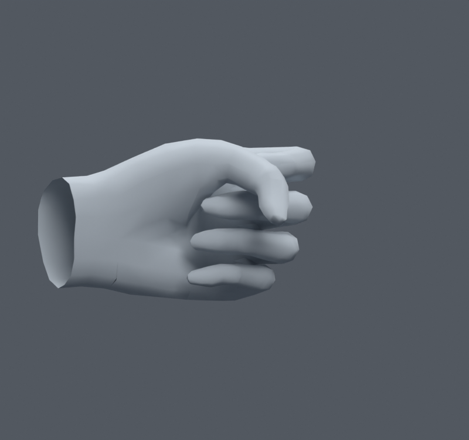

> **기록 시점 안내:** 아래는 해당 단계 당시의 보고서입니다. 후속 결정은 [최신 상태](../../STATUS.md)를 기준으로 읽어주세요. 모델·원본 텍스처·검증 원시 데이터는 이 문서 공유본에 포함하지 않습니다.

# v076 — 손의 면적 가중 노멀 비교

**통합하지 않는다.** v073 손 웨이트 개선 후보에서 손등과 손가락 뿌리의 남은 각진 음영을 확인하기 위해, 기존 면의 실제 기하 노멀을 면적 또는 면적제곱으로 평균했다. 새 정점·면·본은 없고 좌표·웨이트·UV는 그대로다. 변경 대상은 코너 노멀이다.

AREA_HALF는 면적 평균50%, AREA_FULL은100%, AREA2_FULL은 면적제곱 평균100%다. 손등/손바닥 방향의 기본 사본과 세 후보를 렌더했다. 손등 네 장, 손바닥 기본과 AREA2_FULL을 직접 비교했으나 손가락 뿌리의 잔요철을 없애는 뚜렷한 이점이 없었다. AREA_FULL은3500코너에 영향을 주며 단위 노멀 벡터 차이는 최대.3791이다. 차이가 작다고 기존 노멀을 불필요하게 바꾸지 않는다.

손가락 굽힘의 접촉·부피와 음영은 별개다. 이 실험은 노멀만 바꾸므로 기존 웨이트 개선의 면적 경고 감소를 새로운 성과로 중복 계산하지 않았다. 입력 v073의 노멀을 유지한다. `00_trials.py`, `BUILD_*.json`, `../hand_area_normals_v076.py`에 재현 코드와 보존 검사가 있다.
