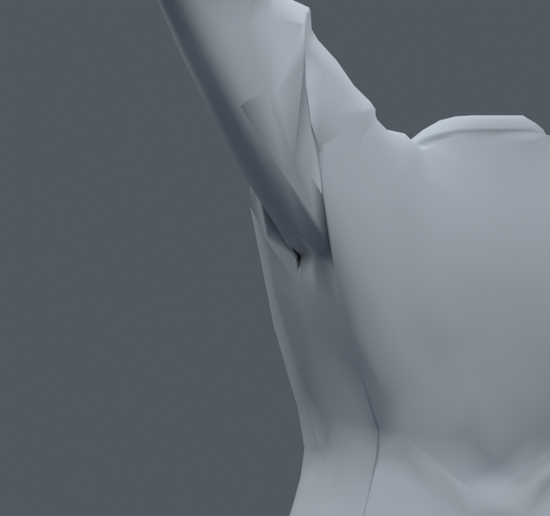
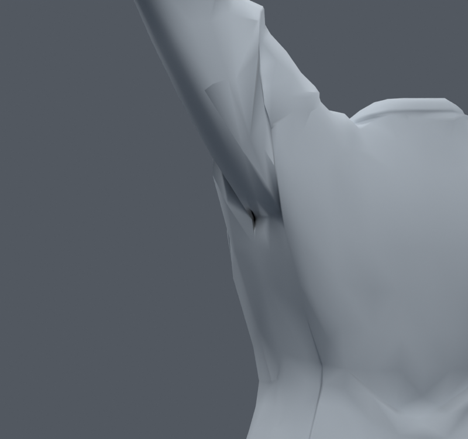
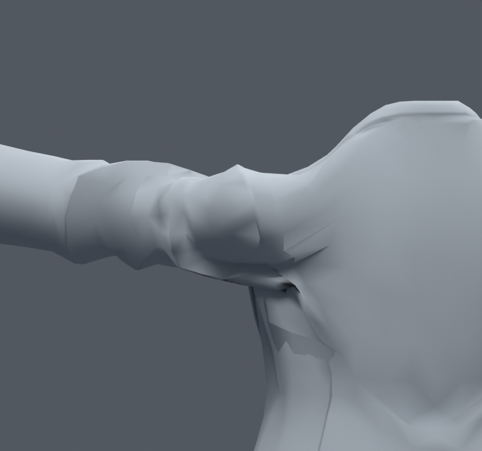

> **기록 시점 안내:** 아래는 해당 단계 당시의 보고서입니다. 후속 결정은 [최신 상태](../../STATUS.md)를 기준으로 읽어주세요. 모델·원본 텍스처·검증 원시 데이터는 이 문서 공유본에 포함하지 않습니다.

# v077 — 어깨 기존 사각면의 대각선 선별

**통합하지 않는다.** v073을 입력으로, 어깨·상부 소매의 기존 사각면401곳을 두 대각선으로 비교했다. 정점·웨이트·본을 바꾸지 않고 기존 사각형만 삼각형 두 개로 나누는 별도 실험이다. UV 코너는 원래 루프 대응으로 정확히 유지하고 노멀 방향을 복원했다. 삼각형 합계는 그대로31363이다. 전신1377+앞 올림315=1692자세를 선별에 사용했다. 면적 경고와 두 삼각형 사이 각도를 함께 보고45면을 골랐다. 캐시에 사용한 사각형별 삼각형 순서도 실제 중립 평가 목록과 대조했다.

| 검사 | 새 면적 경고 / 해소 | 기타 |
|---|---|---|
| 45면 사본 전신1377 실제 재평가 | 0 / 5 | 무릎 동일, 코트–바지 쌍 변화0, 코트–소매 새24·사라짐17 |
| 45면 사본 기본30+새300(seed771117) | 72 / 94 | 선별 밖의 회전에서 악화 |
| 문제 면을 뺀23면 GUARD, 기본30+새500(seed771231) | 7 / 33 | 여전히 새 경고 발생 |

1692자세 선별에 전신1377이 들어갔으므로 첫 줄을 독립 검증이라고 부르지 않는다. 두 난수 검사는 각각 새 seed를 사용했다. GUARD의 선별에는 첫 번째 난수 검사가 들어갔지만 두 번째는 들어가지 않았다. 코트–소매 쌍의 변화는 비평면 사각형 내부 표면이 달라지기 때문이다. 정점이 같다고 모든 자세의 실제 표면까지 같은 것은 아니다.

렌더를 직접 비교했다. 큰 겨드랑이 홈은 계속 보이고 외형 이득은 작다. 추가로 전체 사각형을 삼각형으로 고정하거나 검사에서 경고가 나온 면만 끝없이 제거하는 방향으로 통합하지 않는다. **v062에서 이미 검증된 소매11면 수정은 그대로 유지**하며 이번45/23면은 제외한다.

검수 파일은 `bianca_SHOULDER_DIAGONALS.blend`, `bianca_SHOULDER_GUARD.blend`. 후자는 새500검사까지이며 전신을 별도로 재실행하지 않았다. `BUILD.json`, `FRESH.json`, `BODY_COMPARISON.json`, `GUARD_FRESH.json`, `00_build.py`~`05_guard_fresh.py`에서 재현할 수 있다. GUARD 빌드의 tested_quads 값은 복사한 보존 코드에서 전체 사각형13716을 출력한 값으로, 실제 최초 탐색 대상은401이다. 이 메타데이터 오차는 선별된23면이나 검사 결과를 바꾸지 않는다.
