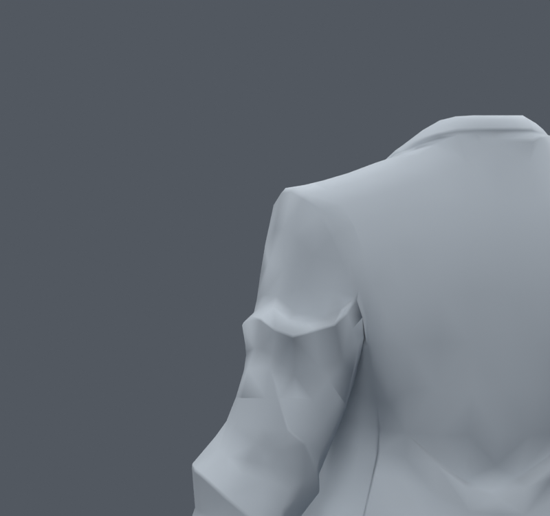
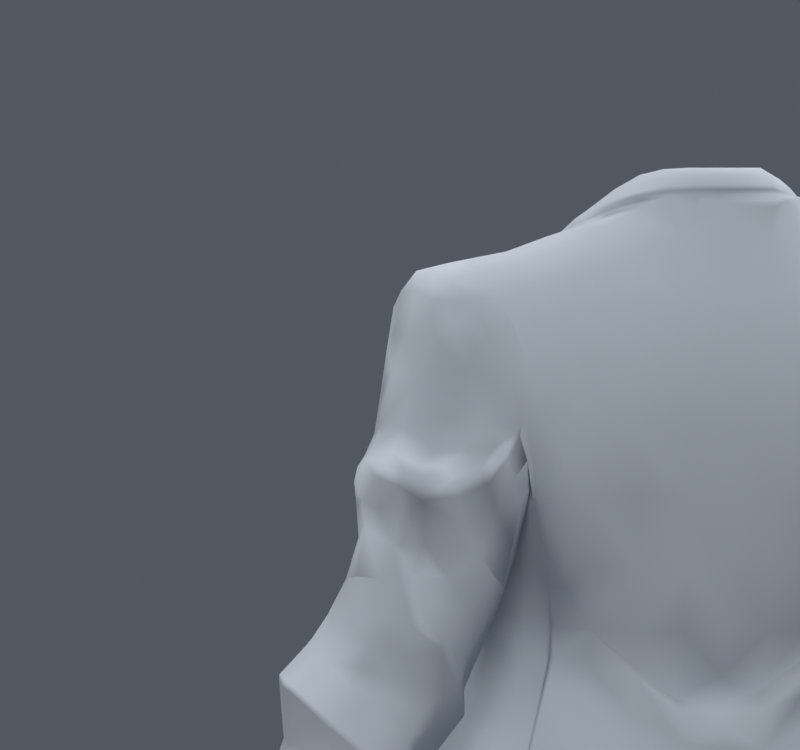
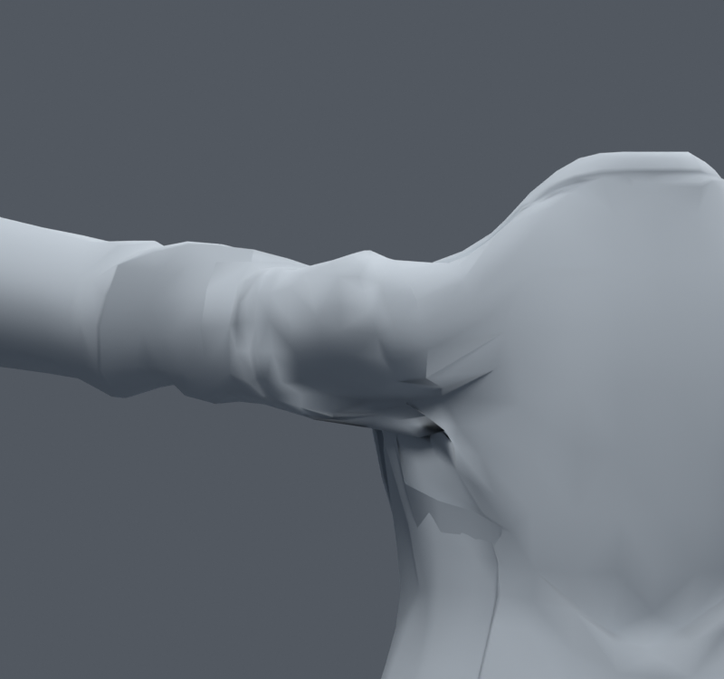
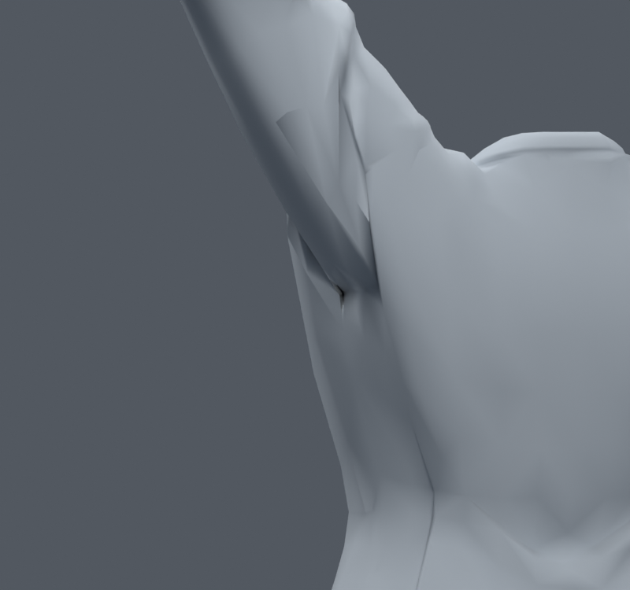

> **기록 시점 안내:** 아래는 해당 단계 당시의 보고서입니다. 후속 결정은 [최신 상태](../../STATUS.md)를 기준으로 읽어주세요. 모델·원본 텍스처·검증 원시 데이터는 이 문서 공유본에 포함하지 않습니다.

# v078 — 중립 소매의 과한 요철을 기존 정점에서 정리

**통합하지 않는다.** 원본 ref_char.png를 다시 실제 열어 각진 재킷 주름과 비교했다. v077의 대각선 변경만으로 큰 홈이 없어지지 않아, 팔을 들기 전 소매에 이미 있는 요철을 줄이는 다른 접근을 시험했다. 기존 코트540raw 정점의 이웃 그래프에서 양/음 평활화 단계를 번갈아 적용하고, 옷깃·몸통과의 경계는 영향을 줄였다. 새 정점·면·본·메시를 만들지 않았고 v073의 웨이트를 그대로 유지했다.

| 사본 | 반복 | 최대 실제 중립 이동 | 기본30자세 면적 경고 합계 |
|---|---|---|---|
| 입력 v073 | 0 | 0 | 113 |
| MILD | 5 | 3.0000mm | 143 |
| MEDIUM | 12 | 4.3790mm | 164 |
| BROAD | 25 | 5.1843mm | 159 |

교대 계수는 .5/−.53이다. 수축을 줄이려는 필터이며 국소 마스크와 경계가 있는 이 결과의 체적 보존을 증명한 것은 아니다. 노멀은 원래 방향을 유지했다. 각 사본의 중립·옆·앞 렌더를 만들었고, 기본중립 및BROAD 세 방향을 직접 열람했다.

중립 주름은 부드러워졌지만 원본의 각진 옷 표현도 줄고, 팔을 든 큰 홈은 남는다. 압축 경고도 늘었다. 따라서 단순히 원래 소매를 매끈하게 만드는 것을 해법으로 채택하지 않는다. 변형 후 목표를 맞춘 v057과 달리 이번에는 중립 이웃 형상을 직접 정리했으며, 두 실험을 같은 결과로 중복 계산하지 않는다.

추가 자료 검색에서 Blender 공식 문서의 Laplacian Smooth는 재구성 표면의 잡음과 체적 보존 옵션을 다룬다. 이번 교대 필터는 해당 모디파이어를 그대로 실행한 것은 아니다. 공식 영문 본문 열기는 접근 오류가 나서 전체 내용을 읽었다고 주장하지 않는다. [Blender 문서](https://docs.blender.org/manual/en/latest/modeling/modifiers/deform/laplacian_smooth.html). 실제로 구현한 식과 제한은 `00_trials.py`, 보존 수치는 `BUILD_*.json`, 실제 면적 검사는 `QUICK_*.json`에 기록했다.
