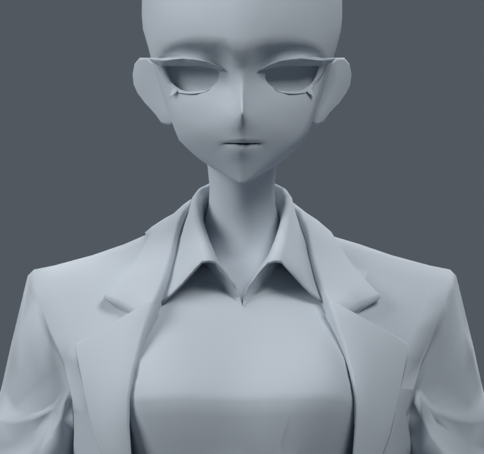
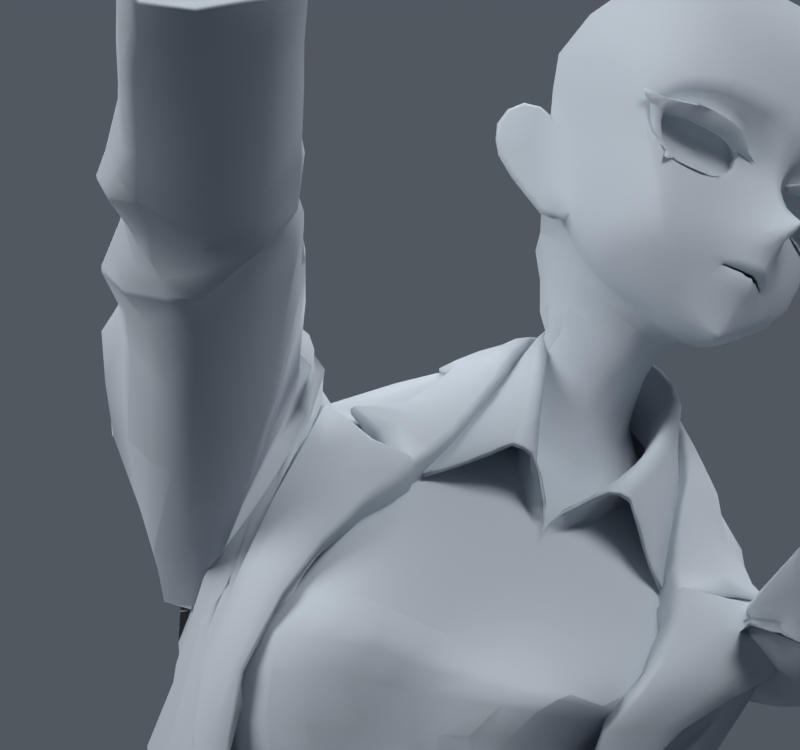
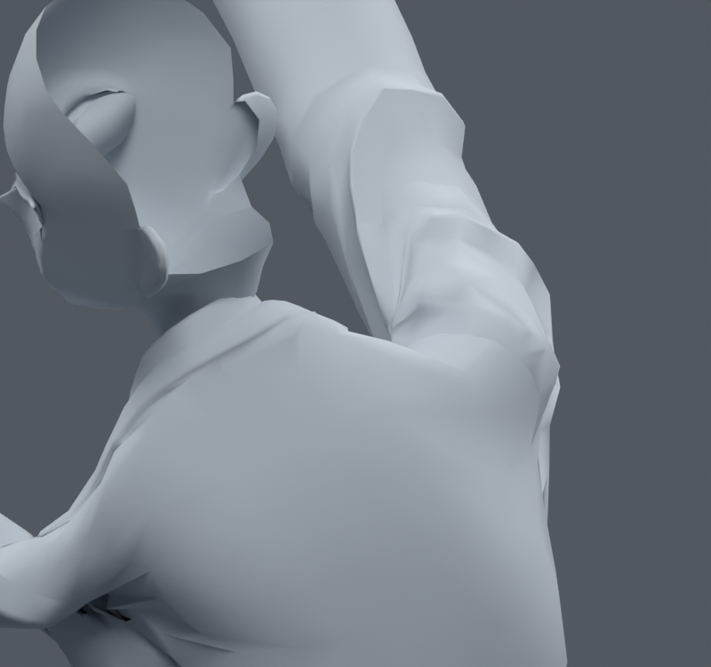
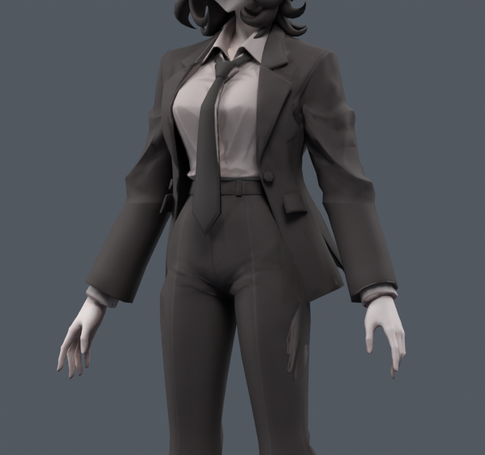
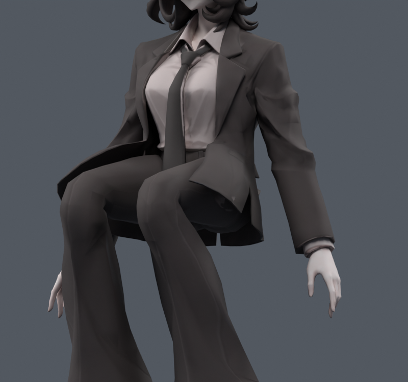
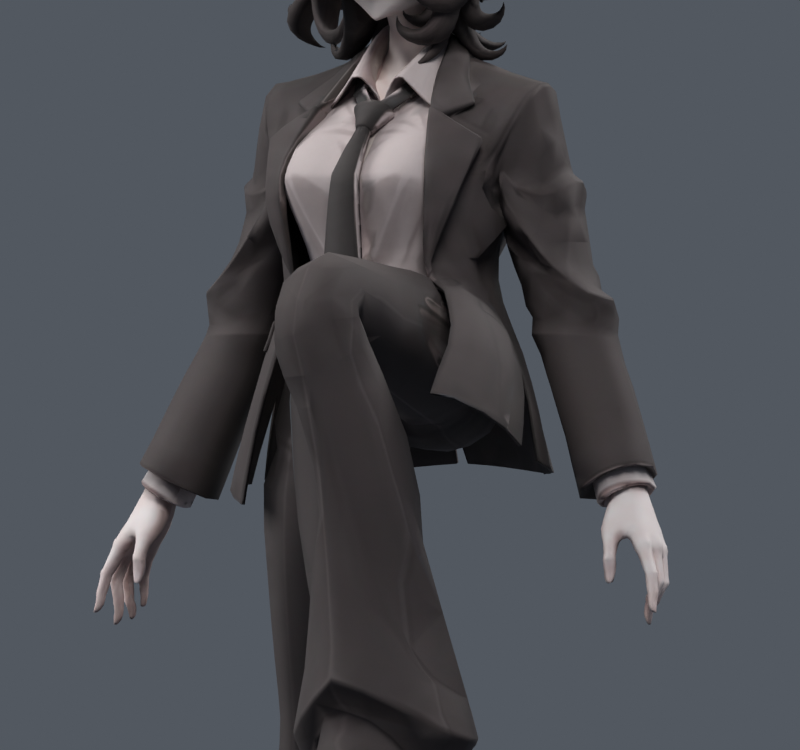
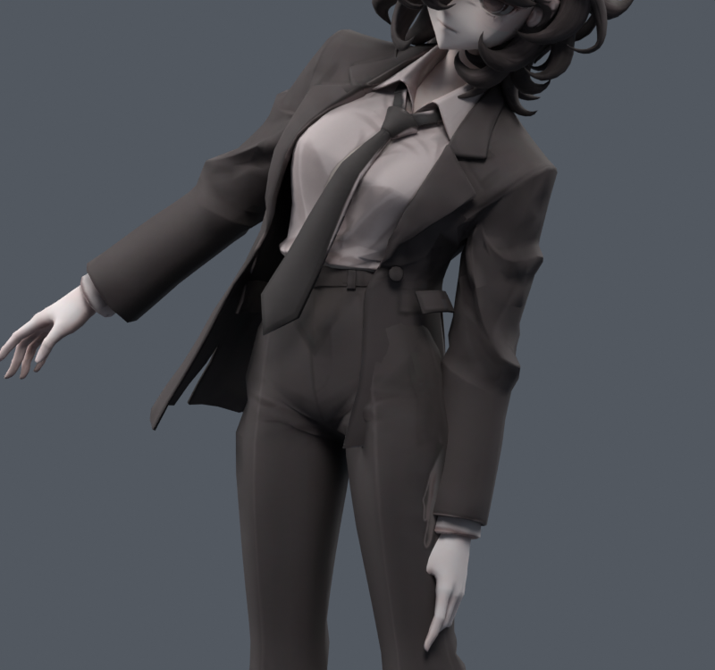

> **기록 시점 안내:** 아래는 해당 단계 당시의 보고서입니다. 후속 결정은 [최신 상태](../../STATUS.md)를 기준으로 읽어주세요. 모델·원본 텍스처·검증 원시 데이터는 이 문서 공유본에 포함하지 않습니다.

# v079 — 카라·목 복합 회전과 코트 자락 범위 재검수

입력은 v073 손 개선 후보다. 이 단계는 **실제 원인 위치를 분리한 진단**이며 모델을 새로 만들거나 외형을 수정하지 않았다. 원본 그림, 중립 카라, 문제가 큰 복합 회전과 앉기·옆굽힘을 직접 렌더로 확인했다. 카라와 목, 어깨를 하나의 오류로 묶지 않는다.

## 목과 카라

목 yaw5개×pitch3개×roll3개=45개에서는 면적 경고0이다. 이 기본45개에 팔·몸통·목의 새 복합240개(seed790910)를 추가하니 총30개 경고가 있었다. 원래 면 기준으로 피부 뒤 목15813/9604/9569/15686이 각각11/8/2/2번, 코트2520/16521이4/3번이다. 카라 전체가 무너진다는 증거로 해석하면 안 된다.

피부 네 면은 z약.839~.840m의 목–머리 웨이트 전환부다. 가운데 두 면의 평균 neck/head는 약56/44%, 옆 두 면은64/36%다. 이 부분은 v080에서 기존 웨이트의 국소 변경을 시험한다. 코트2520은 쇄골/상완/몸통이 함께 작용하는 어깨 앞쪽이며16521은 뒤 어깨다. 목 피부 수정으로 이 둘까지 해결됐다고 표시하지 않는다.

그림은 검사하려고 머리카락·눈알 등을 가린 clay 뷰다. 눈의 빈 공간이나 잘린 소매 가장자리를 실제 새 메시 구멍으로 해석하지 않는다. 기본 카라, 복합37 앞/뒤를 직접 확인했다. 넥타이/머리 포함 색상은 아래 전신 의상 그림에서 확인한다.

## 옷자락은 흔들림 범위에 따라 별도 접촉 문제가 생긴다

기존4뿌리+8변형본에 앞뒤/옆 방향의 −15~15°를5° 간격으로 더했다. 중립, 양쪽 다리105°, 앉기90°, 양쪽 옆굽힘의6몸자세×2축×7각도=84개다. 둘째 마디에는 첫 마디의 절반 각도를 적용했다. 모든 패널에 같은 로컬 방향을 더한 **스트레스 검사**이며 자연스러운 바람 애니메이션이나 물리 시뮬레이션이 아니다.

예를 들어 로컬X 방향에서 중립의 −10/−5/0/+5°는 코트–바지 접촉쌍0이지만,−15°는124쌍,+10°는32쌍이다. 앉기는0/+5/+10°에서0쌍이며−15°에서는172쌍이다. 즉 단일 대칭 각도 제한 하나를 모든 자세의 안전 범위로 정할 수 없다. 측정은 실제 변형 후 삼각형의 원래 면쌍이며, 쌍 수가 관통 깊이나 사용자에게 보이는 심각도는 아니다.

네 색상 렌더를 직접 확인했다. 왼다리105°의 기존 앞허리 접촉11쌍, 옆굽힘의47쌍도 남는다. v075의 국소 앞허리 패치가 다른 회전으로 접촉을 옮겼던 결과와 함께 보아야 한다. 물리 단계에서는 몸통/허벅지 충돌체, 패널별 비대칭 제한, 앉기에서 다리 회피와 자유 흔들림의 우선순위를 함께 설계해야 한다. 현재 본이 있다고 바람·충돌이 완성됐다고 하지 않는다. 새 면을 만들거나 관통을 숨기려고 바지를 삭제하지 않았다.

원시 자료는 `NECK.json`, `TAIL.json`, 재현은 `00_neck.py`, `01_tail.py`다. 전체관절의 새 회귀 및 보호된 무릎 비교는 후속 선별 검수본에서 이어서 수행한다.
