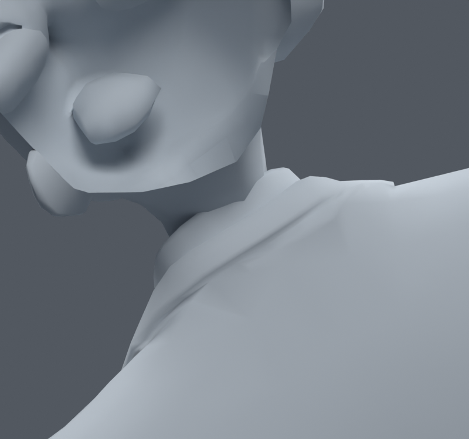
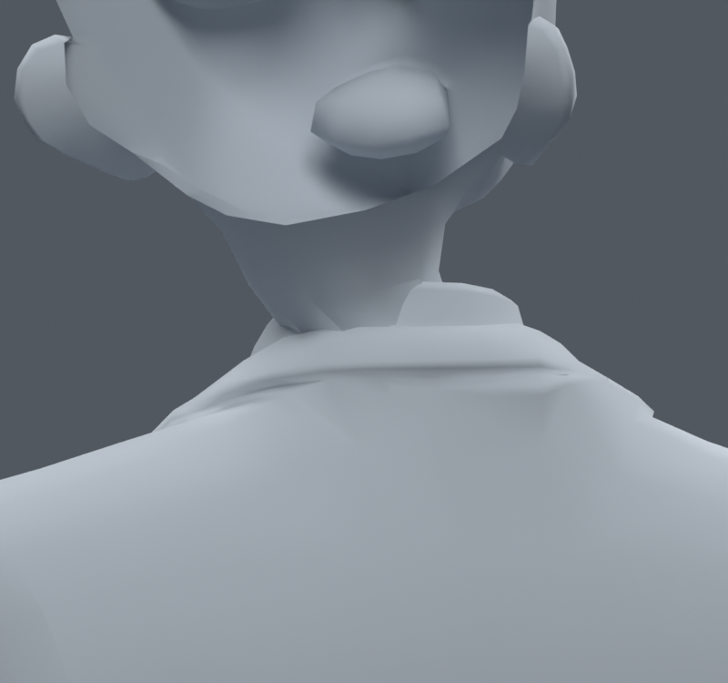

> **기록 시점 안내:** 아래는 해당 단계 당시의 보고서입니다. 후속 결정은 [최신 상태](../../STATUS.md)를 기준으로 읽어주세요. 모델·원본 텍스처·검증 원시 데이터는 이 문서 공유본에 포함하지 않습니다.

# v080 — 뒤 목의 목–머리 웨이트 국소 보정

**BOTH 사본을 선별 검수 후보로 남긴다.** v079에서 분리한 피부 뒤 목 네 면 주변10위치/14raw 정점의 기존 neck/head 웨이트만 최대4.000002%p 조정했다. 중립 정점·면·UV·노멀·102본·제약은 입력 v073과 정확히 같고, v073 손 개선을 포함한다. 새 메시·본·셰이프 키는 없다.

처음에는 실제 각 자세에서 선택된 대각선만으로1662자세(전신1377+목285)를 최적화했다.1%p에서는16개 삼각형 경고,2%p에서는7개,약3.8766%p에서 캐시 경고0이 됐다. 하지만 실제 Blender 재평가의 목285에서는 피부 경고23→3이었다. 웨이트가 바뀌면서 비평면 사각형의 분할도 달라지는 차이를 확인했다.

그래서 해당18면의 사각형을 **양쪽 대각선 모두** 고려하는 목표로 다시 계산했다. 실제 메시를 모두 삼각형으로 바꾼 것이 아니다. 각 사각형에서 가능한 삼각형4개를 진단 목표에 넣었고, 실제 .blend의 면은 원래대로다.4%p 사본은 이 목표에서0이며 최대 표면 이동은1662개 캐시 기준1.268592mm다.8%p 한도도 비교했지만 더 큰 이동을 채택할 이유가 없어4%p를 골랐다.

| 실제 Blender 검사 | 기존 → BOTH | 새 경고 / 해소 | 목 피부에 남은 경고 |
|---|---|---|---|
| 목285(기본45+복합240,seed790910) |30 → 7|0 / 23|0|
| 별도445(기본45+복합400,seed801117) |46 → 14|0 / 32|1|

나머지 경고는 쇄골·어깨의 코트다. 새445의 피부 원래면15686에서1건은 남으므로 모든 목 자세가 해결됐다고 하지 않는다. 기본45는 두 검사에 중복되고, 전신1377과 첫 목285는 수정에 사용했다. 새 난수400은 사용하지 않았다.

접촉은 첫 검사에서 원래 면쌍 새287·사라짐175, 새445에서 새433·사라짐342였다. 새445의 추가쌍421개는 피부–셔츠,12개는 피부–코트다. 접촉쌍 수는 깊이·외형 점수가 아니지만 반드시 기록한다. 변화가 큰 PRESS/CONTACT/TURN의 전후 렌더를 만들었다. 초기 고정 카메라에서는 목이 화면 밖으로 나가 **수정 정점의 실제 평가 위치로 카메라 중심을 바꿔 재렌더**했다. PRESS/TURN 전후를 직접 확인했고 눈에 띄는 큰 카라 관통 악화는 보이지 않았다. 작은 접촉과 기존 뒤 카라 음영은 남는다.

눈·머리카락 등을 가린 진단 렌더다. 보이는 얼굴 내부 면은 모델 재생성이나 새로 생긴 구멍이 아니다. 본문 그림은 손·목 중심의 작은 개선을 확인하는 용도이며, 전체 캐릭터 검수는 [최신 통합 안내](../v083_review_delivery/START_HERE.md)를 사용한다.

검수 파일 `bianca_NECK_BOTH_REVIEW.blend`, SHA `28789dde13f16feebc285e9c8a4df49f71b1b0cb6ac3011fa6ffaf5fcf773134`. 초기 `bianca_NECK_LOCAL_REVIEW.blend`는 이전3.8766%p 실험이다. `BUILD_BOTH.json`, `BOTH_TRAIN.json`, `BOTH_FRESH.json`, `BOTH_LINESEARCH.json`, `00_cache.py`~`08_render.py`에 기록했다. [전신·손목 회귀](../v081_continued_review/REVIEW.md)에서도 새 경고/코트 접촉0, 무릎 동일을 확인했다. 사용자 채택·Unity 실행 완료는 아니다.
