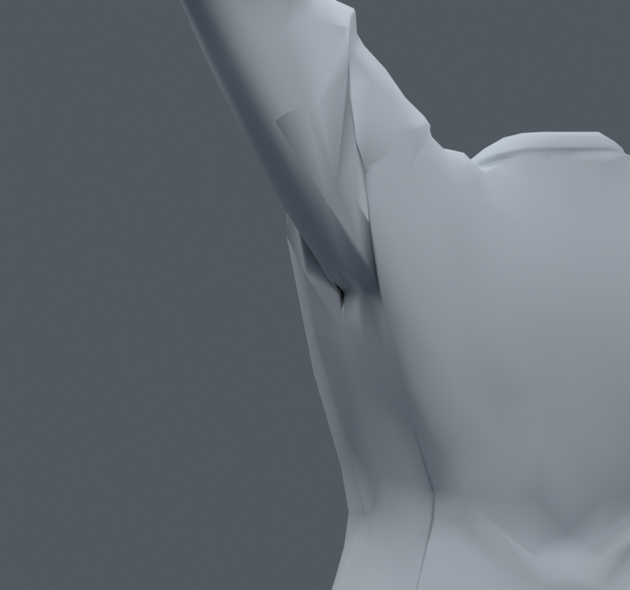
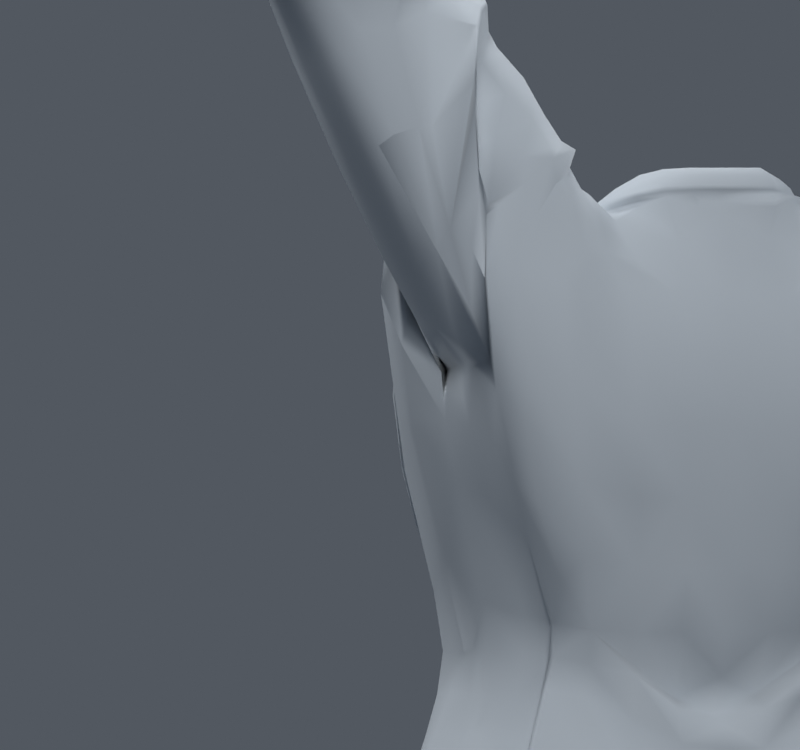
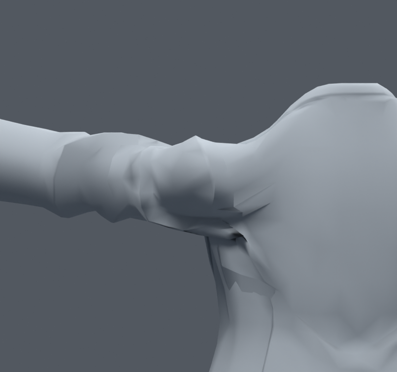
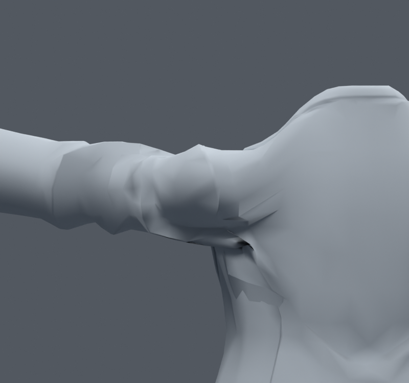

> **기록 시점 안내:** 아래는 해당 단계 당시의 보고서입니다. 후속 결정은 [최신 상태](../../STATUS.md)를 기준으로 읽어주세요. 모델·원본 텍스처·검증 원시 데이터는 이 문서 공유본에 포함하지 않습니다.

# v082 — 어깨 관절 중심의 안팎·앞뒤 위치 비교

**통합하지 않는다.** 기존 v024에서는 어깨 중심 높이를 비교했으므로 이번에는 높이를 유지하고 안쪽5/10mm, 바깥5mm, 앞5mm, 뒤5mm의 다른 방향을 시험했다. 입력은 v080 초기 목 후보(3.8766%p)이며, 각 사본은 기존 상완 시작점·쇄골 끝·어깨 보조본의 위치를 좌우 함께 옮긴다. 본을 새로 추가하지 않았고 메시 좌표·면·UV·웨이트는 정확히 보존했다. 원래 본6개의 rest 구조가 달라지는 별도 실험이다.

| 사본 | 기본30자세 경고 합계 | 새 경고 / 해소 |
|---|---|---|
| 입력 |113|—|
| IN5 |111|12 / 14|
| IN10 |105|17 / 25|
| OUT5 |117|19 / 15|
| FRONT5 |103|20 / 30|
| BACK5 |115|21 / 19|

모든 사본의 앞·옆 올림을 렌더했다. 기본 앞·옆, IN10 옆, FRONT5 앞, OUT5 앞, BACK5 옆을 직접 비교했다. 관절 중심 이동은 연결부 주름을 옮기지만 큰 홈을 없애지 못했고 새로운 압축도 발생했다. 낮은 합계만 보고 팔의 중심과 비틀림축을 바꾸는 이득은 없다. 사용자에게 채택을 요청할 만큼 뚜렷한 품질 개선이 없어 기존102본 구조를 유지한다.

재현은 `00_trials.py`, `BUILD.json`, `QUICK_*.json`, `COMPARISON.json`. 전신/손가락/런타임 검증을 통과한 새 기본 리그로 주장하지 않는다. v080의 후속4%p 목 사본은 이 어깨 변경을 포함하지 않는다.
