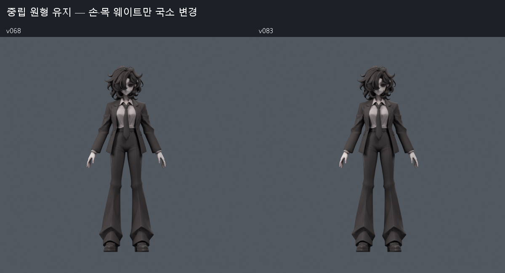
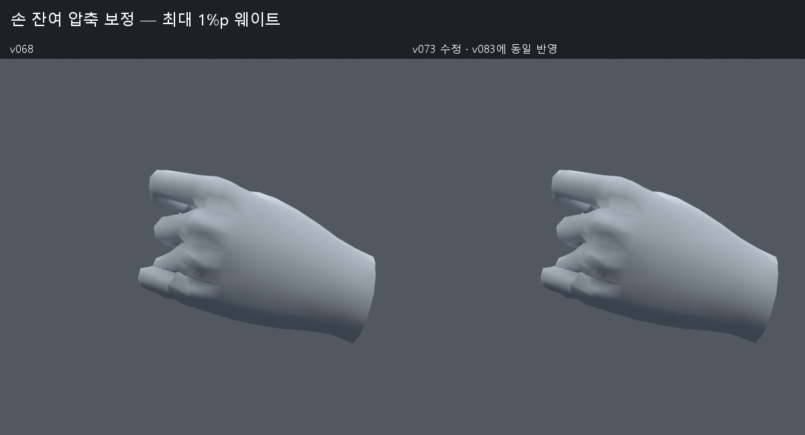
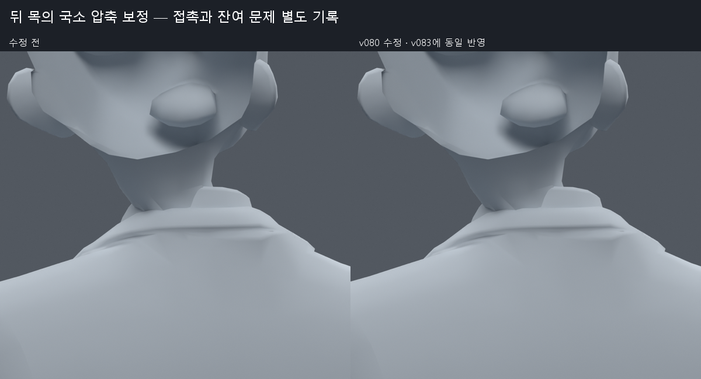
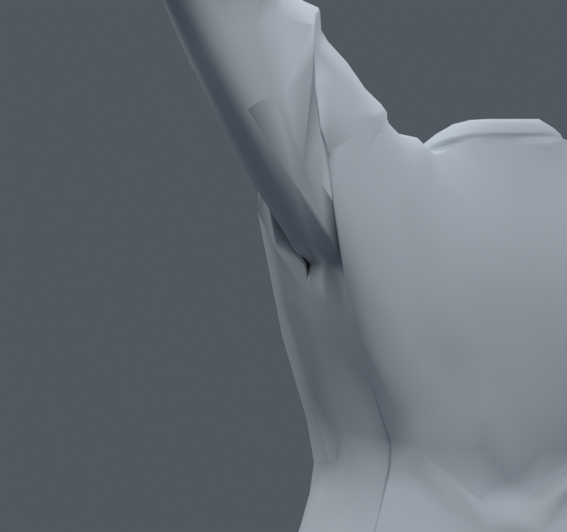
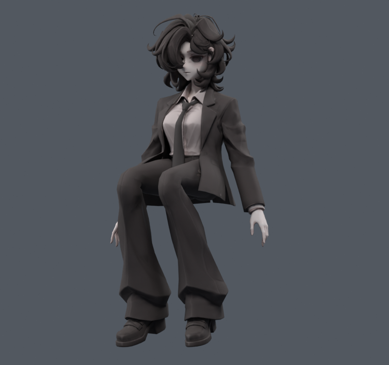

> **기록 시점 안내:** 아래는 해당 단계 당시의 보고서입니다. 후속 결정은 [최신 상태](../../STATUS.md)를 기준으로 읽어주세요. 모델·원본 텍스처·검증 원시 데이터는 이 문서 공유본에 포함하지 않습니다.

# v083 — 1~3번 연속 작업을 한 번에 확인하기

**현재 선별 검수본은 v083이다. v068에 손15개·뒤 목14개 정점의 웨이트 수정만 추가했다.** 원형·UV·텍스처·면·기존102본·채택된 v038 SMALL 무릎은 유지했다. 어깨·겨드랑이의 큰 홈과 코트 자락의 일부 접촉은 아직 해결되지 않았다. 효과가 불분명하거나 다른 자세를 악화시킨 구조 변경은 이 파일에 넣지 않았다.

## 1. 어떤 파일을 열면 되나

| 용도 | 파일 |
|---|---|
| 최신 정적 모델 검수 | bianca_CONTINUED_REVIEW.blend (공유본 미포함: `bianca_CONTINUED_REVIEW.blend`) |
| 손·목·어깨·앉기·자락을 한 번에 재생 | bianca_CONTINUED_MOTION_REVIEW.blend (공유본 미포함: `bianca_CONTINUED_MOTION_REVIEW.blend`) |
| 빠른 동작 미리보기 | [MOTION_PREVIEW.gif](MOTION_PREVIEW.gif) |
| 이전 작업 전체 지도 | [v068 종합 문서](../v068_upper_delivery/START_HERE.md) |

동작 파일은301프레임/24fps다. 타임라인 마커로 아래 자세에 바로 갈 수 있다. 검사 장면 간의 전환을 포함하며 완성된 게임 애니메이션은 아니다. 파일 이름 REVIEW는 사용자 채택이나 Unity/VRChat 실행 완료를 뜻하지 않는다.

| 프레임 | 확인 부위·동작 |
|---:|---|
|1|중립 원형|
|13 / 25 / 37|옆으로 팔 들기·높이 들기·비틀기 — 겨드랑이 잔여 홈|
|49|팔 내리기|
|61 / 73 / 85|앞으로 팔 들기·높이 들기·비틀기|
|97 / 109|중립·손 펴기|
|121 / 133 / 145 / 157|주먹·가리키기·브이·엄지 올리기|
|169|손목·전완 회전|
|181 / 193|목·몸통 회전 / 중립 복귀|
|205|앉기90° — 코트·무릎|
|217 / 229|왼쪽·오른쪽 다리105° 들기|
|241 / 253|왼쪽·오른쪽 옆굽힘|
|265|뒤 목 압축을 확인한 복합 자세|
|277 / 289|손 잔여 경고를 고친 두 개의 복합 손가락 자세|
|301|최종 중립|

각도는 저작용 명령값이다. 예를 들어 옆 들기120°는 기존 A포즈에 추가한 회전으로 실제 상완 기울기140.48°에 해당한다. 해부학적 각도나 Unity muscle 수치와 혼동하지 않는다.

## 2. v068에서 실제로 좋아진 부분

| 부위 | 적용한 변경 | 실제 검사 결과 |
|---|---|---|
|손|왼손8위치/15raw 기존 웨이트 최대1%p|기존1100자세 면적 경고3→0, 새1100에서2→0|
|뒤 목 피부|10위치/14raw neck/head 웨이트 최대4%p|목285자세 피부 경고23→0, 새445에서33→1|
|기존 몸·옷·무릎|v068 선별 결과 유지|전신1377 새 면적·코트 접촉0, 무릎 결과 동일|

손은 수정에 사용한550자세에서 표면 이동 최대.151874mm, 목은1662개 수정 표본에서1.268592mm다. 중립 정점은 이동하지 않았다. 외형 변화가 작은 국소 개선이며 큰 어깨 곡면이 좋아진 것처럼 표시하지 않는다.

원본 ref_char.png도 다시 열어 각진 재킷·옷깃·허리·실루엣을 비교했다. 원본에는 높이 든 팔이나 주먹이 없어 해당 자세의 정답을 그림에서 직접 확인할 수는 없다. 이번에 텍스처를 재생성하거나 메시를 새로 만들지 않았다.

## 3. 검증에서 확인한 범위와 한계

| 검사 | 결과·한계 |
|---|---|
|전신1377|새 면적 경고0·코트–바지/소매 새 접촉0. 양쪽 무릎의 전체 검사 항목 동일. 목 수정에도 사용한 회귀 표본|
|손목·전완 새644|기본132+새512(seed810910). 새 면적 경고0, 손–코트 접촉은 입력·수정 모두0|
|저장 동작601|정수·반 프레임에서 새 면적 경고0·기존13해소,26개 키 자세 저장/재로드 위치 오차0|
|원형 보존|32773정점·17647면·31363삼각형·102본. v068의 좌표·UV·노멀·재질·면·본·제약·smooth 설정 동일|
|웨이트|손15raw·목14raw만 다름. 최대4영향·합 오차1.0431e−7|
|중립 평가|v068 대비 최대3.49246e−10m 차이. 기준 v068/v038/v046 파일 SHA 유지|

각 표본군은 기본 자세가 중복된다. 합산해서 그만큼의 독립 자세를 검사했다고 하지 않는다. 면적 경고(.2미만/3초과)는 압축 진단이며 자연스러운 형상이나 관통 깊이를 직접 측정한 점수가 아니다.

손 접촉 총수는 기존1100에서 같았지만 원래 면쌍은 새10·사라짐9였다. 새1100에서는 raw합이1 늘고 원래 면쌍 새8·사라짐6이다. 목445에서는 새433·사라짐342로, 대부분 피부와 셔츠 카라 사이였다. 변화가 큰 자세를 확대 비교했으며 접촉을 모두 없애려 손과 목을 부풀리지 않았다. [손 상세](../v073_hand_residual/REVIEW.md) · [목 상세](../v080_neck_weights/REVIEW.md) · [전신·손목 검사](../v081_continued_review/REVIEW.md).

## 4. 어깨와 옷자락은 어떻게 판단했나

어깨는 모서리 변형을 맞추는 보정, 제한된 자세키, 이웃 웨이트 확산, 사각면 대각선, 중립 소매 정리, 관절 중심 이동을 비교했다. 대개 한 자세의 접힘이 줄어도 다른 회전에서 압축이 생겼다. 검증 합계가 작아지는 것과 실제로 자연스러워지는 것을 구분해, 큰 홈을 해결하지 못한 사본들은 제외했다.

코트 앞허리50raw 패치도 접촉을 줄이는 대신 다른 고관절 비틀기에서 새 접촉을 만들었다. 자락84회전 스트레스 검사는 몸 자세에 따라 허용 가능한 방향이 달라짐을 확인했다. 본만 있으면 바람·움직임·충돌이 완성되는 상태가 아니다. [카라·자락 진단](../v079_collar_tail_review/REVIEW.md).

## 5. 이번 버전별 기록

| 단계 | 내용·판정 |
|---|---|
|[v070](../v070_upper_cause/REVIEW.md)|원본·와이어·본·웨이트 원인 재검사와 추가 자료|
|[v071](../v071_surface_strain/REVIEW.md)|ARAP 기존 표면 목표4개 — 통합 제외|
|[v072](../v072_compact_front/REVIEW.md)|회전 범위 제한 보정키 — 집중 격자에서 악화해 제외|
|[v073](../v073_hand_residual/REVIEW.md)|손15raw 국소 웨이트 — 선별 반영|
|[v074](../v074_shoulder_graph/REVIEW.md)|인접 웨이트 확산6개 — 제외|
|[v075](../v075_coat_clearance/REVIEW.md)|코트 앞허리12조합·실제2사본 — 제외|
|[v076](../v076_hand_surface/REVIEW.md)|손 면적 가중 노멀3개 — 제외|
|[v077](../v077_shoulder_diagonals/REVIEW.md)|어깨45/23면 대각선 — 새 복합 회전에서 악화해 제외|
|[v078](../v078_sleeve_rest/REVIEW.md)|중립 소매 좌표 정리3개 — 원형 주름 손실·새 압축으로 제외|
|[v079](../v079_collar_tail_review/REVIEW.md)|목285·자락84 진단 — 뒤 목과 어깨 문제 분리|
|[v080](../v080_neck_weights/REVIEW.md)|뒤 목14raw 웨이트·양 대각선 고려 — 선별 반영|
|[v081](../v081_continued_review/REVIEW.md)|전신1377·새 손목644 회귀|
|[v082](../v082_shoulder_pivot/REVIEW.md)|어깨 중심 안팎·앞뒤5사본 — 제외|
|[v083](REVIEW.md)|선별 검수본·301프레임 동작·보존 대조·이 종합 문서|

자료는 기존 [상세 리서치](../v042_upper_research/RESEARCH.md)에 이번 [추가 원인 조사](../v070_upper_cause/REVIEW.md)를 더했다. CAVE Academy의 쇄골·견갑/팔 분담, Libigl ARAP, Blender 문서와 제작자 사례를 우리 면·웨이트 구조에 대조했다. 영상 전체를 시청했다고 주장하지 않는다.

## 6. 남은 문제

큰 겨드랑이 홈, 손가락 뿌리의 일부 각진 음영·자기 접촉, 새 목 표본의 피부 경고1개, 앉기·다리 들기·옆굽힘에서의 코트 접촉이 남는다. 어깨는 기존 암홀의 면 흐름과 의도한 재킷 곡면을 더 직접적으로 재배치하는 검토가 필요하며, 현재의 자동 평활화/보조본/중심 이동을 반복 적용할 근거는 부족하다. 기존 메시 수정이라는 제약은 계속 유지한다.

Unity 작업은 수행하지 않았다. [기존 본·엔진 전달 요건](../v068_upper_delivery/RUNTIME_HANDOFF.md)은 유효하다. 보조본 제약 재현, 실제 내보낸 삼각형 목록, PhysBone/충돌체와 앉기 회피, 실제 VRChat 입력을 별도로 검증해야 한다. 이 검수본을 전체 관절 작업 완료로 간주하지 않는다.
