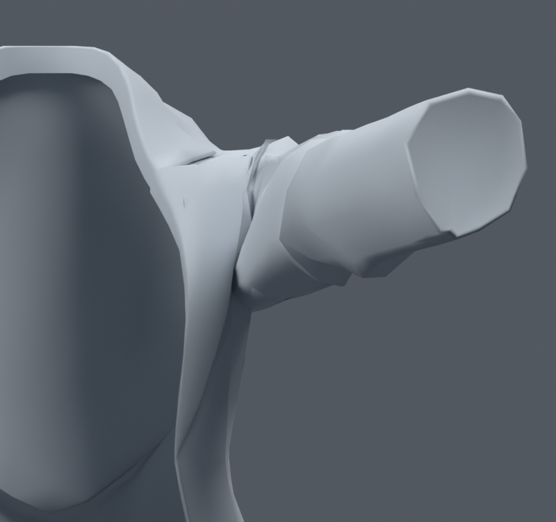

> **기록 시점 안내:** 아래는 해당 단계 당시의 보고서입니다. 후속 결정은 [최신 상태](../../STATUS.md)를 기준으로 읽어주세요. 모델·원본 텍스처·검증 원시 데이터는 이 문서 공유본에 포함하지 않습니다.

# v084 — 기존 사각면 사이의 경계선 회전

**미채택. v083 검수본은 유지한다.** 기존 사각형 두 장 사이의 실제 모서리를 회전하는 방향을 시험했다. v077의 사각형 내부 대각선 선택과 달리, 이웃 사각면의 정점 연결을 바꿨다. 새 메시나 정점은 만들지 않았다.

v083의 중립·옆 올림 60/90/120·앞 올림 45/90, 총 6자세를 사용했다. UV 이음매를 보호하고 중립 삼각형 품질과 면 각도를 확인한 뒤, 앞쪽 두 구간의 각 2방향만 남겼다. 각 사본은 모서리 2개, 기존 면 4장의 연결만 변경한다. 정점 32773, 면 17647, 본 102는 유지한다. 좌표·웨이트·본·재질은 보존했고 UV는 원래 코너에 대응시켜 복원했다. 커스텀 노멀 재기록의 최대 벡터 오차는 0.00033534이며 비트 동일은 아니다.

후보 A/B의 실제 삼각형 목록은 각각 중립·옆 60/120·앞 90에서 6삼각형이 교체됐다. 사각면 평균 법선 사이 각도는 줄었지만, **앞 올림 렌더에서 재킷의 큰 접힘이나 겨드랑이 개선을 확인하지 못했다.** 수치상 면 각도가 좋아졌다고 실제 모양이 좋아졌다고 판정하지 않는다. 전신 회귀 시험으로 확장하지 않고 이번 두 사본을 제외했다.

Blender 공식 매뉴얼의 [Rotate Edge](https://docs.blender.org/UATEST/manual/en/dev/modeling/meshes/editing/edge/rotate_edge.html) 검색 색인에서 두 이웃 면 사이 모서리를 회전하는 동작을 확인했다. 최신 매뉴얼 본문 직접 열기는 오류가 났으므로 전체 본문을 읽었다고 주장하지 않는다. 실제 실행은 Blender의 `bmesh.utils.edge_rotate` 문서를 MCP로 읽은 뒤 수행했다. 최초 키워드 인수 호출은 API에서 거절돼 위치 인수로 수정했으며 저장 사본은 수정 후 결과다.

재현: 00_inspect → 01_search → 02_build → 03_render → 04_surface_check. `V084_source_face/loop`는 이력 대응이며, 회전한 네 면이 옛 면과 같은 표면이라는 뜻이 아니다. BUILD의 other_fingerprint 중 normals=false는 위 재기록 오차와 일치한다. 원형 이미지를 직접 열어 디자인과 비교했다.
