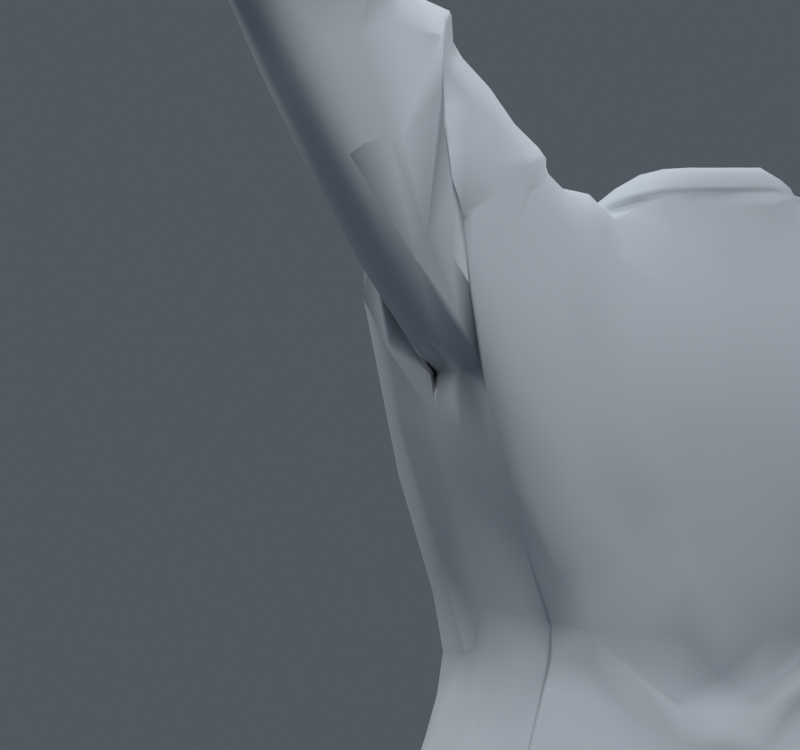
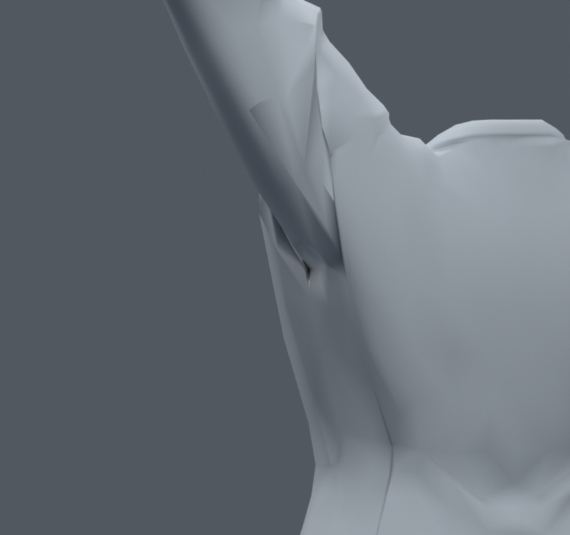
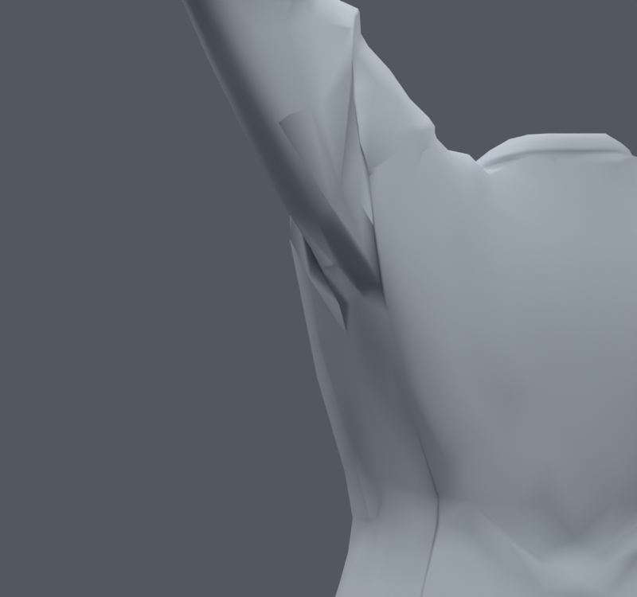

> **기록 시점 안내:** 아래는 해당 단계 당시의 보고서입니다. 후속 결정은 [최신 상태](../../STATUS.md)를 기준으로 읽어주세요. 모델·원본 텍스처·검증 원시 데이터는 이 문서 공유본에 포함하지 않습니다.

# v085 — 깊은 주름의 실제 정점 추적과 세 꼭짓점 보정

**세 사본 모두 미채택.** 검은 홈을 렌더 픽셀에서 실제 면으로 역추적한 뒤, 전체 어깨 대신 기존 주름의 세 꼭짓점만 직접 수정했다. 입력은 v083이며 v084의 연결 변경을 섞지 않았다.

화면의 홈 끝은 현재 면 15390/15391 근처이고, 중립 높이 약 0.71~0.72m의 겨드랑이 주름이다. 예를 들어 정점 28802의 중립 높이는 0.71826m, 주름 양쪽 28801/6663은 0.71240/0.70898m다. 이미 중립에서 꺾인 주름이 있으며, 팔 올림에서 각 띠의 서로 다른 본 영향으로 늘어난다. 이 관찰을 전체 어깨 문제의 단일 원인으로 확정하지 않는다. 픽셀·면·정점·위치는 HITS에 기록했다.

24365, 28802, 6708의 목표를 각 주름 양쪽 기존 정점의 중점으로 잡고 끝부분을 65%로 줄였다. 다른 정점 좌표·면·UV·본은 보존했다. 변경 면 주변 14정점의 노멀 방향도 새 곡면에 맞춰 회전했다. 좌표만 바꾼 HALF/FULL과 기존 네 본 웨이트까지 양쪽 평균으로 보간한 WEIGHT를 비교했다.

| 사본 | 최대 중립 이동 | 같은 30팔 자세의 면적 경고 |
|---|---:|---:|
| v083 기준 | 0 | 113 |
| HALF | 3.823mm | 170 |
| FULL | 7.647mm | 229 |
| WEIGHT | 7.647mm, 웨이트 최대 9.070%p | 233 |

면적 경고는 중립 대비 삼각형 면적이 20% 미만 또는 300% 초과인 현재 면의 누적 수다. 새 경고/해소 수와 같은 지표가 아니다. 경고 증가는 별도로 실제 모습과 대조했다. HALF에서는 홈이 남고, FULL/WEIGHT에서는 홈 끝에 각진 작은 면이 더 드러난다. 원래 디자인의 주름을 무조건 평평하게 펴는 방식은 이번 모델에서 좋은 해결이 아니었다.

정점 수 32773, 면 17647, 본 102 유지, 새 메시·정점·면·본 생성 0. 첫 실행의 보존 assertion은 fingerprint의 노멀 키 이름을 잘못 제외해서 실패했고, 키 이름을 수정한 후 세 파일을 생성·재검사했다. 실패한 결과를 합격 수치로 사용하지 않는다. 후속 v086에서는 좌표 이동과 별개로 기존 접힘 꼭짓점의 국소 정리를 비교한다.
