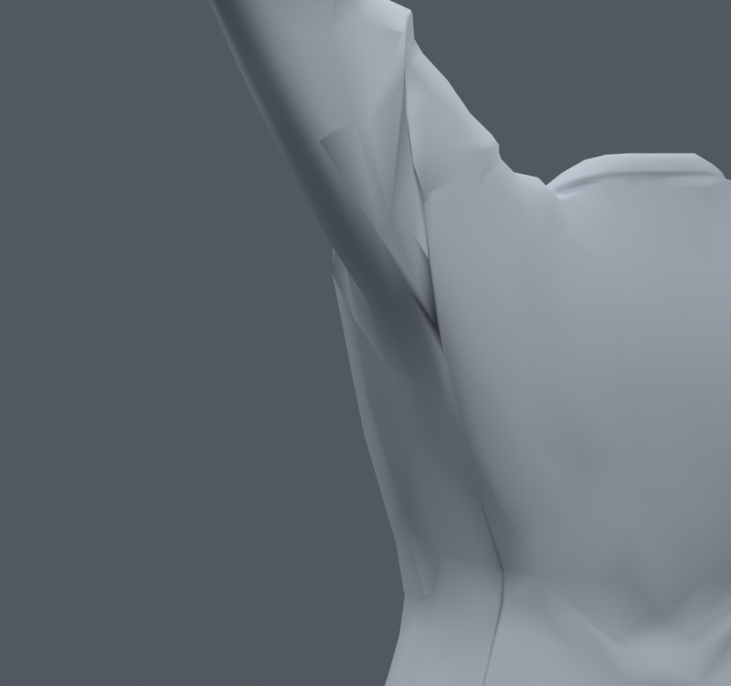
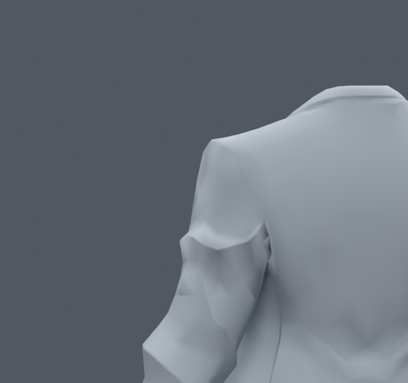
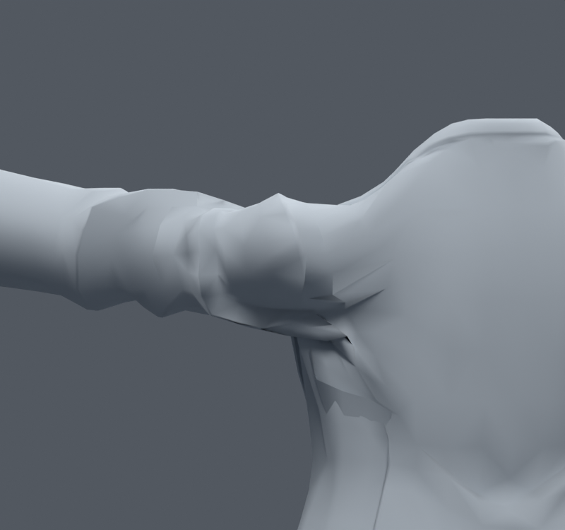

> **기록 시점 안내:** 아래는 해당 단계 당시의 보고서입니다. 후속 결정은 [최신 상태](../../STATUS.md)를 기준으로 읽어주세요. 모델·원본 텍스처·검증 원시 데이터는 이 문서 공유본에 포함하지 않습니다.

# v086 — 겨드랑이 접힘 꼭짓점의 국소 정리

**검수본에 통합하지 않는다.** 후속 v088 UV 검사에서 STRIP의 새 다각형 경계가 서로 다른 아틀라스 섬을 가로지르고 UV 경계가 자기 교차하는 문제도 확인했다. 아래의 '원래 UV 코너 값 복원'은 수치 보존이며 **새 면의 텍스처 무늬 보존을 뜻하지 않는다.** 해당 연결을 최종 결과로 채택하지 않았다.

v085처럼 꼭짓점을 움직이는 대신, v083의 기존 메시에서 주름 꼭짓점 하나 또는 세 개를 dissolve했다. 발생한 국소 다각형만 Blender BEAUTY 방식으로 삼각 분할했다. 새 메시·대체 표면·리메시·새 정점 생성은 하지 않았다.

CENTER는 정점 28802 하나를 제거해 32772정점/17649면, STRIP은 24365·28802·6708 세 개를 제거해 32770정점/17648면이다. 본 102개와 남은 모든 정점의 좌표·웨이트는 정확히 유지한다. 수정 밖 면은 원래 정점 대응으로 순서까지 같고, UV는 원래 루프에서 정확히 복원했다. STRIP의 국소 62코너는 새 면에 맞춰 자동 노멀을 사용하며 그 밖은 기존 노멀 방향을 복원했다. 삭제 부위의 옛 면 ID는 이력이며 같은 표면이라는 뜻이 아니다.

옆 올림 렌더에서 작은 검은 홈 끝은 줄어들지만, 긴 접힘과 앞 올림의 각진 어깨는 남는다. 시각상의 작은 개선을 확인한 뒤, 기본 30자세에 새 난수 300자세(seed860910)를 더해 실제 모델 두 개를 재평가했다.

| 330자세 검사 | v083 | STRIP |
|---|---:|---:|
| 수정 밖 면적 경고 | 1280 | 1280, 집합도 동일 |
| 수정 영역 삼각형 면적 경고 | 40 | 1181 |
| 수정 영역 최소 면적 비율 | 0.01683 | 0.05810 |
| 수정 영역 최대 면적 비율 | 3.335 | 12.812 |
| 코트 자기 접촉 면쌍 누적 | 26812 | 26294 |

면 분할이 달라졌으므로 수정 영역의 삼각형 개수나 접촉 면쌍 합계를 동일 분모의 품질 점수로 보지 않는다. 다만 일부 새 삼각형이 원래 면적의 12.8배까지 늘어나는 것은 직접 확인한 문제다. 접촉 합계가 줄었다고 모든 관통 깊이가 개선됐다는 뜻도 아니다. 수정 밖 새 면적 경고/해소는 모두 0이다. CENTER는 대표 렌더까지만 확인했고 STRIP의 330검사를 상속하지 않는다.

v085 문서의 기준 그림과 같은 카메라다. 00_trials, 01_render, 02_validate로 재현한다. 후속 v088에서는 이 국소 다각형의 삼각 분할을 여러 자세에 맞춰 고를 수 있는지 검토한다. **이 단계는 어깨 해결이나 전체 관절 완료가 아니다.**
