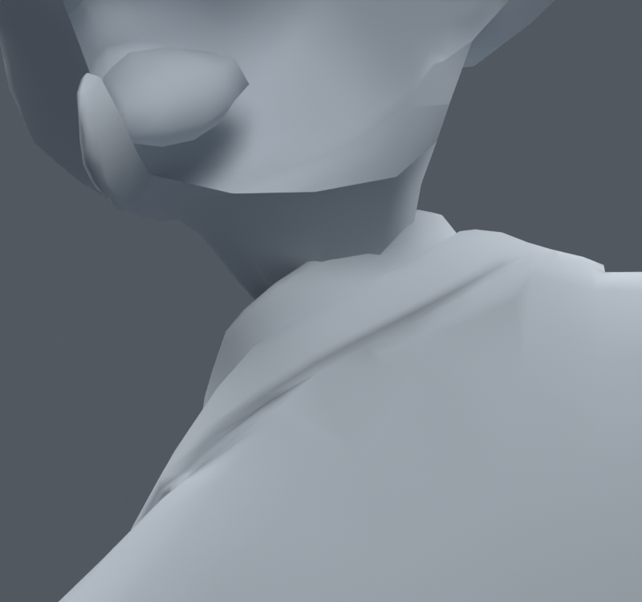

> **기록 시점 안내:** 아래는 해당 단계 당시의 보고서입니다. 후속 결정은 [최신 상태](../../STATUS.md)를 기준으로 읽어주세요. 모델·원본 텍스처·검증 원시 데이터는 이 문서 공유본에 포함하지 않습니다.

# v087 — 뒤 목 잔여 한 면의 작은 웨이트 보정

**후속 검수 후보에 포함할 작은 보정이다. 전체 목·관절 해결이나 사용자 최종 채택은 아니다.** v083에서 원래 면 15686 주변의 기존 neck/head 웨이트만 조정했다. 기존 메시·정점 좌표·면·UV·노멀·본·제약·재질·기존 키와 드라이버 구성은 정확히 유지한다.

최종 변경은 29215, 29216, 29244, 29247, 29467, 29468의 여섯 raw 정점이다. 최대 변화는 0.300002%p이고 최대 본 영향은 4개, 웨이트 합 오차는 1.0431e-7이다. 파일은 `bianca_NECK_RESIDUAL_REVIEW.blend`, SHA `5de4bccd3fc885173d6f13953b092c16f6c6899c502075e7102300450b6c5003`다. 32773정점/17647면/102본 유지, 새 메시·정점·면·본 0.

기존 전신1377과 목730을 합친 2107자세에서 해당 면 주변 4위치·9면의 양쪽 사각형 대각선을 모두 고려했다. 최대 웨이트 변화 0.1/0.3/0.5/1.0%p 네 후보 중 가장 작은 합격 후보인 0.3%p를 골랐다. 이 국소 계산의 최대 변위는 0.09216mm다. 이전 목445는 이번 선별에 포함했으므로 더 이상 독립 검증이라고 부르지 않는다.

| 실제 Blender 재검사 | v083 → 후보 | 새 면적 경고 |
|---|---|---:|
| 기존 목730 | 피부 1→0, 전체 21→20 | 0 |
| 새 목1045: 기본45+난수1000, seed870910 | 피부 2→1, 전체 36→35 | 0 |
| 전신1377 | 기존 결과 유지, 무릎 항목 동일 | 0 |

새 목 검사의 남은 피부 경고는 fresh_33의 원래 면9604다. fresh_199의15686 경고는 해소됐다. '피부 0'을 전체 목 모든 회전의 합격으로 표현하지 않는다. 전신1377 기준은 v062의 검증 기록이며, v083이 같은 전신 결과였음을 이전 기록과 대조했다. 이번 후보1377은 실제로 다시 실행했고 코트–바지/소매 접촉쌍도 새0·해소0이다. 전신 세트는 선별에도 썼으므로 독립 검사는 아니다.

접촉 집합은 정확히 동일하지 않다. 기존730은 새30·해소36쌍, 새1045는 새44·해소37쌍이다. 접촉 수와 면적 경고는 별도 지표이며 모든 관통 깊이를 해결한 것은 아니다. fresh_199와 잔여 fresh_33, 새 접촉쌍이 가장 많은 fresh_852를 동일 카메라로 비교했다. 변화가 매우 작고 큰 새 균열은 관찰하지 못했지만, 미세 접촉 전수 해소를 주장하지 않는다.

첫 캐시 계산은 배열을 저장한 뒤 NumPy int64의 JSON 변환에서 실패했다. 이미 생성된 2107자세 배열의 표본 수를 확인하고 메타데이터만 복구했으며, 원시 로그에 실패를 남겼다. 결과를 두 번 실행한 것으로 세지 않는다. 00_cache/01_fit/02_build/validation/06_body와 각 실행 스크립트로 재현한다.
