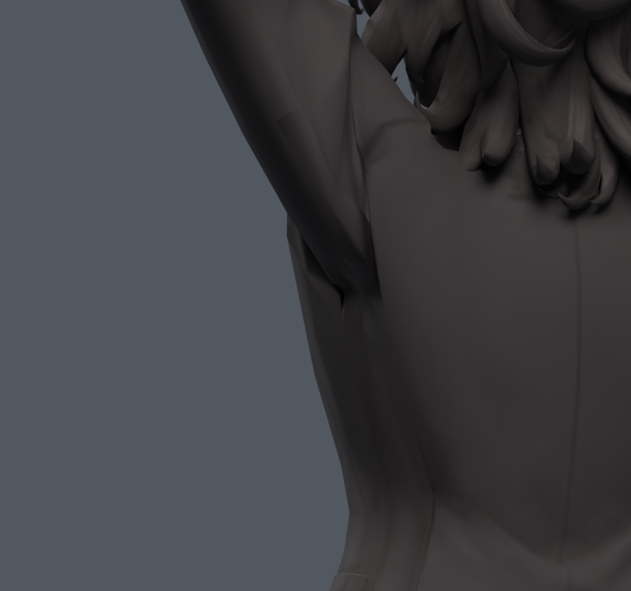
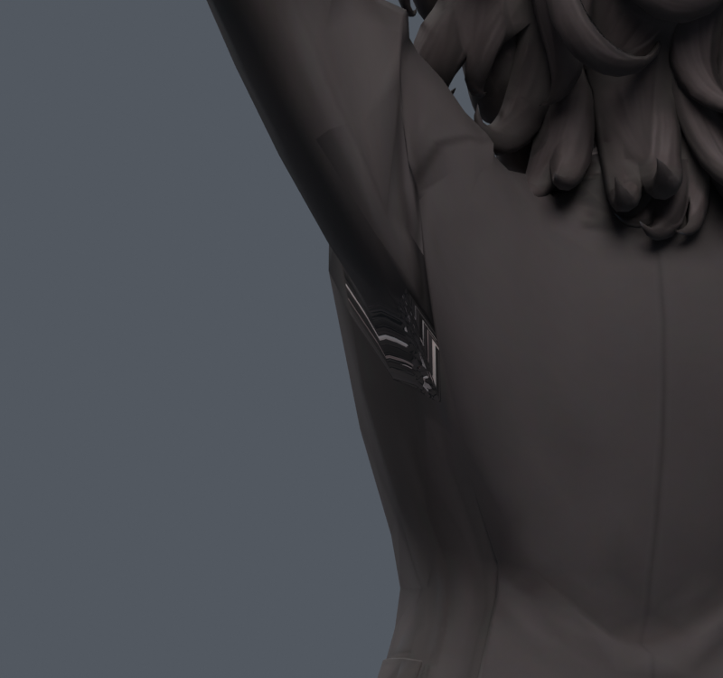

> **기록 시점 안내:** 아래는 해당 단계 당시의 보고서입니다. 후속 결정은 [최신 상태](../../STATUS.md)를 기준으로 읽어주세요. 모델·원본 텍스처·검증 원시 데이터는 이 문서 공유본에 포함하지 않습니다.

# v088 — 면 재연결에서 UV 경계를 놓치면 생기는 문제

**새 모델을 만들지 않았고 v086 STRIP도 제외한다.** 해당 12각형의 분할을 330자세에 맞춰 고르는 작업을 시도하던 중, 기존 UV 섬을 가로지르는 문제가 확인됐다. 단순히 최적화 조건을 풀어 강제로 삼각형을 만들지 않았다.

v086에서 정리한 기존 면 9장은 국소 UV 연결상 네 묶음이다. 같은 메시에서 맞닿아 있지만 텍스처 아틀라스에서는 떨어져 있다. 면15390/15391의 공유 정점 UV 차이는 최대 약0.5164다. 합쳐진 12각형의 UV 경계에는 실제 자기 교차도 한 쌍 있다. 따라서 이 경계를 단일 UV 다각형으로 간주한 분할은 성립하지 않았다. 330자세는 v086 검증에서 가져왔으므로 이번 분할 선별에 사용하려던 데이터이며 새 독립 검증 수가 아니다.

이는 **'기존 UV 코너의 값이 같다'와 '새 면에서도 원래 텍스처가 보인다'가 다르다는 실제 사례**다. 컬러 렌더에서 STRIP의 겨드랑이에 아틀라스의 다른 부분을 가로지르는 흰 줄 무늬가 나타났다. 이 문제는 회색 재질 비교에서 드러나지 않았다. v086 문서에도 이 한계를 명시했다.

다음 구조 수정의 조건은 명확하다. 먼저 UV 섬 경계를 보존하는 범위에서 기존 면 흐름을 조정한다. 경계를 반드시 넘어야 하는 경우에는 해당 국소 영역의 UV와 텍스처 재베이크를 함께 다루고, 원본 그림과 중립·동작 컬러 렌더를 비교해야 한다. 기존 아바타 메시의 전체 교체나 리메시는 계속 금지다. 피부·의상 윤곽, 면 변형, 텍스처 표시 중 하나만 좋아진 결과를 최종본에 합치지 않는다.

PATCH/UV_CHARTS/UV_AUDIT에 실제 경계·네 묶음·자기 교차를 기록했다. 최초 분할 탐색은 유효 해가 없어 assertion에서 멈췄고 이후 원인을 분리 진단했다. 새 .blend나 성공한 분할 결과는 없으며, v083을 원본으로 복원했다.
