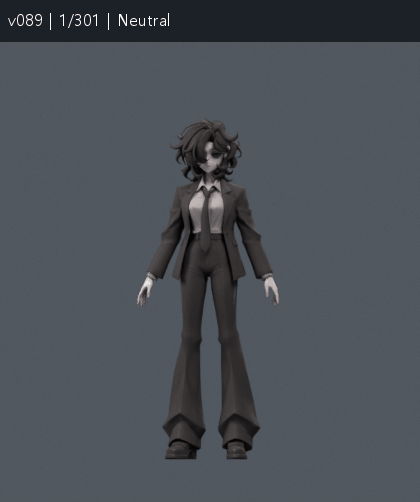
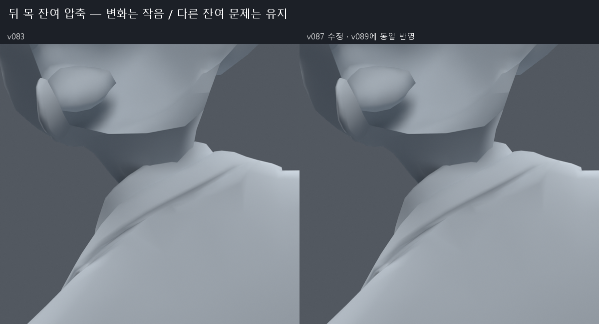
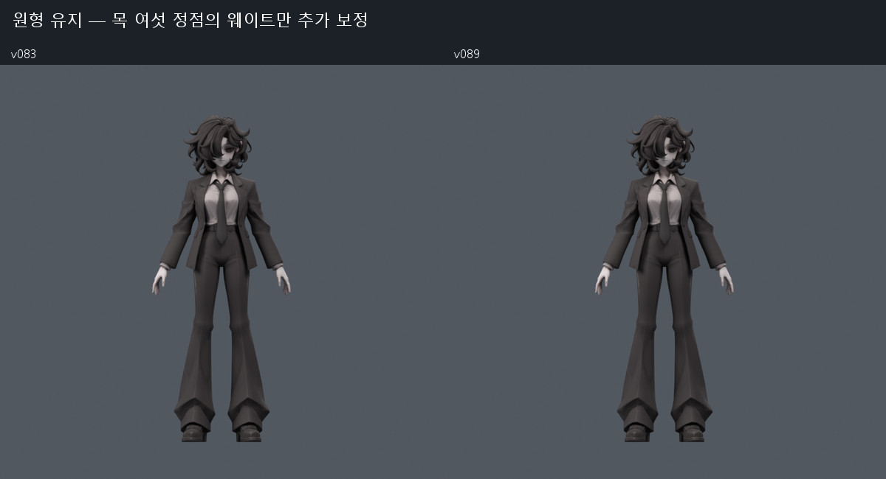
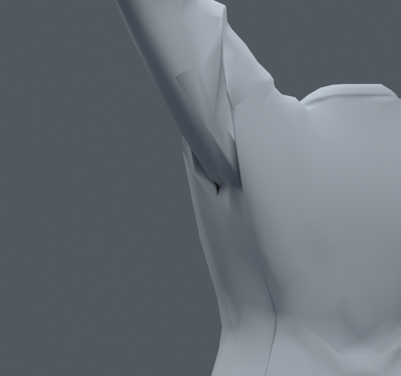

> **기록 시점 안내:** 아래는 해당 단계 당시의 보고서입니다. 후속 결정은 [최신 상태](../../STATUS.md)를 기준으로 읽어주세요. 모델·원본 텍스처·검증 원시 데이터는 이 문서 공유본에 포함하지 않습니다.

# v089 — 이번 연속 개선 시도와 최신 검수 안내

**최신 검수 후보는 v089다. v083에 뒤 목 여섯 정점의 웨이트 보정만 추가했다. 외형 차이는 매우 작으며, 큰 어깨·겨드랑이 홈은 아직 해결되지 않았다.** 원본 디자인과 채택된 v038 SMALL 무릎을 유지한다. 사용자 최종 채택이나 Unity/VRChat 실행 완료를 뜻하지 않는다.

## 어떤 파일을 보면 되는가

| 목적 | 파일 |
|---|---|
| 현재 모델을 직접 확인·후속 편집 | bianca_LOCAL_REFINEMENT_REVIEW.blend (공유본 미포함: `bianca_LOCAL_REFINEMENT_REVIEW.blend`) |
| 팔·손·목·앉기·다리·몸통의 저장 동작 확인 | bianca_LOCAL_REFINEMENT_MOTION_REVIEW.blend (공유본 미포함: `bianca_LOCAL_REFINEMENT_MOTION_REVIEW.blend`) |
| 이번 이전의 손·옷·본 작업 전체 지도 | [v083 종합 안내](../v083_review_delivery/START_HERE.md) |

동작 사본은 24fps, 301프레임, 26개 마커다. 중간값은 선형 보간이며 실제 PhysBone이나 Unity Humanoid 구동 영상은 아니다.

## 이번에 반영한 것

뒤 목의 기존 neck/head 영향만 최대 **0.3%p** 조정했다. 기존 목730자세의 피부 면적 경고는 1→0, 새 목1045자세에서는 2→1이었다. 두 검사에서 새 면적 경고는 0이다. 남은 새 검사 피부 경고는 원래 면9604이며 목 접촉 문제 전체가 사라진 것은 아니다. 자세한 수치와 접촉쌍 변화는 [v087 검증 문서](../v087_neck_residual/REVIEW.md)에 있다.

32773정점/17647면/31363삼각형/102본이다. v083 대비 정점 좌표·면 연결·UV·커스텀 노멀·재질·본·제약·기존 키·드라이버·smooth 설정은 그대로다. 중립 위치 차이는 0이고, 저장된 26마커에서 변경한 여섯 정점 밖의 위치 차이도 0이다. 이 마커들에서 최대 변화는 약0.0513mm였다. 새 메시 생성·교체·리메시는 하지 않았다.

## 무엇을 시도했고 왜 제외했는가

| 단계 | 실제 작업 | 판단 |
|---|---|---|
| [v084](../v084_armhole_flow/REVIEW.md) | 기존 사각면 사이 모서리 2곳을 각각 두 방향으로 회전 | 면 각도 수치는 좋아져도 큰 주름의 시각적 개선 부족. 제외 |
| [v085](../v085_fold_landmarks/REVIEW.md) | 실제 홈을 픽셀→면→정점으로 추적하고 세 꼭짓점 직접 보정 | 각진 작은 면과 변형 경고 증가. 세 사본 제외 |
| [v086](../v086_fold_cleanup/REVIEW.md) | 기존 주름 꼭짓점 하나/세 개 dissolve와 국소 면 정리 | 홈 끝은 일부 줄지만 다른 자세에서 과도한 늘어남. 제외 |
| [v087](../v087_neck_residual/REVIEW.md) | 뒤 목 웨이트의 네 작은 범위 비교 | 0.3%p 후보만 추가 검증 후 v089에 포함 |
| [v088](../v088_fold_tessellation/REVIEW.md) | 국소 다각형 분할과 UV 경계 진단 | 기존 면9장이 UV4묶음. 합친 경계가 자기 교차하고 실제 텍스처 줄무늬 발생. 새 분할을 강행하지 않음 |
| v089 | 선별 보정·저장 동작·전후 비교·보존 검사 | 현재 검수 후보 |

이번에 확인한 핵심은 **면의 연결을 바꿀 때 원래 UV 숫자만 보존해서는 충분하지 않다**는 점이다. 회색 재질에서 덜 파인 것처럼 보여도 실제 텍스처가 망가질 수 있었다. v088에 잘못된 사본의 컬러 비교도 숨기지 않고 남겼다. 실패한 구조를 v089에 합치지 않았다.

## 검증 범위

| 검사 | 결과와 한계 |
|---|---|
| 목730 실제 재검사 | 전체 면적 경고21→20, 피부1→0. 선별에도 사용한 표본 |
| 새 목1045 실제 재검사 | 전체36→35, 피부2→1, 새 면적0. 기본45+독립 난수1000(seed870910) |
| 전신1377 실제 후보 재검사 | 새 면적0·해소0, 무릎 항목 동일, 코트–바지/소매 접촉쌍 변화0. 선별에도 사용한 표본 |
| 저장 동작601 정수/반프레임 | 실제 v083 동작 파일 대비 새 면적0·해소0. 26키 저장/재로드 위치 오차0 |
| 원형·다른 부위 보호 | v083과 전체 기하·UV·노멀·본 일치, 웨이트는 목6정점만 차이. v038/v046/v083 원본 SHA 유지 |

목의 접촉쌍은 기존730에서 새30/해소36, 새1045에서 새44/해소37로 바뀌었다. 면적 경고가 줄었다고 접촉까지 모두 해소됐다고 표현하지 않는다. 같은 동작 명령을 반복한 세트들의 합을 고유 자세 수로 세지 않는다. v089는 v087과 동일한 모델 데이터이므로 목/전신 결과를 동일성 검사에 근거해 이어받으며, v089 이름으로 다시 실행했다고 세지 않는다.

## 주요 동작 위치

| 프레임 | 확인할 부위 |
|---:|---|
| 1 | 중립 원형 |
| 25 / 37 | 옆 팔 올림 / 비틀림 |
| 73 / 85 | 앞 팔 올림 / 비틀림 |
| 121 / 133 / 145 / 157 | 주먹 / 가리키기 / V / 엄지 |
| 169 / 181 | 손목·전완 / 목·몸통 |
| 205 / 217 / 229 | 앉기 / 왼다리 / 오른다리 |
| 241 / 253 | 좌우 몸통 굽힘 |
| 265 | 복합 목 자세 |
| 277 / 289 | 기존 손 잔여 문제 검수 자세 |
| 301 | 중립 복귀 |

## 남은 문제와 다음 수정 조건

큰 어깨 홈·소매의 덩어리 같은 접힘, 손등 음영과 일부 자기 접촉, 새 목 검사 피부1건, 코트 앞허리·다리·옆굽힘 접촉은 남아 있다. 코트·머리카락 물리와 Blender 보조본 제약의 Unity 이전도 완료되지 않았다.

다음 어깨 구조 수정은 **실제 주름 단면과 UV 섬 경계를 함께** 기준으로 삼아야 한다. UV 경계를 넘는 면 재연결이 필요하면 그 국소 영역의 UV·텍스처 재베이크도 함께 검토하고, 기존 메시의 원형·자세별 곡면·컬러 렌더를 모두 비교해야 한다. 목의 남은 면9604는 이번 독립 결과로 보존해 후속 보정 전후 기준으로 사용할 수 있다. 한 자세의 홈이나 경고 숫자만 없애는 수정은 채택하지 않는다.

검수 파일 SHA: `785a345ba8d6785fc46d21e6d1ca68003afbd82b84149892db1512694739ef87`.
동작 파일 SHA: `c058208699dd38d71c623d931722a0143a0d5724c7c23030d5555f0865aa4fa4`.
