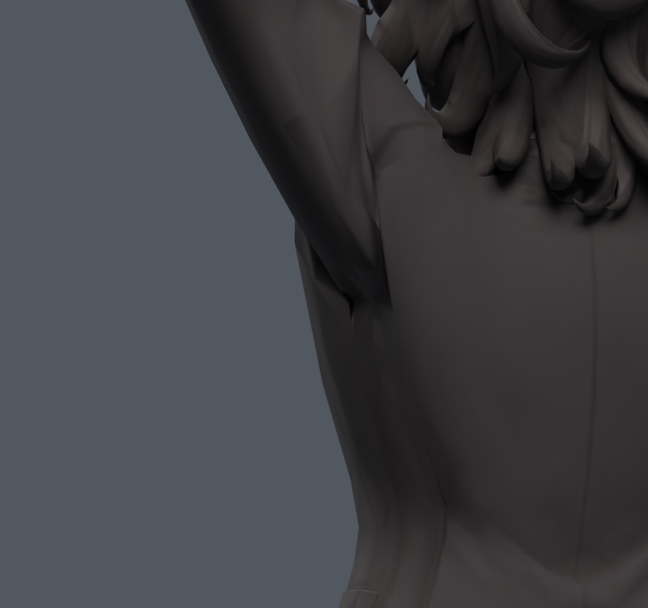
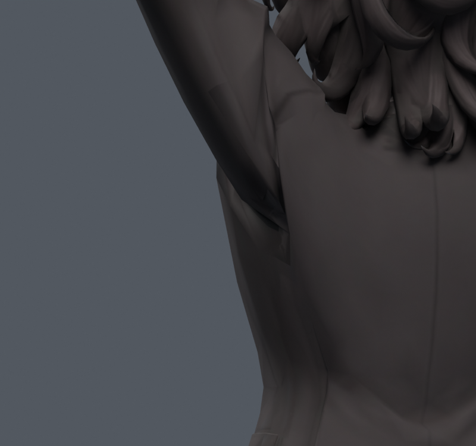

> **기록 시점 안내:** 아래는 해당 단계 당시의 보고서입니다. 후속 결정은 [최신 상태](../../STATUS.md)를 기준으로 읽어주세요. 모델·원본 텍스처·검증 원시 데이터는 이 문서 공유본에 포함하지 않습니다.

# v091 — UV 제약을 분리한 겨드랑이 면 연결

**동작 중 국소 삼각형의 압축·늘어남은 줄었지만, 직접 베이크에 검은 누락이 생겨 이 파일은 검수 후보로 통합하지 않았다.** 흰 줄무늬가 없어졌다는 첫 육안 확인만으로는 부족했다. 실제 저장 이미지 내부를 검사해서 오류를 찾았다.

v089의 기존 주름 꼭짓점 세 개를 제거한 12꼭짓점 경계 안에서, 기존 UV 네 묶음 대신 자기 교차 없는 원형 UV 섬을 만들었다. 경계 정점 좌표와 웨이트는 바꾸지 않았다. 330자세의 삼각형 면적비·모양을 비용으로 삼아 동적 계획법으로 10삼각형의 연결을 골랐다. 새 캐릭터 생성·교체·리메시는 없다. 이 330자세는 **선별 표본**이며 독립 검증이라고 부르지 않는다.

## 실제 저장 파일 검사

| 항목 | v089 기준 | v090 기본 분할 | v091 자세 고려 분할 |
|---|---:|---:|---:|
| 기존330 국소 삼각형 경고 사건 | 40 | 1181 | 8 |
| 새530 국소 삼각형 경고 사건 | 52 | 1782 | 16 |
| 기존330 최대 면적비 | 3.3352 | 12.8125 | 3.0853 |
| 새530 최대 면적비 | 3.3046 | 13.6931 | 3.1036 |
| 기존330 코트 접촉 사건 합 | 26812 | 26294 | 26368 |
| 새530 코트 접촉 사건 합 | 36382 | 35561 | 35718 |

새530은 기본30 반복과 난수500(seed910911)이다. 팔 옆/앞 들기, 좌우/양팔, 비틀기와 가슴·목 복합 회전을 포함한다. 팔 명령값과 실제 관절 월드 각도는 같지 않다. 면적 경고는 중립 대비 0.2배 미만/3배 초과. 기준 16삼각형과 후보 10삼각형이므로 경고 사건을 동일 분모의 개선율로 표현하지 않는다. 접촉쌍의 수·계보가 달라지므로 합계 감소도 관통 깊이 개선을 증명하지 않는다.

실제 저장된 후보를 재로드한 330검사에서 캐시 예측 8건을 재현했다. 330·530 양쪽에서 수정 부위 밖의 원래 면 경고 집합은 기준과 동일했다. 면 연결을 바꾸면서도 좌표와 웨이트, 수정 면 밖 UV/연결/재질 번호/smooth, 본/제약/키/드라이버를 보존했다. 커스텀 노멀은 국소 재계산 및 외부 재인코딩 오차가 있어 전체 동일하다고 하지 않는다.

## 텍스처 오류 발견

직접 베이크는 원형 UV 안쪽 142564픽셀 중 **26381픽셀(약18.5%)이 검정**이었다. 알파는 모두 불투명해서 알파 검사만으로 발견할 수 없었다. 줄무늬가 사라졌어도 검은 삼각형 일부는 베이크 누락이다. 이 이미지를 정상 텍스처로 보고하지 않는다. 후속 v093에서 모델 데이터를 고정하고 투사/색 전달을 비교한다.

## 원형과 한계

남은 정점은 정확히 같아도 연결을 바꾸면 표면은 달라진다. 국소 표면 표본 거리 최대는 원본→후보 1.415mm, 후보→원본 3.646mm다. 원본 16삼각형에3696표본, 후보10삼각형에2310표본을 사용한 근사 검사다. 정확한 최대 거리나 전역 원형 동일성 보장이 아니다.

중립 앞/옆/뒤/반대옆 800×750 렌더에서는 알파 실루엣 차이가 모두0이었다. 이는 해당 카메라·해상도에서 외곽선이 같다는 뜻이며 내부 표면까지 같다는 뜻은 아니다. 큰 어깨·겨드랑이의 각진 주름은 남는다. 손·목·코트 자락의 기존 잔여 문제를 이번 국소 실험으로 해결했다고 하지 않는다.

파일 `bianca_FLOW_REBAKED.blend`, SHA256 `938a517942b13a9a4a9dec201a1f7e61e564aeda13309ff2e6a87ab14d247312`. 32770정점/17648면/31357삼각형/102본. 최대4웨이트, 합 오차1.0431e-7. 추가512텍스처와 재질 슬롯1개. Unity 실행·엔진 삼각형·PhysBone 검증은 이번 실험 범위가 아니다.
