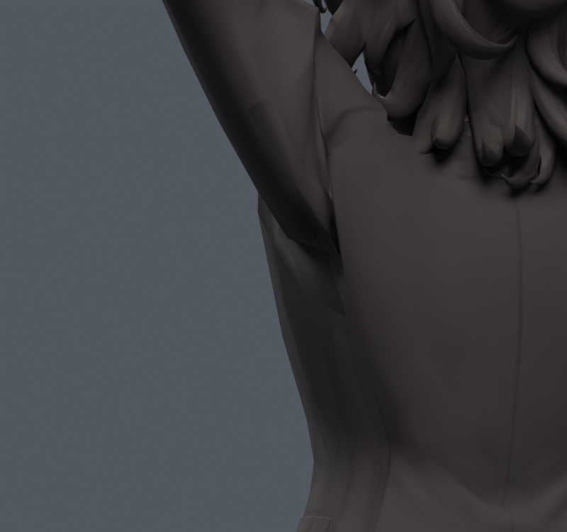
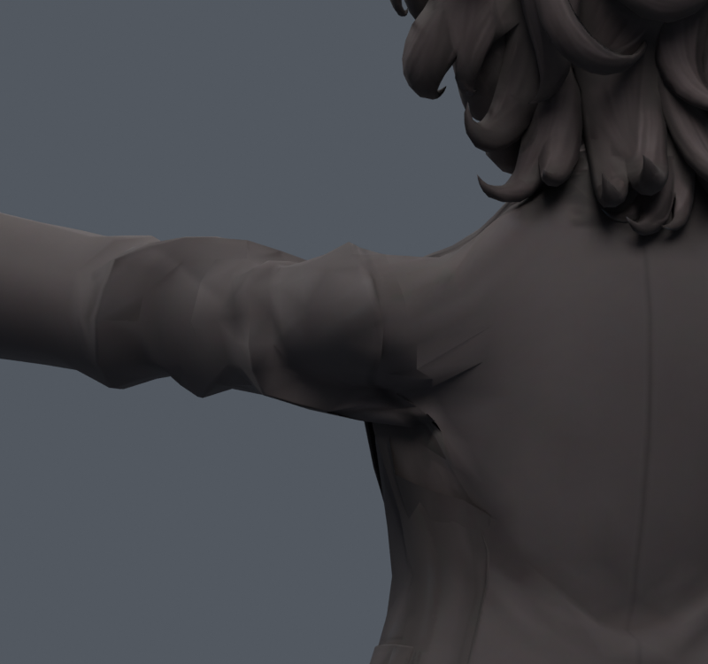

> **기록 시점 안내:** 아래는 해당 단계 당시의 보고서입니다. 후속 결정은 [최신 상태](../../STATUS.md)를 기준으로 읽어주세요. 모델·원본 텍스처·검증 원시 데이터는 이 문서 공유본에 포함하지 않습니다.

# v092 — 경고 최소 분할의 형상 손실 확인

**국소 면적 경고는 가장 적었지만, 중립 표면이 더 멀리 벗어나므로 제외한다.** v091과 같은 12꼭짓점 경계·기존 좌표·웨이트를 두고, 330자세에서 면적 경고 사건 수를 우선 최소화하는 연결을 비교했다. 새 메시 생성이나 정점 추가는 없다.

## 결과

| 검사 | v089 | v091 | v092 |
|---|---:|---:|---:|
| 선별330 국소 경고 사건 | 40 | 8 | 5 |
| 새530 국소 경고 사건 | 52 | 16 | 9 |
| 원본→후보 표면 표본 최대 거리 | — | 1.415mm | 1.397mm |
| 후보→원본 표면 표본 최대 거리 | — | 3.646mm | **6.866mm** |

면적 경고의 기준·표본 구성·기준16/후보10삼각형이라는 차이는 [v091 문서](../v091_patch_flow/REVIEW.md)와 같다. 새530 결과는 같은 seed910911 세트이며, 이전 후보 결과를 이미 본 뒤 수행한 후속 실험이다. 모든 단계가 완전히 독립인 최종 테스트라고 표현하지 않는다.

동적 계획법의 경고 우선 비용에서는 330표본의 경고가 5건 아래로 내려가지 않았다. 이는 이번 고정 경계·좌표·웨이트·UV 대각선 조건에 한정된 계산 결과이며, 모든 토폴로지나 웨이트에서 가능한 최저치가 아니다. 실제 Blender 저장 파일에서도 5건이 재현됐다.

텍스처는 v093의 조사와 연계해 v090에서 누락 없이 구운 동일 경계 UV 이미지를 재사용했다. 내부142564픽셀 검은 누락0, 남은 좌표·웨이트와 수정 밖 UV/면/재질/smooth 보존. 본·제약·키·드라이버 동일, 최대4웨이트, 합 오차1.0431e-7. 따라서 이 그림의 각진 면을 단순한 베이크 빈칸으로 해석해서는 안 된다.

파일 `bianca_GUARD_REBAKED.blend`, SHA256 `21431becb4bce2beb22f3dac0b9a43de9aaccff81001ac0b4fcb21bae4f9c7e5`. 32770정점/17648면/31357삼각형/102본. 세 꼭짓점을 제거한 국소 구조 실험이며 원형 전체 동일성 주장은 하지 않는다. 커스텀 노멀 외부 재인코딩 성분 오차 최대0.000315367도 존재한다.

경고 수 감소보다 원형과 실제 접힘 품질을 우선한다. 이 구조를 v089에 통합하지 않았다. 후속 방향은 경계를 고정한 채 대각선만 계속 바꾸기보다, 남은 암홀 단면과 옷 주름 경계를 실제로 조정할 필요가 있는지 검토하는 것이다. 그 경우에도 기존 메시의 별도 사본에서만 수행하고, 원형 거리·실루엣·색·복합 회전을 함께 검증한다.
