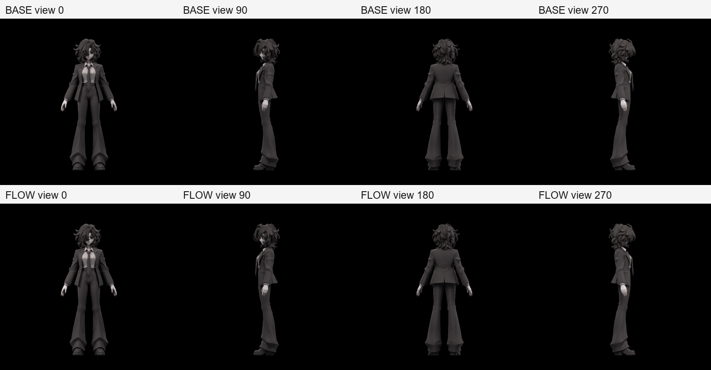
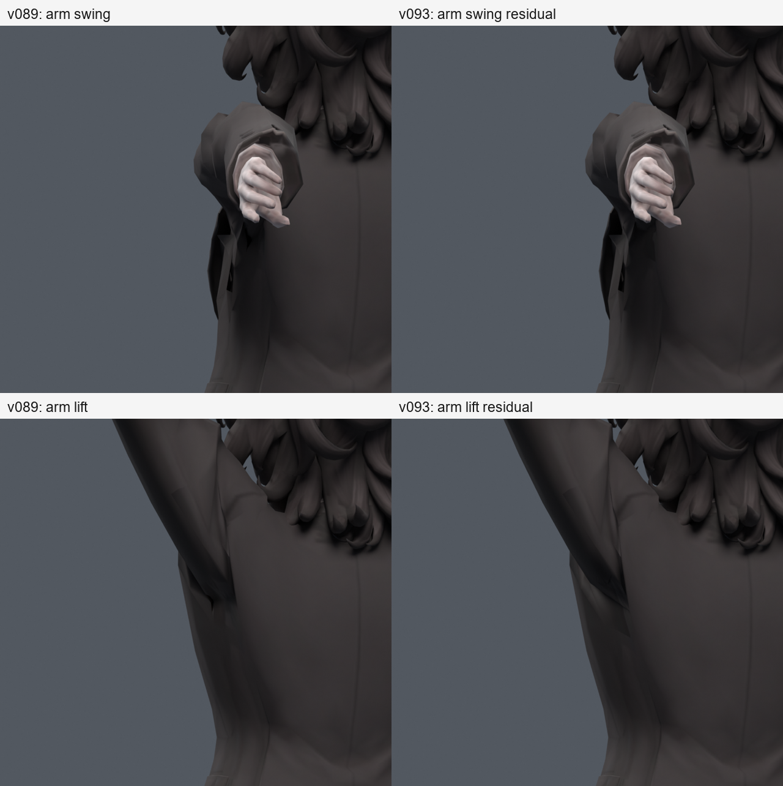

> **기록 시점 안내:** 아래는 해당 단계 당시의 보고서입니다. 후속 결정은 [최신 상태](../../STATUS.md)를 기준으로 읽어주세요. 모델·원본 텍스처·검증 원시 데이터는 이 문서 공유본에 포함하지 않습니다.

# v093 — 형상을 고정한 텍스처 전달과 전신 검증

**흰 줄무늬와 검은 베이크 누락을 해결하는 색 전달 경로는 확보했다. 큰 겨드랑이 주름은 해결되지 않았고 새 국소 변형 경고도 남아, v089에 통합하지 않았다.** 이번 결과는 별도 비교용 사본이다. [파일·그림·전체 작업 안내](START_HERE.md)

## 투사 방식 비교

v091의 좌표·면·웨이트·UV를 동일하게 유지한 상태에서 기존 코트 색을 옮겼다. 새 캐릭터 메시나 새로운 디자인 텍스처 생성은 하지 않았다. 베이크 중 사용하는 source/target/cage는 기존 표면의 임시 사본이며 최종 파일에서는 제거했다.

| 방법 | 원형 UV 내부142564픽셀 중 검은 누락 |
|---|---:|
| v091 기본 extrusion8mm | 26381 |
| extrusion2mm | 28554 |
| extrusion20mm | 24464 |
| 원래 정점 노멀을 사용한 명시 cage8mm | 21859 |
| 같은 cage20mm | 20821 |
| 누락 없이 구운 동일 경계 UV 색 전달 | **0** |

단순히 투사 거리를 늘리는 것으로 해결되지 않았다. 마지막 방법은 v090에서 기존 코트 색을 정상적으로 구운 이미지를 재사용한다. v090과 v091의 패치 경계는 같은 12정점과 같은 UV 좌표다. 이미지 픽셀을 다시 그리거나 보간 가공하지 않고, v091의 국소 재질에 이 기존 이미지를 연결·패킹했다. **v091 대비 모델 fingerprint는 images 외 모두 같고 웨이트도 정확히 같다.**

두 형상의 내부 대각선이 달라 UV 내부와 3D 표면의 대응은 달라질 수 있다. 검은 누락0은 원래 색의 모든 위치가 완벽히 일치한다는 뜻이 아니다. 실제 컬러 렌더에서 경계와 주름을 비교했다. 패치의 각진 면과 음영이 남는 점도 기록한다.

Blender 공식 자료의 UV 설명은 하나의 3D 정점에 여러 face-corner UV가 대응할 수 있음을 구분한다. 따라서 정점 번호나 UV 숫자를 일부 보존하는 것만으로 면 재연결 이후의 색 보존을 보장할 수 없다. 이번에는 일반 Data Transfer modifier를 적용하지 않고 동일 경계 UV를 명시적으로 사용했다. [Blender Data Transfer](https://docs.blender.org/manual/id/5.0/modeling/modifiers/modify/data_transfer.html)

베이크 공식 자료의 Emit·Selected to Active·cage/extrusion·margin을 조사하고 설치된 Blender 5.2.1에서 실제 옵션을 실행했다. 공식 웹 본문 직접 열기는402로 실패했으므로 검색 색인 확인과 실제 실행 증거를 구분한다. 이번에 새 유튜브 영상을 재생해 검증했다고 주장하지 않는다. [Blender Render Baking](https://docs.blender.org/manual/en/latest/render/cycles/baking.html)

## 보존 검사

v093의 텍스처 전달은 v091 형상 그대로다. v089와 비교하면 기존 주름 세 꼭짓점의 dissolve와 국소 면 재연결이 있으므로 전체 기하 동일성은 주장하지 않는다. 32770정점/17648면/31357삼각형/102본, 추가512텍스처·재질 슬롯1개다.

남은 정점 좌표·웨이트, 수정 면 밖 UV·연결·재질 번호·smooth, 본·제약·키·드라이버는 대응 데이터와 같다. 커스텀 노멀에는 국소 재계산과 외부 재인코딩 성분 오차 최대0.000315367이 있다. 국소 표면 표본 거리 최대는 원본→후보1.415mm/후보→원본3.646mm로, 원형이 미세하게라도 바뀐 사실을 숨기지 않는다.

중립800×750 렌더의4방향 알파는 완전히 동일했다. 내부 표면 거리 검사와 별개인, 해당 해상도·카메라의 실루엣 검사다. 얼굴·머리·무릎을 새로 만들거나 형태를 바꾸지 않았다.

## 실제 동작 검증

| 검사 | 결과 |
|---|---|
| 기존330·새530 어깨 복합 자세 | v091과 동일한 형상/W로 결과 상속: 국소 경고40→8,52→16. v093 이름으로 중복 실행했다고 세지 않음 |
| 전신1377 실제 v093 재검사 | 수정 밖 새/해소 면적 경고0/0, 무릎 항목 동일, 코트–바지 변화0 |
| 같은 전신의 수정 패치 | 원래 면 계보15391에 새 경고2, 해소0 |
| 코트–소매 접촉쌍 | 새3/해소3, 모두 수정 면 계보 포함. 수정 밖 변화0 |
| 저장 동작301프레임·24fps | 26마커, 재로드한 마커 정점 오차0 |
| 저장 동작601 정수/반프레임 | 수정 밖 새/해소0/0, 수정 패치 계보 새6/해소19 |

전신 기준은 v089와 모델 데이터가 동일한 v087의 저장 검증 결과를 사용했다. 기준을 이번에 재실행했다고 하지 않는다. 동작은 실제 저장된 v089 motion 파일과 비교했다. 원래 면9장→새10삼각형의 계보는 정확한 면대면 대응이 아니므로 새/해소 계보 수를 전체 품질 점수로 쓰지 않는다. 접촉쌍 교체도 관통 깊이 개선/악화의 직접 증거가 아니다.

전신 새 경고 자세는 `arm_swing_L_90`, `arm_lift_L_120_twist_0`이다. 접촉쌍 교체는 `spine_y_-20`, `chest_y_-20`, `coat_sidebend_R`에서 나타났다. 실제 렌더도 남겼다. 큰 홈과 접힌 면의 각짐이 남아 최종 채택을 보류한다.

## 다음 수정의 기준

경계를 고정한 대각선 변경만으로 해결하려 하면 v092처럼 면적 경고는 줄어도 원형 표면이 더 멀어졌다. 다음 구조 실험은 남은 암홀 주름의 **단면·경계 위치·본별 이동 차이**를 먼저 나란히 확인해야 한다. 필요하면 기존 모서리의 국소 분할과 기존 정점/웨이트 조정으로 지지 구간을 만들되, 별도 사본에서 수행한다. 전체 새 메시·리메시는 하지 않는다.

형상 후보가 달라질 때마다 원형 양방향 표면 거리, 중립4방향, 팔 앞/옆 들기·비틀기·몸통 회전, UV 내부 누락과 실제 컬러 경계를 함께 본다. 이번에 문제가 드러난 두 자세는 앞으로 회귀 검사에 포함한다. 이들을 포함한 뒤에는 독립 테스트라고 부르지 않고 새 난수 세트를 추가해야 한다.

손 잔여 음영/접촉, 목9604, 코트 허리·자락의 기존 문제는 이번 국소 텍스처 작업으로 해결되지 않았다. Unity 보조본 제약 이전·엔진의 실제 삼각형·PhysBone은 여전히 별도 단계다.
