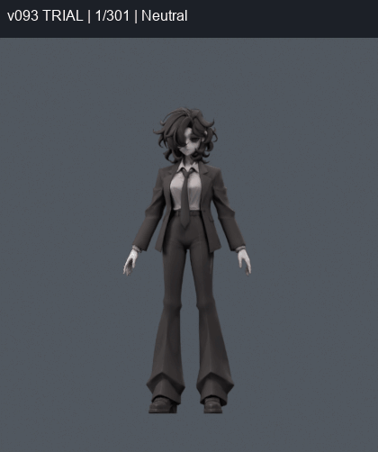

> **기록 시점 안내:** 아래는 해당 단계 당시의 보고서입니다. 후속 결정은 [최신 상태](../../STATUS.md)를 기준으로 읽어주세요. 모델·원본 텍스처·검증 원시 데이터는 이 문서 공유본에 포함하지 않습니다.

# v090–v093 — 이번 텍스처·겨드랑이 후속 작업 안내

**텍스처가 깨지던 원인과 수정 방법은 확인했다. 어깨·겨드랑이의 큰 주름은 아직 해결하지 못해 기준 모델은 v089를 유지한다.** 이번 네 단계는 모두 별도 파일에 보존했다. 새 캐릭터 생성·교체·리메시는 하지 않았다.

## 바로 확인할 파일

| 목적 | 파일 |
|---|---|
| 이번 색 전달과 국소 면 연결을 직접 비교 | bianca_TEXTURE_PATCH_TRIAL.blend (공유본 미포함: `bianca_TEXTURE_PATCH_TRIAL.blend`) |
| 같은 사본의 팔·손·목·몸통·다리 동작 | bianca_TEXTURE_PATCH_MOTION_TRIAL.blend (공유본 미포함: `bianca_TEXTURE_PATCH_MOTION_TRIAL.blend`) |
| 계속 유지하는 기준과 이전 작업 전체 | [v089 종합 안내](../v089_review_delivery/START_HERE.md) |
| 이번 검증 수치·실패 원인·다음 수정 기준 | [v093 상세 기록](REVIEW.md) |

두 TRIAL 파일은 **미채택 비교용**이다. motion은24fps·301프레임·26마커이며 실제 Unity/VRChat 실행이나 물리 시뮬레이션이 아니다. Blender 타임라인에서1중립,25옆으로 팔 들기,73앞으로 들기,121주먹,169손목,181목/몸통,205앉기,241/253몸통 기울기 등을 확인할 수 있다.

## 무엇이 달라졌나

| 단계 | 시도 | 판단 |
|---|---|---|
| [v090](../v090_patch_rebake/REVIEW.md) | 기존 코트 색을 새 국소 UV로 재베이크 | 흰 줄무늬 제거. 면 변형이 나빠 형상 제외 |
| [v091](../v091_patch_flow/REVIEW.md) | 자세별 늘어남을 고려한 기존 면 연결 | 경고 감소. 직접 베이크의 검은 누락 발견 |
| [v092](../v092_patch_guard/REVIEW.md) | 경고 수 우선 최소화 | 더 적은 경고에도 표면 변화 최대6.866mm로 제외 |
| [v093](REVIEW.md) | 거리·케이지4방법과 동일 경계 색 전달 비교 | 마지막 방법은 텍스처 내부 누락0. 형상 문제는 남아 비교용 보존 |

왼쪽은 v089, 가운데는 검은 베이크 누락이 있는 v091, 오른쪽은 그 누락을 없앤 v093이다. 오른쪽에도 큰 각진 주름이 남는다. 텍스처 오류와 형상 문제가 함께 있었고, 색 수정만으로 둘 다 해결되지는 않았다.

## 검증 결과를 어떻게 봐야 하나

어깨330자세에서 수정 패치의 과도한 압축·늘어남 사건은40→8, 별도530에서는52→16이었다. 530에는 반복 기본30과 새 난수500이 포함된다. 기준 패치16삼각형/후보10삼각형이라 동일 분모의 성공률로 환산하지 않는다.

전신1377검사에서 무릎 결과와 수정 부위 밖 경고는 같았다. 하지만 수정 부위에 새 계보 경고2건이 생겼고, 저장 동작601표본에서도 새6/해소19건이 있었다. 검사 수를 더해 모두 서로 다른 고유 자세라고 하지 않는다. 잔여 주름을 포함해 **품질 합격으로 선별하지 않은 이유**를 상세 기록에 남겼다.

v093 색 수정 자체는 v091의 형상·웨이트를 그대로 유지한다. 다만 v089 대비 국소 면 연결 실험이 들어 있으므로 전체 원형 동일성은 아니다. 중립4방향 외곽선은 렌더상 같지만 국소 표면 표본 거리는 최대3.646mm 달랐다. 기존 기준 파일을 덮어쓰지 않았다.

다음은 고정된12점 경계의 대각선만 반복하기보다 남은 암홀 단면과 경계의 움직임을 확인하고, 필요한 기존 면/정점만 별도 사본에서 조정하는 방향이다. 손·목·옷자락 잔여, Unity 통합과 PhysBone은 계속 남아 있다.
