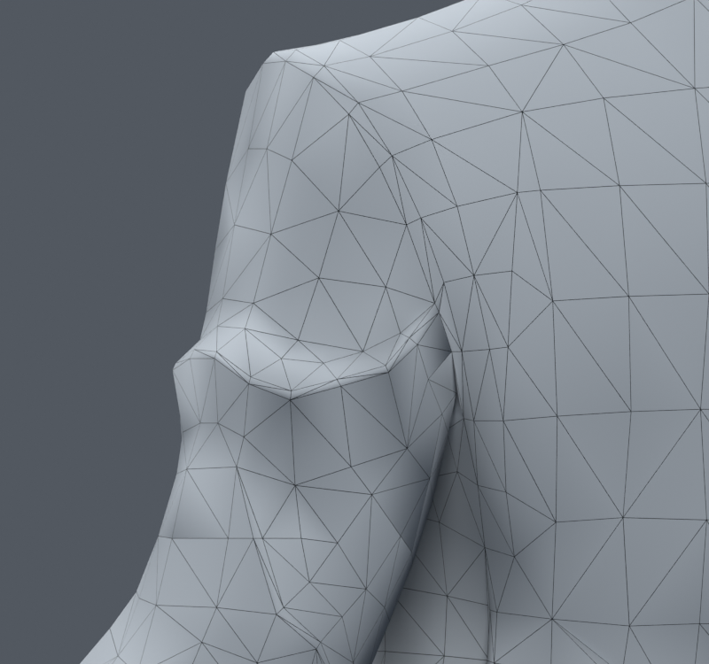
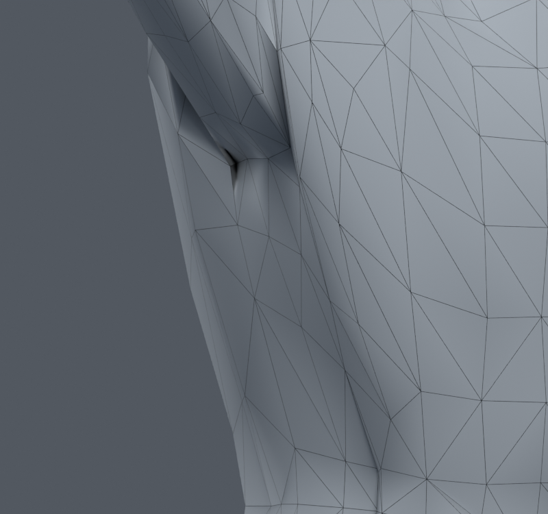

> **기록 시점 안내:** 아래는 해당 단계 당시의 보고서입니다. 후속 결정은 [최신 상태](../../STATUS.md)를 기준으로 읽어주세요. 모델·원본 텍스처·검증 원시 데이터는 이 문서 공유본에 포함하지 않습니다.

# v094 — 어깨·겨드랑이 변형 재조사와 수정 설계

작성 2026-09-10. **수정 실험 전에 작성한 조사·계획 문서**다. 기준은 v089이며 후속 실험 결과는 별도 버전에 기록한다. PC Unity/VRChat용 기존 아바타의 원형을 지키면서 문제를 줄이는 것이 목적이다. 새 캐릭터 생성·교체·리메시는 하지 않는다.

## 1. 판단 요약

현재 깊은 겨드랑이 홈에는 세 요인이 함께 있다. 중립 상태부터 존재하는 좁고 각진 옷 주름, 그 단면에서 크게 오르내리는 본 웨이트, 팔을 크게 올렸을 때의 피부 변형 방식이다. **면 수가 부족해서 생긴 문제 하나로 단정할 근거는 없다.** v090–93의 국소 면 연결 변경은 UV 경로를 확보했지만 큰 홈을 해결하지 못했고 일부 자세에서 새 경고를 만들었다.

다음 순서는 기존 주름의 단면별 웨이트를 일관되게 만드는 제한 실험이다. 기본 웨이트 수정으로 해결되지 않는 잔여 형상에는 방향별 포즈 보정이 유력하다. 다만 Blender의 드라이버가 VRChat에서 그대로 실행된다는 가정은 하지 않는다. 정적 외관, 여러 회전 방향, 원형 보존, 런타임 구현 가능성을 각각 확인한다.

## 2. 자료별 확인 내용과 우리 모델에의 적용

| 자료 | 확인한 사실 | 적용 판단과 한계 |
|---|---|---|
| [Jonathan Williamson — shoulder topology](https://blender.stackexchange.com/questions/415/what-is-the-ideal-topology-for-a-shoulder-joint) | 삼각근의 흐름을 따르는 어깨 연결, 앞뒤 세로 흐름과 팔의 가로 흐름을 설명한다. 모양에 따라 구체적 구성이 달라진다. | 단순히 사각형/삼각형을 고르는 문제보다 회전축 주위 면 흐름이 중요하다. 인체 설명을 정장 코트의 주름에 그대로 복사할 수는 없다. |
| [Dikko — Biped Topology Example](https://dikko.gumroad.com/l/Mtgoa) | 저자가 변형 애니메이션을 포함한 토폴로지 참고 모델과 관련 강의를 제공한다. | 정적인 와이어 모양만 보지 말고 움직임으로 검수해야 한다는 비교 방향에 사용한다. 배포 blend를 내려받아 검사한 것은 아니다. |
| [Dikko — body retopology walkthrough](https://www.blendernation.com/2025/04/11/learn-body-retopology-the-right-way-with-this-comprehensive-walkthrough/) | 저자가 신체 부위별 리토폴로지 강의를 소개한다. | 참고 학습 경로다. 이 글 자체가 현재 모델의 특정 9개 정점 수정값을 뒷받침하지 않는다. |
| [CGDive — Improve Deformations with Shapekeys](https://www.youtube.com/watch?v=7fHpWhM4rtc) | 팔꿈치·무릎·어깨 보정과 드라이버 곡선을 다루며 실제 어깨 보정 장면을 확인했다. | 기본 웨이트 이후 남는 포즈별 형태를 따로 수정하는 사례다. 우리 모델에 동일한 보정량·축을 복사할 근거는 없다. |
| [Blender Studio — Clothing Shapes](https://studio.blender.org/training/realistic-human-research/clothing-shapes/) | 재킷과 바지의 자세별 형상을 따로 다룬다. 팔 들기, 앞뒤 이동, 비틀기와 팔꿈치·무릎 굽힘을 분리한다. | 코트를 피부처럼 한 방향으로만 보정해서는 부족하다. 혼합 자세와 낮춘 팔도 별도 검수한다. 원작도 모든 혼합 자세를 커버하는 완전한 해법은 아니다. |
| [Blender Studio — Rigging workflow](https://studio.blender.org/tools/pipeline-overview/rigging) | 절차적 제어 리그 위에 수동 웨이트와 보정 형태 작업을 수행한다. | 본을 늘리는 것만으로 표면 품질이 자동 완성되지 않는다. 현재 102본에서 표면과 웨이트를 먼저 진단하는 근거다. |
| [Blender Studio — Pose Shape Keys](https://studio.blender.org/tools/addons/pose_shape_keys) | 특정 액션·프레임의 변형 결과를 복사해 목표 형태를 조정하고 보정 키에 반영한다. 웨이트가 바뀌면 목표 포즈를 다시 적용할 수 있다. | 기존 메시 사본에서 목표를 만드는 저작 방식은 사용자 허용 범위에 맞는다. 드라이버의 축과 부호, 마스크를 검토해야 하며 Unity 이식은 별도다. |
| [Blender 5.2 — Editing Weight Paint](https://docs.blender.org/manual/en/5.2/sculpt_paint/weight_paint/editing.html) | Smooth는 연결 이웃의 평균 쪽으로 웨이트를 섞는다. 반복을 늘리면 세부 형태에 원치 않는 결과가 날 수 있다. Limit Total은 작은 영향부터 제거한다. | 전체 어깨에 반복 Smooth를 적용하지 않는다. 주름 단면을 명시적으로 선택하고 기존 4본 안에서 합과 변화량을 확인한다. |
| [Texas A&M — Linear Blend Skinning](https://people.engr.tamu.edu/sueda/courses/CSCE450/2023F/assignments/A2/index.html) | LBS는 본 변환 행렬을 정점 웨이트로 가중 평균한다. 회전을 행렬 성분별로 섞는 데서 변형 문제가 생긴다. | 같은 단면의 웨이트 불일치가 추가적인 상대 이동을 만들 수 있다는 아래 수학적 진단의 근거다. DQS를 쓰면 모든 옷 문제가 해결된다는 의미는 아니다. |
| [Permanent Style — Collar and armhole](https://www.permanentstyle.com/2020/10/collar-and-armhole-how-bespoke-craft-enhances-fit.html) | 몸에 맞는 암홀은 팔 움직임에 몸판 전체가 끌려가는 것을 줄인다. 무조건 작은 암홀이 좋은 것은 아니며 너무 조여도 당김과 주름이 생긴다. | 코트 몸판을 전부 팔에 붙이거나 반대로 완전히 고정하는 두 극단을 피한다. 실물 치수를 캐릭터의 목표 치수로 사용하지 않는다. |
| [VRChat — Rotation Constraint](https://creators.vrchat.com/common-components/constraints/vrc-rotation-constraint/) | 가중 회전 원본, 축, 오프셋과 로컬 공간 설정을 제공한다. | 보조본을 이식할 후보 기능이다. 현재 Blender 제약과의 수치적 동등성은 실제 Unity 자세 비교가 필요하다. |
| [VRChat — Allowed Avatar Components](https://creators.vrchat.com/avatars/whitelisted-avatar-components/whitelisted-avatar-components/) | 아바타에서 허용하는 Animator·SkinnedMeshRenderer·VRC 제약 등의 목록을 정한다. | 임의 커스텀 C# 변형기를 최종 아바타 해법으로 전제하지 않는다. Blender 보정 키 제작과 런타임 활성화는 별도 문제다. |

## 3. 영상 학습 지점과 확인 범위

[CGDive 원본 영상](https://www.youtube.com/watch?v=7fHpWhM4rtc)의 공개 설명·챕터를 실제 브라우저에서 확인했다.

| 시점 | 내용 | 현재 작업에서 확인할 항목 |
|---|---|---|
| [0:14](https://www.youtube.com/watch?v=7fHpWhM4rtc&t=14s) | Elbow Fix Shapekey | 접힌 상태의 표면 목표와 기본 형태를 구분하는 구성 |
| [4:26](https://www.youtube.com/watch?v=7fHpWhM4rtc&t=266s) | Elbow Shapekey Driver | 보정 형태와 회전 입력을 연결하는 단계 |
| [7:31](https://www.youtube.com/watch?v=7fHpWhM4rtc&t=451s) | Driver Curves | 시작·중간·최대 회전에서 보정이 켜지는 양 |
| [11:32](https://www.youtube.com/watch?v=7fHpWhM4rtc&t=692s) | Knee Fix Shapekey | 접힘 부피 보정의 학습용 비교. 채택 v038 무릎 수정 지시로 해석하지 않음 |
| [15:09](https://www.youtube.com/watch?v=7fHpWhM4rtc&t=909s) | Shoulder Fix Shapekey | 팔을 올린 어깨의 보정 형태 및 곡선 사용 |

어깨 구간의 A포즈, 팔을 든 캐릭터와 보정/곡선 화면을 표본으로 직접 확인했다. 영상 전체 음성이나 모든 조작을 분석한 것은 아니다. 자막 패널이 내용을 반환하지 않아 전사 기반의 상세 인용은 하지 않았다. 위 시점은 저자 챕터이며 모든 구간의 시청 완료 표시가 아니다. Dikko의 [배포 페이지가 연결한 강의](https://youtu.be/GxMz4HylQfU)는 추가 학습 링크로 남긴다. 외부 영상·모델을 작업물에 재배포하지 않는다.

## 4. 현재 모델에서 직접 확인한 사실

검사 파일은 `v089_review_delivery/bianca_LOCAL_REFINEMENT_REVIEW.blend`, SHA256 `785a345ba8d6785fc46d21e6d1ca68003afbd82b84149892db1512694739ef87`이다. 32,773정점·17,647면·31,363삼각형·102본이다. 기존 참고 이미지 `avator_references/ref_char.png`를 실제 열어 정장 실루엣과 옷깃·소매 주름을 비교했다. 이 이미지에는 팔을 높이 든 목표 자세가 없어 그 자세의 정확한 주름은 추론해야 한다.

중립부터 좁은 주름이 있고 팔을 올렸을 때 그 주변이 크게 접힌다. 아래는 그 주름을 가로지르는 세 단면의 **상완.L 웨이트 실측값**이다. raw는 현재 파일의 정점 번호이며 좌우 자동 대칭 적용을 뜻하지 않는다.

| 단면 | 낮은 쪽 bank | 높은 쪽 bank | 주름 peak | 상완 웨이트 순서 |
|---|---:|---:|---:|---|
| A | 24370 | 24361 | 24365 | 23.62% → 44.20% → 28.78% |
| B | 6663 | 28801 | 28802 | 21.53% → 44.13% → 29.95% |
| C | 6662 | 28803 | 6708 | 15.89% → 42.14% → 31.57% |

각 단면의 높이 차는 수 mm이고 가중치는 spine/chest/clavicle.L/upper_arm.L 사이에 분배된다. 그 좁은 거리에서 상완 영향이 약 16~28%p 올라갔다가 다시 낮아진다. 따라서 화면에서 보이는 꼭짓점만 누르는 것과, 단면 전체가 어떻게 움직이는지 조정하는 것은 다른 실험이다. 측정 원본은 내부 `INSPECT.npz`와 `SOURCE.json`에 보관한다.

검사 코드의 side 120은 쇄골 분담과 초기 A포즈가 포함된 명령값이다. 해부학적 상완 외전 120도와 동일하다고 표기하지 않는다.

## 5. 원인 가설: 단면을 가로지르는 변환 차이

LBS 식을 `qᵢ = Σ wᵢⱼ Tⱼ pᵢ`로 쓸 때, 이웃 i/k의 웨이트가 같으면 두 점의 차이는 하나의 공통 가중 행렬로 변환된다. 웨이트가 다르면 본별 변환 차이에 의한 상대 이동 항이 추가된다. 이는 [LBS 공식](https://people.engr.tamu.edu/sueda/courses/CSCE450/2023F/assignments/A2/index.html)을 현재 단면에 적용한 **자체 추론**이며 외부 저자가 이 모델을 진단한 결론이 아니다.

단면의 웨이트를 가까워지게 하면 기존 주름을 새로 조각하지 않고도 과도한 상대 이동을 줄일 가능성이 있다. 그러나 공통 행렬 자체도 부피를 줄일 수 있고 수정 경계에서 새 변형이 생길 수 있다. 따라서 평균 웨이트가 곧 정답이거나 해부학적 관절을 구현한다는 주장은 하지 않는다.

## 6. 이전 시도와 이번 실험의 차이

| 과거 시도 | 확인된 한계 | 이번에 달리 하는 점 |
|---|---|---|
| v085 peak 3점의 위치/웨이트 조절 | 기본 30자세 경고가 113에서 170/229/233으로 증가 | peak만 바꾸지 않고 양 bank와 peak의 단면별 이동 관계를 함께 조정 |
| v074 등 넓은 웨이트 평활화 | 새 압축/접촉과 외관 이득 부족 | 연결 이웃 전체 평균 대신 3개 단면의 명시적 9점에만 제한 |
| v077/84 대각선 변경 | 특정 표본 이득이 다른 회전에서 유지되지 않음 | 이번 첫 실험은 면 연결을 그대로 유지해 같은 원래면으로 비교 |
| v086/90–93 peak dissolve·재분할 | 주름 자체는 남고 표면/UV/접촉 검증 비용 증가 | 정점 좌표·면·UV·노멀·이미지를 모두 보존한 웨이트 수정으로 원인 분리 |
| v071/72 등의 포즈 보정 | 방향 밖·혼합 자세에서 새 경고 | 기본 웨이트 실험 후 남는 형태만 대상으로 삼고, 방향과 보정량의 중간값까지 재검증 |

## 7. 후속 수정 절차 — 실험 전에 확정

1. **v095 단면 웨이트 실험:** v089에서 별도 파일. 각 A/B/C 단면의 기존 4본 웨이트 평균을 구하고 원래값에서 25/50/75/100% 섞는 네 강도를 비교한다. 같은 위치의 연결 중복 정점이 있다면 동일 처리를 검토하고 실제 변경 목록을 저장한다. 평균은 단면 간에 공유하지 않는다.
2. 좌표·면·UV·노멀·본·재질·이미지·키·제약 보존, 웨이트 합/영향 수, 중립 평가 결과를 검사한다. 수정점 밖의 가중치가 바뀌면 제외한다.
3. 기본 30자세로 후보 선별. 원래면 면적비 경고, 기존 대비 새 경고와 해소 경고, 주름 단면의 높이·폭, 앞/옆/중립 컬러를 함께 확인한다. 면적비 경고 감소만으로 채택하지 않는다.
4. 개선 후보는 넓은 회전/몸통 혼합 표본과 새 난수 표본에서 실제 Blender 변형 후 다시 검사한다. 전신 및 저장 동작으로 확장하고, 원래면 접촉쌍 변화도 기록한다. 단순 raw 총합 감소는 관통 깊이 개선 증거가 아니다.
5. 단면 평균이 실패하면 실패 지점을 문서화하고 더 제한된 bank 웨이트/주변 전환을 비교한다. 기본 형태를 유지한 상태에서도 큰 홈이 남으면 Pose Shape Keys 방식의 **기존 메시 국소 포즈 목표**를 후속으로 검토한다. Blender에서 가능한 보정과 Unity/VRChat에서 활성화할 방법을 분리한다.

수정 대상은 현재 불량이 확인된 왼쪽 국소 단면이다. 우측에 수치만 복사하지 않으며 우측과 양팔 자세도 회귀 검사한다. v038 SMALL 무릎은 보호한다. 새 파일은 실험/검수 상태를 명시하고 사용자 채택으로 간주하지 않는다.

## 8. 잔여 부위에 적용할 원칙

| 부위 | 먼저 분리할 원인 | 검증할 동작 |
|---|---|---|
| 어깨·겨드랑이·소매 | 기존 주름, 단면 웨이트, 쇄골/상완 분담, 혼합 회전 | 팔 옆/앞/내림, 비틀기, 몸통 굽힘 동시 적용 |
| 팔꿈치·손목 | 압축면과 늘어나는 면, 비틀기 분배, 소매 간섭 | 굽힘+회내/회외, 손목 굽힘·폄·옆기울임 |
| 손·손가락 | 연결 부위 웨이트, 근위부 회전, 음영과 실제 교차 구분 | 주먹·펴기·벌림·엄지 맞섬, 중간 동작 |
| 목·카라 | 피부와 셔츠/코트의 다른 이동, 뒤 목 잔여면9604 | 좌우 회전+숙임/젖힘, 몸통과 조합 |
| 허리·코트 자락 | 몸판/골반 분담, 바지 접촉, 자락 본 회전 | 앉기·옆굽힘·다리 들기, 이후 런타임 물리 |

PhysBone은 머리카락·자락의 후속 움직임을 위한 단계이며 잘못된 기본 스키닝이나 어깨 주름을 대신 고치는 수단으로 취급하지 않는다. 위 부위들이 이번 조사만으로 해결됐다는 의미는 아니다.

## 9. 승인 판단과 아직 모르는 것

성공 조건은 레퍼런스의 코트 모양을 유지하면서 문제 자세에서 덜 무너지고, 다른 관절과 회전에서 눈에 띄는 새 결함을 만들지 않는 것이다. 중립 기하 동일성은 웨이트 실험의 강한 보존 조건이지만 변형 후 형태 품질까지 보장하지 않는다. 면적 임계값 0.2/3은 오류 탐색 기준이며 물리적 직물 모델이나 관통 깊이 계산이 아니다.

실제 목표 고각도 레퍼런스, 모든 가능한 혼합 자세, Unity 내 최종 삼각분할과 제약 동등성은 아직 확인되지 않았다. 이를 완료 항목으로 쓰지 않는다. 보정 키가 필요하면 어깨 들기/전방/비틀기를 구별하고 중간값을 확인해야 한다. 현재 조사에서 **가장 먼저 실행할 방법은 기존 주름 단면의 웨이트 일관성 실험**으로 확정한다.

## 자료 접근 기록

조사일 2026-09-10. 위 공식 문서·저자 글의 본문 또는 검색으로 반환된 본문을 확인했다. Blender Studio 일부 페이지와 Blender 문서 직접 열기는 응답 제한이 있어 검색 반환 본문을 사용했다. CGDive는 원본 브라우저의 설명·챕터와 어깨 화면 표본을 직접 확인했으며 자막 전사·전체 시청을 주장하지 않는다. 외부 모델 내부 검사나 원본 영상 재배포는 하지 않았다. 수치·우리 모델 이미지·단면 가설은 자체 검사 결과다.
