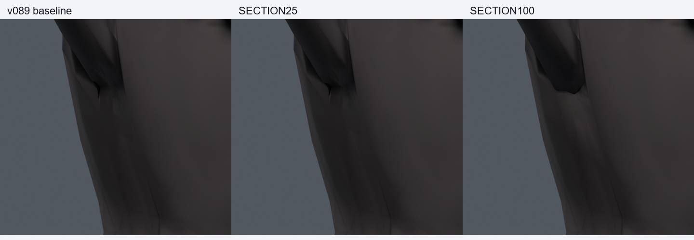

> **기록 시점 안내:** 아래는 해당 단계 당시의 보고서입니다. 후속 결정은 [최신 상태](../../STATUS.md)를 기준으로 읽어주세요. 모델·원본 텍스처·검증 원시 데이터는 이 문서 공유본에 포함하지 않습니다.

# v095 — 단면 전체 웨이트 비교

**모두 미채택. 기준 v089 유지.** v094 조사 문서를 작성·커밋한 뒤 기존 모델 사본에서 수행했다. 세 단면의 bank/peak 총 9정점에 단면 평균 웨이트를 25/50/75/100% 혼합했다.

| 사본 | 새 / 해소 면적 경고 | 새 / 해소 코트 접촉쌍 |
|---|---:|---:|
| SECTION25 | 13 / 2 | 17 / 21 |
| SECTION50 | 40 / 2 | 40 / 39 |
| SECTION75 | 60 / 4 | 65 / 61 |
| SECTION100 | 77 / 3 | 121 / 66 |

기본 30자세에서 실제 Blender 변형 후 삼각분할을 다시 읽어 비교했다. 각 행은 자세별 원래면 또는 원래면 쌍 사건의 합이다. 면적비 0.2 미만/3 초과를 탐색 경고로 쓴다. 관통 깊이·천의 물리적 정확성을 뜻하지 않는다. 후보별 삼각분할 대각선이 달라질 가능성은 있지만 기존 원래면 번호·연결은 유지된다.

큰 강도는 날카로운 끝의 모양을 바꾸지만 주변과 다른 회전에서 새 압축/늘어남이 생긴다. 그림 하나에서 끝이 덜 날카로워 보이는 것만으로 개선을 확정하지 않았다. 이 단계는 첫 30자세에서 탈락했으므로 전신1377이나 독립 난수 검증을 통과했다고 하지 않는다.

기존 정점 좌표·모서리·면·UV·노멀·본·재질·이미지 등 fingerprint는 정확히 동일하다. 수정 정점 밖 웨이트는 변경하지 않았다. 중립의 평가 좌표 차이는 부동소수점 기준 최대 3.7252903e-09m, 웨이트 최대 변경량은 17.444855%p다. 새 메시·정점·면·본·텍스처0. 파일은 `bianca_<사본명>.blend`, 원시 검사 `CHECK_<사본명>.json`이다.

원형을 다시 만들지 않고 원인을 분리한 실험이다. 평균화가 실패한 결과를 숨기지 않으며, [조사 및 다음 방법](../v094_shoulder_research/RESEARCH.md)의 포즈별 보정 검토로 이어간다.
