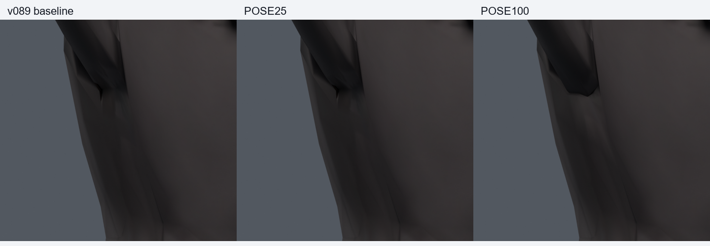
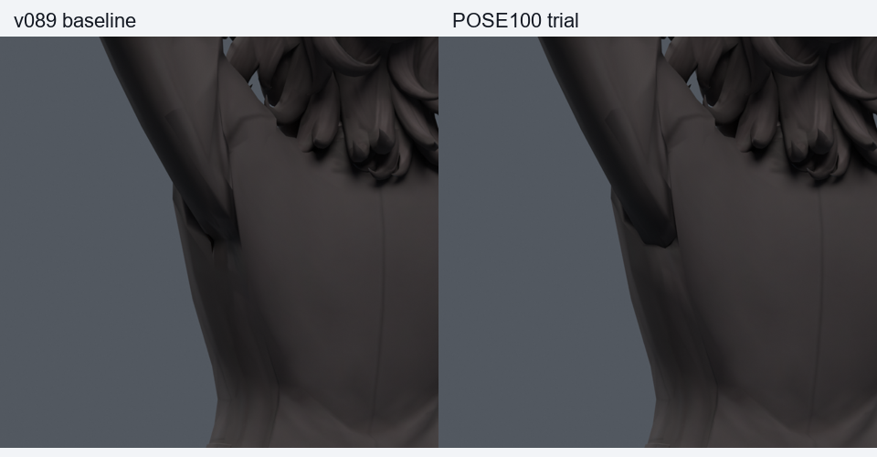
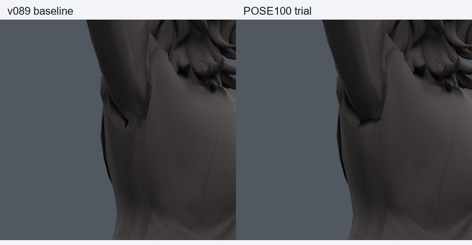

> **기록 시점 안내:** 아래는 해당 단계 당시의 보고서입니다. 후속 결정은 [최신 상태](../../STATUS.md)를 기준으로 읽어주세요. 모델·원본 텍스처·검증 원시 데이터는 이 문서 공유본에 포함하지 않습니다.

# v097 — 국소 포즈 보정 검사

**세 사본 모두 미채택. 기준 v089 유지.** [v094 조사](../v094_shoulder_research/RESEARCH.md)의 포즈 보정 저작 방식을 실제로 시험했다. 기존 40정점의 Shape Key 1개와 Blender 드라이버 1개를 추가했다. 9점 단면 평균의 목표 변위를 기존 연결 두 겹 이웃에 조화 확산하고 바깥을 고정했다. 이것은 튜토리얼 저자가 제공한 목표 형상이 아니라 이번 모델에서 만든 실험 목표다.

기존 rest 좌표·연결·UV·노멀·본·재질·이미지·웨이트는 정확히 동일하다. 중립 키0, 목표 키1이며 저장 후 재로드해 재확인했다. 목표 재현 오차는 최대 6.67e-8m다. 목표 자세 이동은 25/50/100% 순으로 5.198/10.396/20.791mm다. 큰 강도는 작은 수정으로 표현할 수 없으며 별도 사본에만 보관했다. 새 메시·정점·면·본·텍스처는 없다.

## 혼합 회전 검사

기본30 + 난수170(seed970910), 총200자세를 각 후보에서 실제 평가했다. 같은 파일에서 드라이버를 끄고 켜 비교했으며 실제 보정이 동작한 자세는96개다. 상완/쇄골 방향·비틀기, 팔꿈치, 몸통 회전을 포함한다. 이 세 후보의 비교 표본이며 별도의 최종 독립 검증으로 표현하지 않는다.

| 사본 | 새 / 해소 면적 경고 | 새 / 해소 코트 접촉쌍 |
|---|---:|---:|
| POSE25 | 70 / 36 | 7 / 2 |
| POSE50 | 152 / 50 | 19 / 8 |
| POSE100 | 291 / 64 | 71 / 10 |

위 실패 예시는 `new_88`이고 새 경고 원래면은 [3255, 3265, 12692, 12693, 15328, 15329, 15338, 15340, 15353, 15357, 15360, 15388, 15392, 15394, 15396, 15398]다. 면적비 경고와 접촉쌍은 기하 문제를 찾는 지표이며 육안 품질이나 관통 깊이와 동일하지 않다. 끝을 둥글게 만드는 변화는 보이나 큰 겨드랑이 함몰을 해결하지 못한다. 기본 200자세에서 회귀가 이미 확인돼 이 후보들을 전신1377/저장동작601로 승격하지 않았다.

## 무엇을 알게 됐는가

드라이버가 목표에서 켜지고 중립에서 꺼지는 구현은 작동했다. 그러나 **단면 평균에서 얻은 목표 형태 자체가 적절하지 않았다.** 포즈 보정이라는 제작 방식이 틀렸다는 결론도, 본을 더 늘려야 한다는 결론도 이 실험에서 나오지 않는다. v095·96에서 실패한 웨이트 목표를 자세별로 제한하는 것만으로는 충분하지 않았다.

후속은 이 평균 목표의 강도나 드라이버 반경을 반복 조절하기보다, 팔을 든 상태의 소매 뿌리와 몸판이 이루어야 할 곡면을 직접 설계하는 작업이다. 실제 코트의 암홀과 삼각근 주변 흐름을 구분하고, 원래 주름의 bank/peak를 목표 곡면 위에서 함께 조정해야 한다. 필요한 기존 면 분할은 국소 범위로 제한하고 같은 자세에서 색·UV·원형 거리까지 다시 확인한다. 최종 목표 자세를 만든 뒤 중간 자세와 비틀기를 시험한다.

Unity/VRChat에서 이 Blender quaternion 드라이버가 자동 실행되지는 않는다. 현재 파일은 저작 실험이며 런타임 구현·최종 채택이 아니다. 검증 JSON·구현 코드·사본은 작업 저장소에 보관하고 공유 저장소에는 본 문서와 자체 비교 그림만 포함한다.
