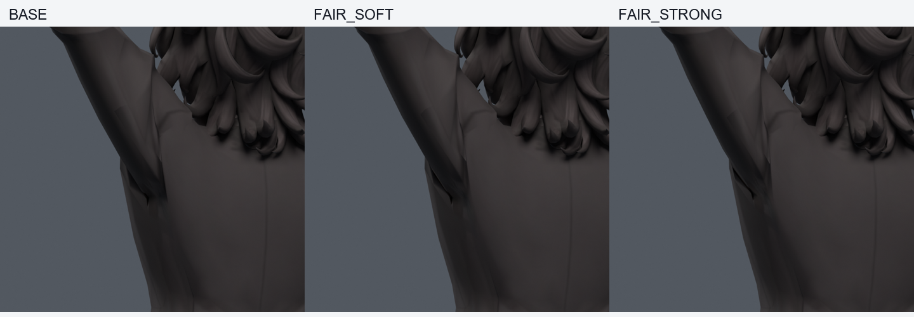
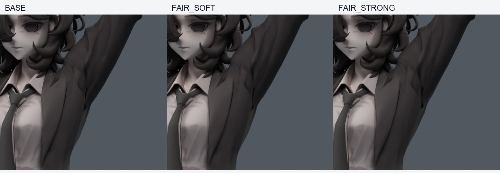

> **기록 시점 안내:** 아래는 해당 단계 당시의 보고서입니다. 후속 결정은 [최신 상태](../../STATUS.md)를 기준으로 읽어주세요. 모델·원본 텍스처·검증 원시 데이터는 이 문서 공유본에 포함하지 않습니다.

# v098 — 주름 끝에서 소매 뿌리 전체로 수정 범위 변경

**별도 목표 사본, 아직 미채택.** v089의 실제 팔 올림 표면을 ray 검사해 최근 수정이 아래쪽 주름 끝에 집중됐음을 확인했다. 위쪽 긴 함몰까지 포함한 기존54정점을 대상으로, 바깥 고정·위치 유지 벌점·안쪽 수축 성분 제거를 적용한 포즈 곡면 목표 세 개를 만들었다. 단면 웨이트 평균에서 목표를 가져오지 않는다.

긴 꺾임이 완화되는 변화는 있지만 새로운 면 압축이 남는다. 강/중/약 최대 변위8.000/6.286/4.247mm, 목표 재현오차8.29e-8m 이하. 기존 기하·면·UV·노멀·본·이미지·웨이트 fingerprint 보존, 새 메시/정점/면/본0. 기존 Shape Key1개와 Blender 드라이버1개만 사본에 추가했다.

## 실제 200자세 검사

30기본+170혼합 난수(seed980910), 보정 활성105자세. 같은 파일에서 키 off/on을 실제 평가했다. 면적비0.2미만/3초과 원래면과 코트 접촉쌍의 자세별 사건이다.

| 목표 | 새 / 해소 면적 경고 | 새 / 해소 접촉쌍 |
|---|---:|---:|
| FAIR_STRONG | 206 / 81 | 3 / 18 |
| FAIR_MEDIUM | 173 / 81 | 3 / 16 |
| FAIR_SOFT | 129 / 62 | 4 / 16 |

접촉쌍 감소를 관통 깊이 개선으로 해석하지 않는다. 목표가 유망한 부분과 실패하는 부분을 분리해 [v099 면 제약 계획](../v099_surface_guard/PLAN.md)으로 이어간다. v099는 이200자세를 이제 선별 자료로 사용하므로 후속 독립 검증이라고 다시 세지 않는다. 새 텍스처나 UV 편집은 없다.
