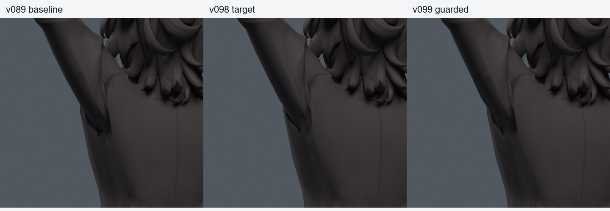
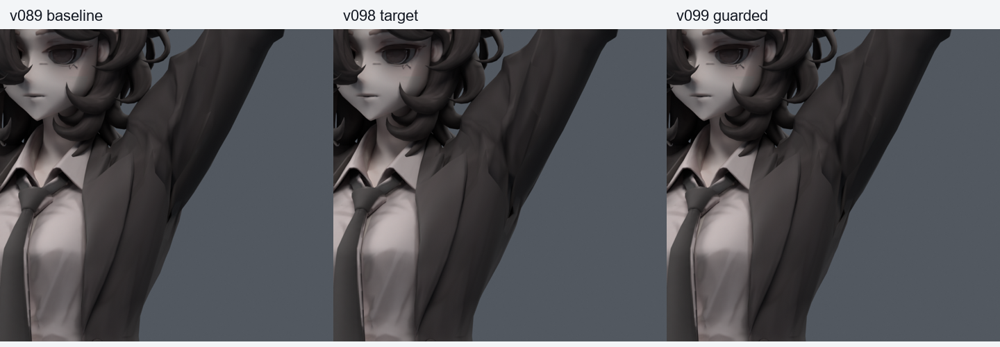

> **기록 시점 안내:** 아래는 해당 단계 당시의 보고서입니다. 후속 결정은 [최신 상태](../../STATUS.md)를 기준으로 읽어주세요. 모델·원본 텍스처·검증 원시 데이터는 이 문서 공유본에 포함하지 않습니다.

# v099 — 복수 자세에서 면을 지키는 표면 보정

**200자세에서는 진전이 있었지만 새530에서 회귀가 남아 최종 미채택.** v098의 기존54정점 목표를 두고, 200혼합+1377전신 명령에서 키가 활성되는135개를 실제 캐시했다. 비활성1442개도 명령 목록에 기록했다. 전체1577을 새로운 독립 검증으로 세지 않는다.

기존 면의 모든 삼각 조합278개를 사용해 사각면 양쪽 대각선을 함께 확인했다. 면적과 방향 벌점을 포함해 목표를 적합하고, 원래 임계값을 통과한 면에는 양의 여유를 두도록 수정했다. 이는 실제 변형 후 삼각분할 검사와 구분하는 보수적 선별이다.

## 결과

STRICT30000 선별 캐시에서 새 삼각형 경고0/해소132, 최대 목표이동5.649mm. 실제 Blender200에서는 새 원래면 경고0/해소50, 코트 접촉 새3/해소16이었다. 강한 표면 평활화만 쓴 v098의 새206보다 줄었다. 더 약한 제약 GUARD30은 실제200 새10/해소47이어서 제외했다.

새 난수500(seed990911)+반복기본30의530 실제 검사는 새 면적19/해소136, 접촉 새6/해소12였다. 200의 새 접촉은 new_19 [15398,15404], new_147 [15338,15398] 및 [15398,15404]다. 접촉 총합이나 면적 사건만으로 깊이·외관 품질을 단정하지 않는다.

최적화 도함수는 유한차분과 최대 상대오차2.25e-10으로 대조했다. 강한 제약 단계는 반복 상한에서 종료했으므로 최적해에 수렴했다고 주장하지 않는다. 최종 후보의 평가값과 실제 검증을 따로 기록했다. 면적 임계값은 계속0.2/3이며 이를 완화해 합격시키지 않았다.

기존 rest 기하/면/UV/노멀/본/재질/이미지/웨이트는 그대로이며 기존 Shape Key의 목표만 바꿨다. 새 메시·정점·면·본0. 실제 키 목표 재현 오차는 BUILD JSON에 기록했다. Blender 드라이버이며 Unity 런타임 검증은 아니다.

새530의 실패 회전과 분리되어야 하는 원래면 쌍을 [v100](../v100_surface_contact/PLAN.md)에 포함해 이어간다. 해당530은 이제 선별 자료이며 이후에는 다른 난수로 확인한다. 기준v089와 보호무릎v038은 유지한다.
