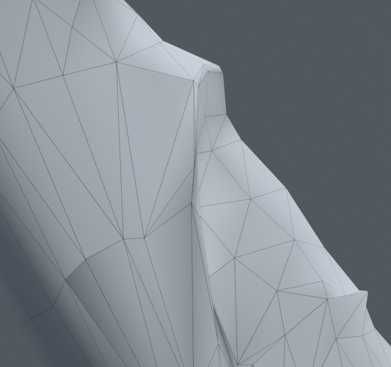

> **기록 시점 안내:** 아래는 해당 단계 당시의 보고서입니다. 후속 결정은 [최신 상태](../../STATUS.md)를 기준으로 읽어주세요. 모델·원본 텍스처·검증 원시 데이터는 이 문서 공유본에 포함하지 않습니다.

# v100 — 왼쪽 표면과 접촉 제약

v099의 새530을 선별 자료로 전환해 총2107명령에서 활성434개를 실제 캐시했다. 기존54정점 포즈 키의 목표만 수정했다. 이미 발견한 코트 접촉쌍의 분리 축으로207개 선형 간격 조건을 추가했다. 목표와 면적·방향·간격 벌점을 함께 적합했다.

CONTACT30000의 선별 삼각 조합에서는 새0/해소446, 최대변위5.602mm다. 반복상한1600에서 종료했으므로 수렴한 최적해라고 하지 않는다. 간격 조건 최대 잔차는0.00002793mm이며 실제 교차 깊이와 다르다.

| 실제 검사 | 새 / 해소 원래면 경고 | 새 / 해소 코트 접촉쌍 |
|---|---:|---:|
| 기존200 | 0 / 47 | 2 / 2 |
| 이전 새530, 현재 선별 | 1 / 132 | 0 / 9 |

200의 새 접촉은 new_39/new_156 [15403,15404]. 530의 새 면은 new_95 원래15415다. 실제 검사에서 사각면 대각선이 바뀌며 baseline1.430/0.700에서 candidate2.174/0.108로 변했다. 이 문제는 수치 오차로 분류하지 않았다. [v103 경계 보호](../v103_bilateral_review/PLAN.md)에서 이 사각면 중 움직이는 한 정점28805의 보정을 고정한다.

별도 `bianca_CONTACT30000.blend`, 미채택. 기존 기하·연결·UV·노멀·본·이미지·웨이트는 그대로다. 새 메시/정점/면/본0, Blender 저작 키이며 Unity 런타임 완료가 아니다. 아직 실행하지 않은 새 난수/전신용 스크립트를 통과 결과로 세지 않는다.
