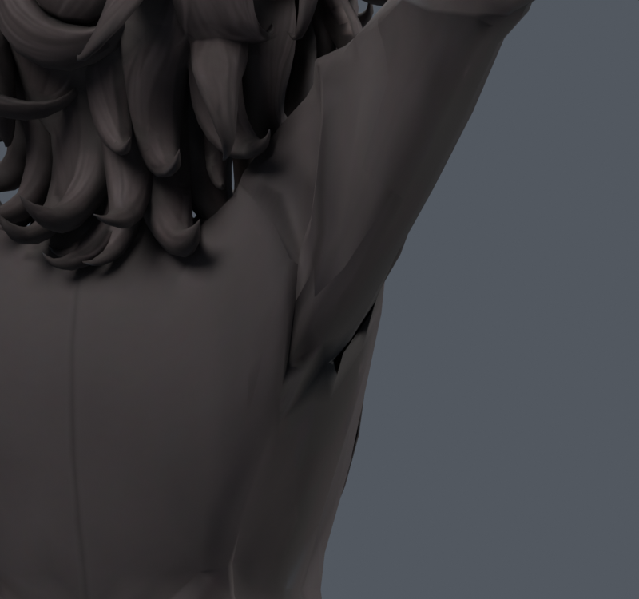

> **기록 시점 안내:** 아래는 해당 단계 당시의 보고서입니다. 후속 결정은 [최신 상태](../../STATUS.md)를 기준으로 읽어주세요. 모델·원본 텍스처·검증 원시 데이터는 이 문서 공유본에 포함하지 않습니다.

# v101 — 오른쪽 소매의 독립 보정

왼쪽의15개 기준 정점에 대응하는 기존 오른쪽 정점을 확인했다. rest 거울 대응 오차는 최대0.0000269mm로 매우 작지만, 기존 면 연결과 실제 변형 결과로 오른쪽 목표를 별도로 계산했다. 기존54정점의 포즈 표면 목표를 만든 뒤2107명령 중 활성434개와 기존 삼각 조합278개에 대해 적합했다.

RIGHT30000은 캐시에서 새 삼각형 경고0/해소545, 최대7.821mm, 평균2.216mm다. 강한 제약 단계는1400회 상한으로 종료하여 최적 수렴 주장 없음. 실제200(30+170seed980910)은 새 원래면0/해소63, 코트 접촉 새3/해소2였다. 이 파일은 최종 미채택이며 v102의 주변 간격 검사로 이어갔다.

기존 rest기하/UV/웨이트/본/재질 보존, 새 메시·정점·면·본0. 왼쪽 수치 변위를 그대로 미러 복사한 결과가 아니다. `bianca_RIGHT30000.blend`는 Blender 포즈 키 사본이며 Unity 런타임/전체 관절 완료가 아니다.
