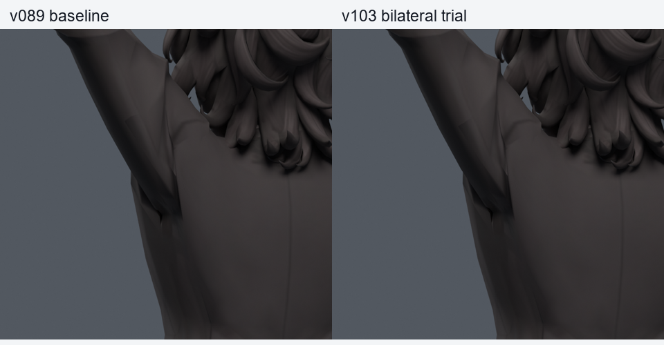
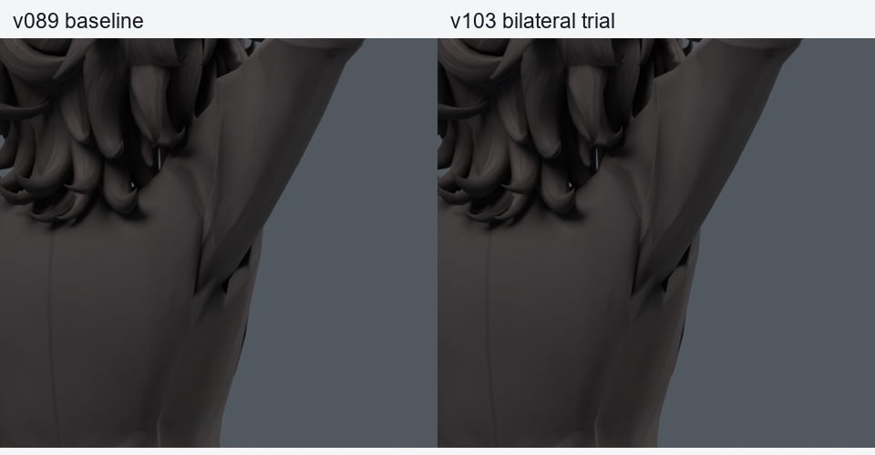
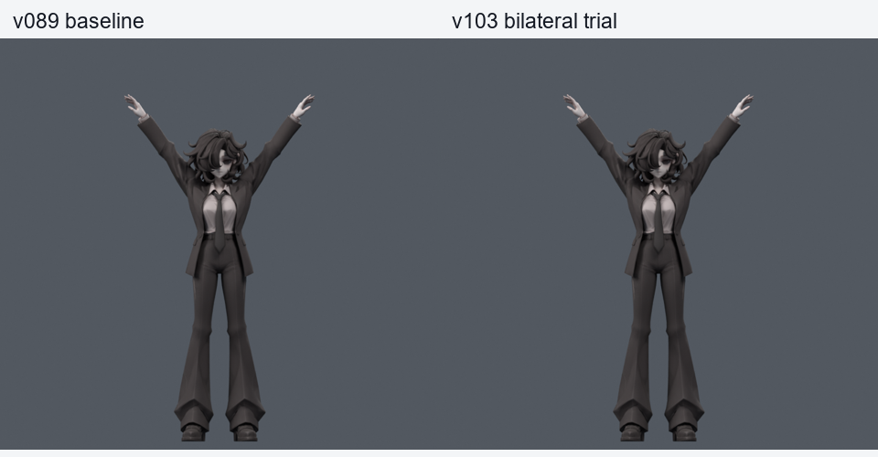
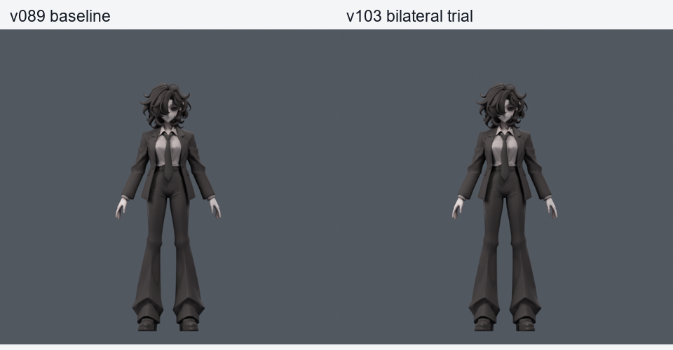

> **기록 시점 안내:** 아래는 해당 단계 당시의 보고서입니다. 후속 결정은 [최신 상태](../../STATUS.md)를 기준으로 읽어주세요. 모델·원본 텍스처·검증 원시 데이터는 이 문서 공유본에 포함하지 않습니다.

# v103 — 양쪽 통합, 경계 사각면과 회전 길이 보정

v102의 좌우 목표를 v089의 두 포즈 키에 합쳤다. 사각면15415의 보정 경계 정점28805와 대응 오른쪽16737을 고정했다. 기존 rest 기하/면/UV/노멀/본/이미지/웨이트는 정확히 동일하며 중립 평가 차이0이다. 새 메시·정점·면·본0. 전체108기준 정점 중 두 점을 고정하여 최대106개 기존 정점이 포즈 보정 대상이다.

드라이버는 quaternion의 길이를 나누고 방향을 비교한다. 속성 길이를0.6배/1.3배로 바꿔도 양쪽 목표 키는1이며, 평가 형상 차이는0/2.67e-7m 이하였다. 중간 애니메이션에서 quaternion 길이가 바뀌는 경우에 대비한 검사다. 전체 동작 검증 완료를 뜻하지는 않는다. 포즈 목표 재현 오차는1.07e-7m.

| 실제 검사 | 새 / 해소 원래면 경고 | 새 / 해소 코트 접촉쌍 |
|---|---:|---:|
| 기존200 | 0 / 78 | 4 / 2 |
| 이전 새530, 현재 선별 | 0 / 235 | 13 / 5 |

사각면의 큰 압축 문제는 이 검사에서 해소됐다. 남은 새 접촉은 모두 오른쪽 [8682,8684], [8648,8684] 조합이다. 영역 바깥 고정 면과의 간격을 [v104](../v104_right_contact/PLAN.md)에 추가해 이어간다. **현재 사본은 미채택이며 기준v089 유지.** 이 두 세트는 선별에 쓰였으므로 최종 독립 통과로 세지 않는다.

파일 `bianca_BILATERAL_CANDIDATE.blend`의 실제 SHA256은 BUILD.json에 기록했다. Blender 드라이버 포함 저작 후보이며 Unity/VRChat 자동 구동 완료가 아니다. 사용자 채택도 아니다.

