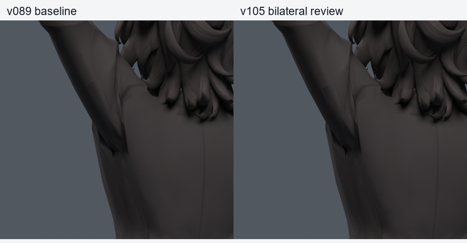
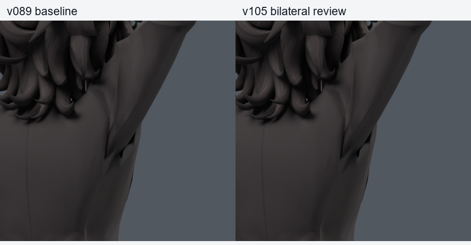
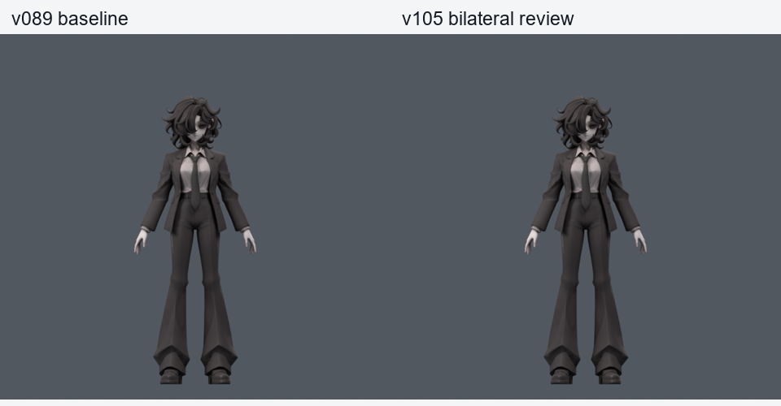

> **기록 시점 안내:** 아래는 해당 단계 당시의 보고서입니다. 후속 결정은 [최신 상태](../../STATUS.md)를 기준으로 읽어주세요. 모델·원본 텍스처·검증 원시 데이터는 이 문서 공유본에 포함하지 않습니다.

# v105 — 양쪽 함몰 완화와 새로운 회전 검사

v102 왼쪽·v104 오른쪽의 포즈 보정을 v089 별도 사본에 합쳤다. 기존 108정점 중 경계 두 점을 고정하여 최대 106점만 보정한다. 원래 기하·면·UV·노멀·본·이미지·웨이트는 정확히 같고, 중립 평가 차이는 0이다. 최대 목표 이동은 왼쪽 5.111mm, 오른쪽 7.570mm다. 기존 캐릭터 메시를 새로 만들거나 교체하지 않았다.

| 실제 Blender 검사 | 새 / 해소 원래면 면적 경고 | 새 / 해소 코트 접촉 |
|---|---:|---:|
| 기존 200, seed980910 | 0 / 75 | 0 / 2 |
| 기존 530, seed990911 | 0 / 232 | 0 / 5 |
| 새 530, seed1050914 | 22 / 192 | 0 / 0 |
| 전신 1,377 | 0 / 0 | 코트–바지·하부코트–소매 변화 0 |
| 저장 동작 601 정수·반프레임 | 0 / 0 | 이 검사는 면적만 측정 |

530은 각각 기본 30자세와 난수 500자세다. 기본 30은 반복 표본이며 독립 530개로 세지 않는다. 전신은 v087 저장 검사와 비교했고 v089와 기초 모델 데이터가 같다. 무릎 좌우의 모든 검사 항목이 정확히 같다. 동작은 같은 26마커·301프레임·24fps의 실제 저장 v089 동작과 비교했다. 마커를 저장·재로드한 위치 오차는 0이었다.

새 경고 22건의 실제 정점·삼각형·전후 비율을 모두 조사했다. 수정된 코트 면의 **늘어남**이며 수치 오차로 제외하지 않았다. 예를 들어 원래면2382는 2.996675에서 3.043255로 늘고, 12707의 한 삼각형은 2.90926에서 3.00930으로 늘었다. 면적비 0.2/3 기준은 그대로 유지했다. v106에서 이미 늘어난 면을 더 늘리지 않는 조건을 넣는다. 이 새530은 이후 선별 자료로 전환한다.

`bianca_BILATERAL_CANDIDATE.blend` SHA256 `9925f7155b1bda8c85d78277b4207ea1810f285e46fa71df51a56deb841be93f`, 동작 `bianca_BILATERAL_MOTION_REVIEW.blend` SHA256 `bff46691d8a1307db8d274d1763ea63a02774465493f86df15a579559b969f23`.

**새 회전에서 늘어남이 남아 최종 선별하지 않은 중간 사본이다.** Blender 쿼터니언 드라이버 두 개를 포함한 저작 결과이며 Unity/VRChat 실행 완료가 아니다. 큰 겨드랑이 홈 전체, 앞으로 팔 들기, 기존 손 음영·목·자락 문제의 해결을 의미하지 않는다. v089와 v038 SMALL 무릎 원본을 보호한다.

같은 카메라의 중립 컬러 600,000픽셀은 전후 완전히 같다. 아래 확대에서는 긴 홈과 위쪽 꺾임이 완화되지만 옷 주름 전체가 사라지는 것은 아니다.

