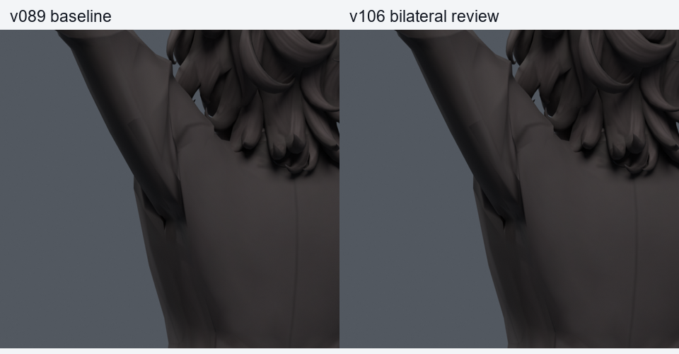
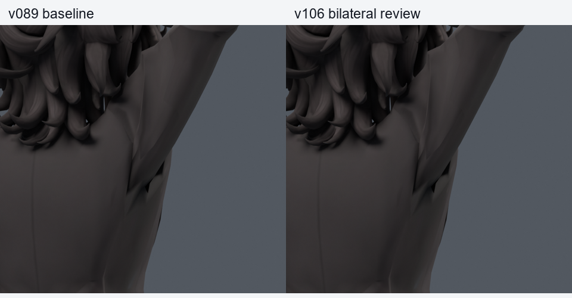
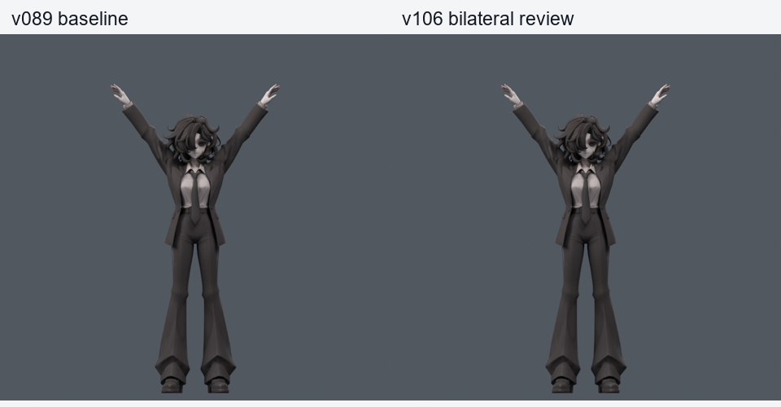
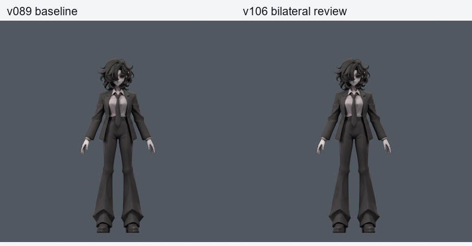
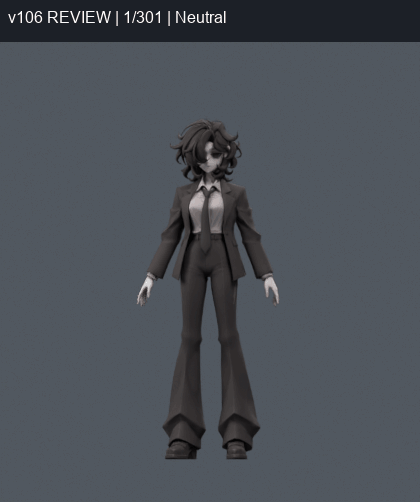

> **기록 시점 안내:** 아래는 해당 단계 당시의 보고서입니다. 후속 결정은 [최신 상태](../../STATUS.md)를 기준으로 읽어주세요. 모델·원본 텍스처·검증 원시 데이터는 이 문서 공유본에 포함하지 않습니다.

# v106 — 늘어남을 제한한 양쪽 소매 보정

v089의 원래 기하·면·UV·노멀·웨이트·본·이미지를 그대로 유지하고, 팔을 옆으로 높이 들었을 때 기존 소매 정점의 위치를 보정한다. 기존108점에서 경계2점을 고정하여 최대106점, 포즈 키2개와 정규화한 회전 드라이버2개다. 새 메시·정점·면·본 생성0. 기존 v038 SMALL 무릎을 유지한다.

왼쪽 최대3.795mm/평균0.742mm, 오른쪽 최대5.599mm/평균0.692mm의 목표 보정이다. 큰 함몰을 완화하지만 옷 주름 전체를 없앤 결과는 아니다. [조건을 바꾼 이유](METHOD.md)에 실제 실패 면·주변 접촉·삼각분할 문제를 기록했다.

## 실제 회전 검사

| 검사 | 보정 활성 자세 | 새 / 해소 원래면 면적 경고 | 새 / 해소 코트 접촉 |
|---|---:|---:|---:|
| 기존 200, seed980910 | 147 | 0 / 33 | 0 / 0 |
| 기존 530, seed990911 | 404 | 0 / 83 | 0 / 0 |
| v105에서 실패했던 530, seed1050914 | 411 | 0 / 78 | 0 / 0 |
| 새 난수 500 + 기본30, seed1060915 | 398 | 0 / 90 | 0 / 0 |

동일 파일에서 보정 키를 끄고 켜서 실제 Blender 최종 삼각형을 검사했다. 면적 경계0.2/3과 비연결 코트 면 접촉 조건을 바꾸지 않았다. 숫자는 자세별 원래면/면쌍 사건이며 고유한 정점 수나 관통 깊이가 아니다. 반복 기본30은 새 독립 표본으로 세지 않는다. 앞의 세 세트는 선별에 사용됐고 seed1060915의 난수500은 그 이후 만든 확인 표본이다.

전신 1377자세: 새 면적 0, 해소 0, 코트–바지 새 0 / 해소 0, 하부코트–소매 새 0 / 해소 0. 좌우 무릎 항목 동일=True. 비교 기준은 v087 저장 검사이며 v089와 기초 모델 데이터가 같다.

저장 동작 301프레임·24fps, 26마커: 정수·반프레임 601표본 새 면적 0 / 해소 0, 마커 저장·재로드 위치 오차 0.0m. 별도 실제 동작 코트 접촉 601표본 새 0 / 해소 0. 모든 연속 회전의 무결함 증명은 아니다.

## 외형·보존 검사

중립 평가 좌표 차이 0.0m, 목표 재현 최대 오차 1.15e-07m. 같은 카메라 중립 컬러 600,000픽셀 중 달라진 픽셀 0. 원래 v038/v046/v083/v089 파일 SHA 대조 통과=True.

## 파일과 한계

시험 입력 `bianca_BILATERAL_CANDIDATE.blend` SHA256 `74a793ac950f40f5accfb57f8ddfca35d0de89ae8ae08bdc82c98cb323511044`. 저장 동작 SHA256 `a7905c1ab7cc80e3823ba440be20c05d34b9eace75926b37da52bfecbaeac95a`. 사용자 검수용 묶음은 [v108 종합 안내](../v108_review_delivery/START_HERE.md)에서 확인한다.

이 결과는 Blender 저작용 보정이다. 앞 들기 v107 시험은 이 파일에 포함하지 않았다. 긴 겨드랑이 홈의 잔여, 앞 들기의 큰 꺾임, 기존 손 음영·목·자락 접촉 및 Unity 제약 이식·보정 자동 활성화·PhysBone은 남는다. 사용자 채택이나 전체 아바타 완성으로 표시하지 않는다.
