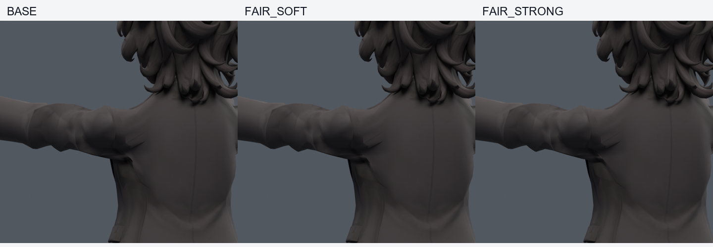
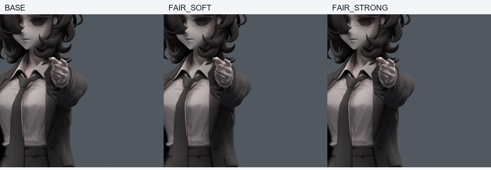
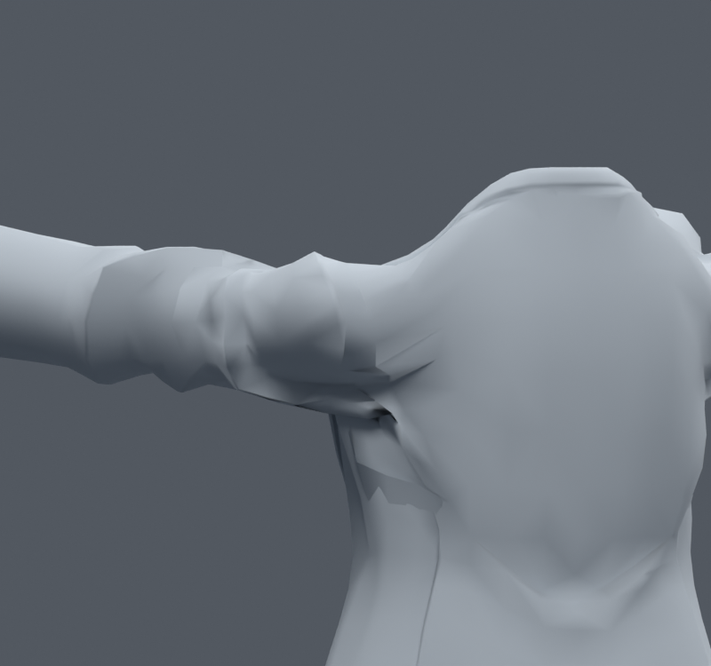

> **기록 시점 안내:** 아래는 해당 단계 당시의 보고서입니다. 후속 결정은 [최신 상태](../../STATUS.md)를 기준으로 읽어주세요. 모델·원본 텍스처·검증 원시 데이터는 이 문서 공유본에 포함하지 않습니다.

# v107 — 앞으로 팔을 들 때의 표면 보정과 음영 분리

**세 보정 사본 모두 미통합.** v089의 기존54정점을 대상으로 앞으로90도 명령에서 강/중/약 목표를 만들었다. 경계점28805는 고정했다. 새 메시·정점·면·본0, 원래 기하·UV·웨이트·본·이미지는 그대로다. 목표 최대이동은8.000/8.000/4.846mm이며 저장 사본의 목표 재현 오차는7.0e-8m 이하다.

앞 들기와 옆 들기 목표의 실제 회전 차이는 상완110.212도, 쇄골34.879도였다. 각 보정 반경은상완45/쇄골15도라 두 방향의 활성 영역이 겹치지 않는다. 단순히 옆 들기 보정을 앞 들기에도 크게 켜는 방식을 쓰지 않았다. 앞 들기 사본의 정규화 쿼터니언 드라이버는245문자다.

## 실제 200자세 결과

앞 들기 부호를 기준 함수와 대조한 seed1071916의 난수170 + 기본30, 보정 활성130자세. 같은 파일의 키 off/on을 실제 평가했다.

| 목표 | 새 / 해소 원래면 면적 경고 | 새 / 해소 코트 접촉 |
|---|---:|---:|
| 강 |58 / 58|340 / 685|
| 중 |56 / 55|275 / 576|
| 약 |53 / 47|182 / 423|

접촉 총합이 줄어도 새로운 접촉이 생겼으므로 통과시키지 않았다. 시각적으로 아래쪽 작은 주름은 완화되지만 위쪽 큰 꺾임은 남았다. 같은54점 목표의 강도만 반복해서 높이는 방식으로 이 문제를 해결했다고 볼 수 없다.

첫 검사 seed1070916은 명령 부호를 확인하니 +X로 뒤로 드는 자세를 만들었다. 활성5/200뿐이라 앞 들기 검증으로 사용하지 않는다. 이 실행 기록을 보존하고 -X로 바로잡은 위 검사로 결론을 냈다. 최초 빌드에서도 실행 변수 이름 충돌로 존재하지 않는 bianca_LEFT.blend를 열려다 실패했으며, 변수를 분리해 세 사본을 모두 다시 저장·검사했다. 실패 실행을 검증 성공으로 세지 않는다.

## 텍스처·커스텀 노멀·날카로운 변 분리

텍스처 없이 단색 재질로 원래 커스텀 노멀과 자동 노멀을 비교했다. 형상 좌표 차이0, 웨이트 동일이다. 두 그림의1674픽셀에서 최대1/255 차이만 나고 큰 홈은 같다. 코트의 sharp 변102개를 임시 해제해도 삼각형 모양의 위쪽 접힘과 깊은 아래 홈이 남았다. 모든 진단은 메모리에서만 실행하고 모델을 저장하지 않았다.

이 결과는 기존 앞 들기 문제가 텍스처나 커스텀 노멀 하나로 설명되지 않음을 보여준다. sharp 해제는 일부 음영을 부드럽게 하지만 큰 접힘 해결로 채택할 이득은 부족했다. 다음 구조 작업은 위쪽 접힘의 실제 면 흐름·경계와 안쪽 겹침을 함께 다뤄야 한다. 이번 원형 보존 검수에는 v106의 옆 들기 보정만 남긴다. 전신/Unity/PhysBone 완료로 표현하지 않는다.
