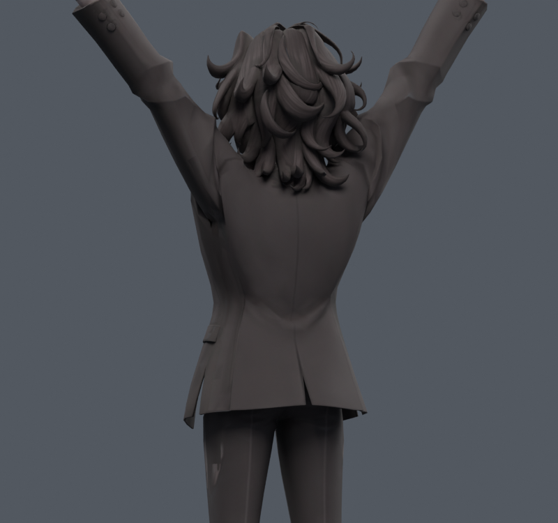
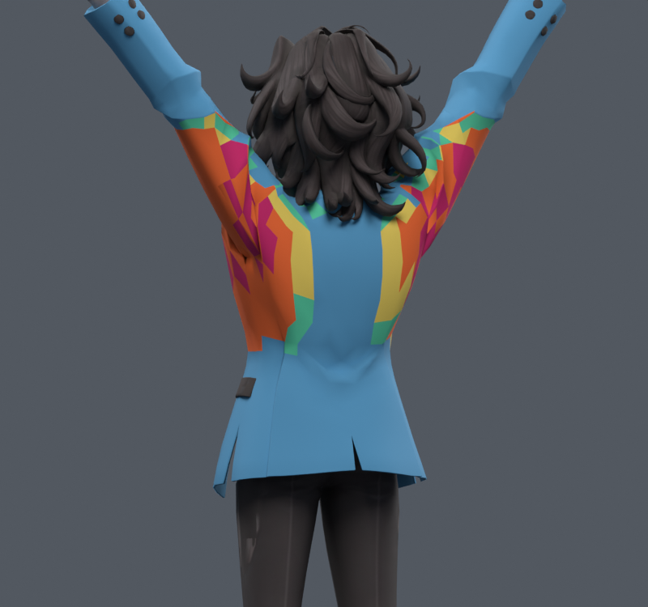
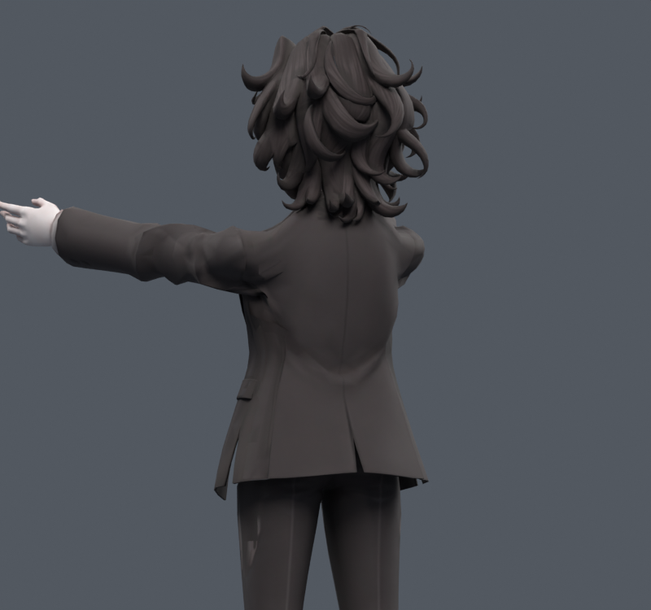
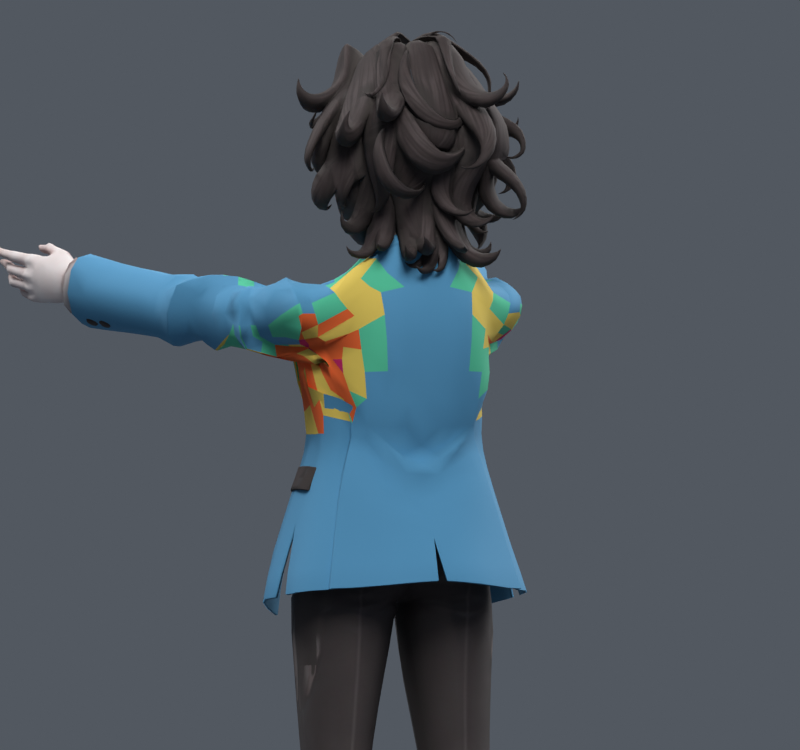

> **기록 시점 안내:** 아래는 해당 단계 당시의 보고서입니다. 후속 결정은 [최신 상태](../../STATUS.md)를 기준으로 읽어주세요. 모델·원본 텍스처·검증 원시 데이터는 이 문서 공유본에 포함하지 않습니다.

# v109 — 코트 전체의 늘어남 진단

**v108의 기존 옷 변형에도 큰 늘어남이 있다. 새 경고 0을 옷 형태 완성으로 해석하면 안 된다.** 실제 Blender에서 22개 자세를 새로 읽었다. 모델은 수정하지 않은 진단 단계다.

[조사·방법·실행 계획](RESEARCH_PLAN.md)

| 자세/명령 | 최대 방향 배율 | 면적가중 상위 95% 배율 | 1.5배 초과 면적 % | 2배 초과 면적 % | 0.5배 미만 눌림 면적 % |
|---|---:|---:|---:|---:|---:|
| neutral | 1.000 | 1.000 | 0.000 | 0.000 | 0.000 |
| side45 | 2.499 | 1.565 | 6.787 | 0.215 | 0.000 |
| side60 | 2.984 | 1.810 | 9.547 | 1.767 | 0.003 |
| side90 | 3.865 | 2.286 | 13.799 | 7.915 | 0.162 |
| side120 | 4.571 | 2.691 | 15.866 | 9.965 | 0.997 |
| side90tw-60 | 4.438 | 2.405 | 14.644 | 8.724 | 0.752 |
| side90tw60 | 4.462 | 2.418 | 14.746 | 8.494 | 0.735 |
| front45 | 2.318 | 1.487 | 4.820 | 0.138 | 0.503 |
| front60 | 2.730 | 1.689 | 7.540 | 0.795 | 1.152 |
| front90 | 3.468 | 2.039 | 10.786 | 5.593 | 2.744 |
| front120 | 4.038 | 2.346 | 13.569 | 7.958 | 4.034 |
| front90tw-60 | 3.967 | 2.046 | 11.406 | 5.649 | 2.249 |
| front90tw60 | 3.889 | 2.022 | 10.582 | 5.191 | 2.596 |
| Return neutral | 1.000 | 1.000 | 0.000 | 0.000 | 0.000 |
| coat_sit_90 | 2.283 | 1.758 | 16.278 | 0.068 | 0.001 |
| coat_leg_L_105 | 3.004 | 1.789 | 9.645 | 1.725 | 0.002 |
| coat_leg_R_105 | 2.736 | 1.789 | 9.229 | 1.695 | 0.008 |
| coat_sidebend_L | 1.946 | 1.261 | 0.578 | 0.000 | 0.631 |
| coat_sidebend_R | 2.039 | 1.275 | 0.804 | 0.035 | 0.533 |
| Back neck compound | 2.345 | 1.466 | 4.370 | 0.503 | 1.177 |
| L_independent_151 | 2.071 | 1.089 | 1.197 | 0.030 | 0.007 |
| L_independent_221 | 1.939 | 1.048 | 0.901 | 0.000 | 0.007 |

분모는 포즈별 실제 삼각분할로 측정한 정지 코트 표면적 약 0.263m²다. 1e-10m² 이하 삼각형은 제외했다. 강체 회전 배율1 및 면적동일 2×/0.5× 검증 PASS. 표의 각도는 작업용 명령이며 해부학적 관절각과 동일하지 않다. 22개 표본을 전체 연속 자세 검증으로 표현하지 않는다.

색 범례: 파랑 ≤1.2, 초록 ≤1.5, 노랑 ≤2, 주황 ≤3, 자주 >3배. 그림은 가독성을 위해 원래 폴리곤 안 삼각형의 최대값을 표시한다. 표는 삼각형별 면적 가중치이므로 그림의 색 면적과 정확히 같지 않다. 표시는 임시 재질이며 모델/텍스처에 저장하지 않았다.

주된 큰 늘어남은 겨드랑이의 작은 홈만이 아니라 소매뿌리에서 옆 몸판으로 이어지는 넓은 구간이다. 앉기에서도 1.5배 초과 구간이 남는다. 레퍼런스의 각진 재킷 주름은 유지하되, 과도한 표면 늘어남을 별도 문제로 다룬다. 다음 [v110 기존 정점 보정 시험](../v110_cloth_metric/REVIEW.md)으로 진행했다.
