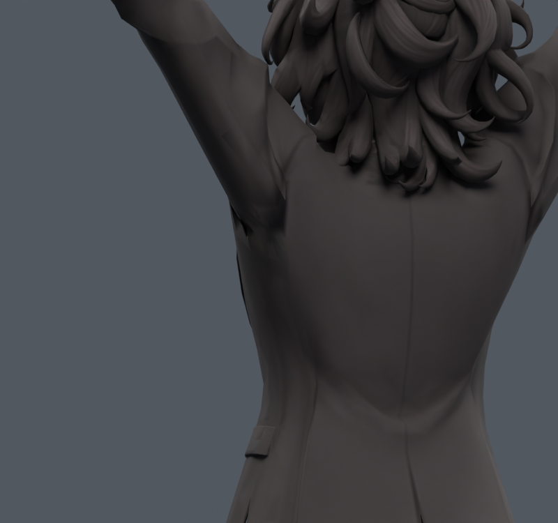
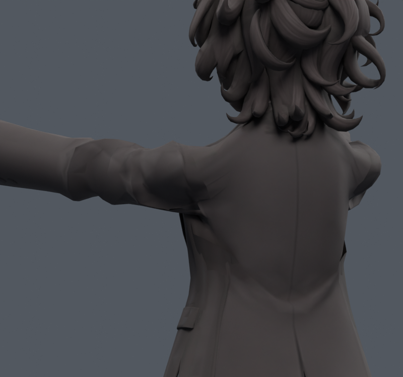

> **기록 시점 안내:** 아래는 해당 단계 당시의 보고서입니다. 후속 결정은 [최신 상태](../../STATUS.md)를 기준으로 읽어주세요. 모델·원본 텍스처·검증 원시 데이터는 이 문서 공유본에 포함하지 않습니다.

# v110 — 원단 늘어남을 줄이는 넓은 보정 6종

**6종 모두 그대로 통합하지 않는다.** 기존 54점 주변 평탄화에서 벗어나 기존 코트 733–904점의 포즈 목표를 변형률 기준으로 계산했다. 새 메시·정점·면·UV·텍스처·웨이트·본 변경0. 중립은 그대로이고 별도 파일의 수동 키로만 확인하는 시험이다.

v071의 모서리 ARAP와 달리, 정지 삼각형의 표면 기울기 특잇값을 허용 범위로 투영한 뒤 면적가중 전역 최소제곱으로 기존 점을 갱신했다. 회전과 허용된 주름 압축은 유지하려 했으며, 완전한 물리 천 시뮬레이션은 아니다.

| 사본 | 최대 이동 mm | 2배 초과 면적 % 전→후 | 새/해소 면적 경고 | 새/해소 코트 접촉 |
|---|---:|---:|---:|---:|
| side120_GENTLE | 19.79 | 9.965 → 8.623 | 8/0 | 0/0 |
| side120_FREE | 30.51 | 9.965 → 7.240 | 9/0 | 0/0 |
| side120_SUPPORTED | 25.05 | 9.965 → 8.110 | 10/0 | 0/0 |
| front90_GENTLE | 10.08 | 5.593 → 2.034 | 0/6 | 45/70 |
| front90_FREE | 15.15 | 5.593 → 0.345 | 0/6 | 68/95 |
| front90_SUPPORTED | 12.73 | 5.593 → 1.037 | 0/6 | 74/82 |

각 행은 해당 목표 자세에서 실제 Blender 변형 후 삼각분할로 재검증한 값이다. 160회 상한에서 종료한 최적화는 완전 수렴 주장 없음. 정지 fingerprint·웨이트 exact, 목표 재현오차 최대1.37e-7m.

앞들기의 늘어남은 크게 줄지만 안쪽 면의 새로운 겹침이 발생했다. 옆들기의 작은 면 압축도 별도 처리해야 한다. 이를 무시하고 좋은 배율만 보고 합격시키지 않았다. [v111](../v111_cloth_guard/REVIEW.md)에서 문제가 생기는 구간을 보호하면서 이득을 남기는 시험을 진행했다.
