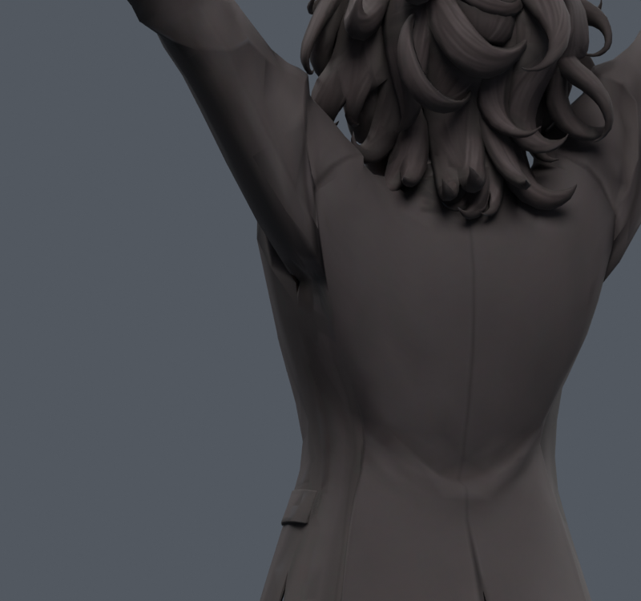
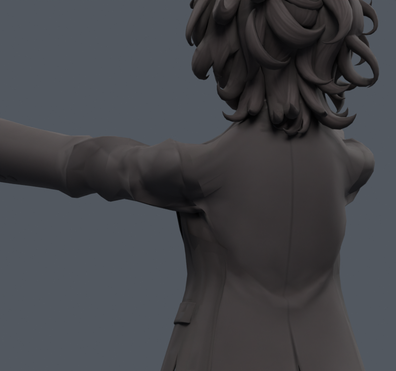

> **기록 시점 안내:** 아래는 해당 단계 당시의 보고서입니다. 후속 결정은 [최신 상태](../../STATUS.md)를 기준으로 읽어주세요. 모델·원본 텍스처·검증 원시 데이터는 이 문서 공유본에 포함하지 않습니다.

# v111 — 넓은 보정과 충돌 구간 보호

v110 목표에서 실제 새 면적 경고·새 코트 접촉이 발생한 원래 면을 찾고, 해당 기존 정점의 보정을 되돌렸다. 주변 3개 모서리 거리까지 0/0.15/0.5/0.85/1 배율로 완화한다. 이 과정은 접촉 해법을 보장하는 물리 계산이 아니라 후보 범위를 줄이는 제작 절차다.

| 목표 | 반복 | 남은 변경점 | 2배 초과 면적 % | 새 면적/접촉 |
|---|---:|---:|---:|---:|
| side | 3 | 861 | 6.439 | 0/0 |
| front | 3 | 593 | 4.329 | 0/0 |

각 목표 한 자세에서 새 경고는 0이지만, 회전/중간 자세까지 통과한 뜻은 아니다. 이전부터 있던 겹침과 큰 홈도 남는다. 정지 fingerprint·웨이트 exact, 별도 파일 재로드 오차0. 수동 `V111_GUARDED_*` 키는 0으로 저장하며 목표에서 1로 확인한다.

자동 포즈 활성과 범위 검증은 [v112](../v112_garment_pose/REVIEW.md)에서 별도로 진행한다.
