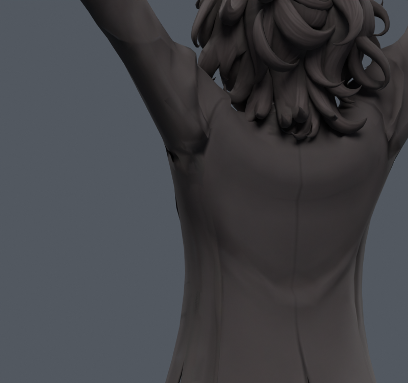
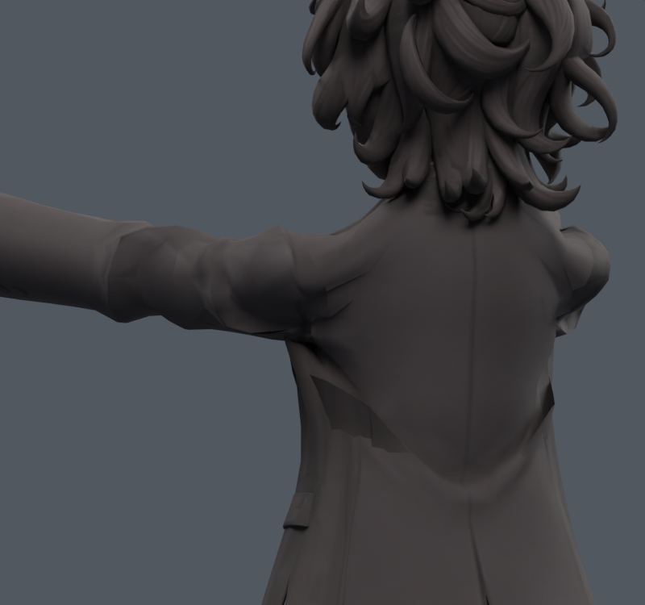
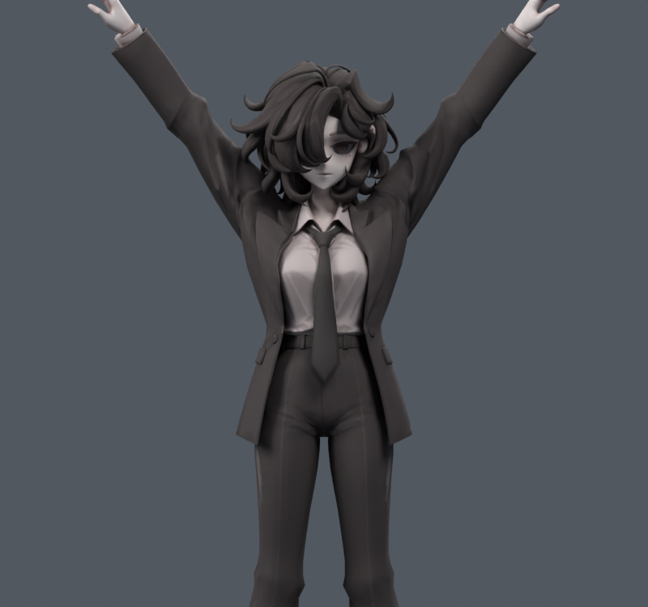
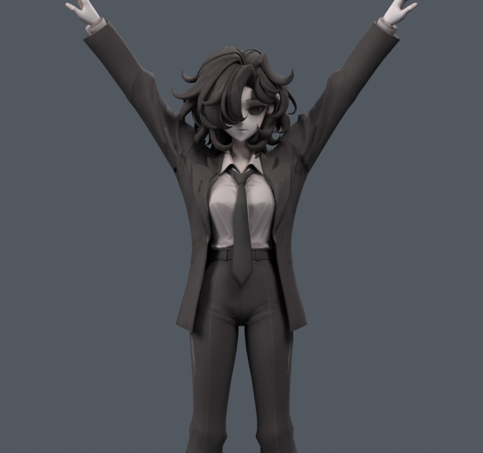
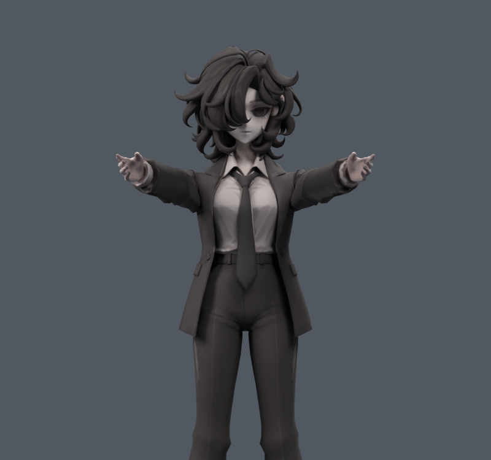
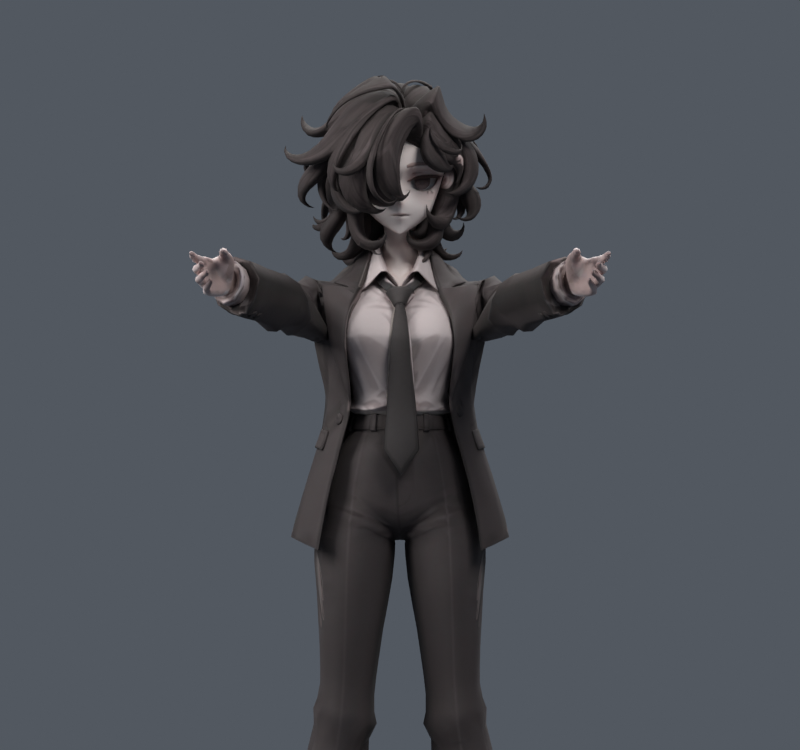

> **기록 시점 안내:** 아래는 해당 단계 당시의 보고서입니다. 후속 결정은 [최신 상태](../../STATUS.md)를 기준으로 읽어주세요. 모델·원본 텍스처·검증 원시 데이터는 이 문서 공유본에 포함하지 않습니다.

# v114 — 코트 몸판·자락 전체 들림 시험

**4종 모두 미채택.** 국소 소매 보정의 한계를 확인하기 위해 기존 코트의 몸판과 자락까지 움직이게 했다. 목/옷깃 상단과 소매 끝은 보호했다. 새 메시를 만들지 않았고 정지 외형·UV·웨이트·본은 유지했다.

초기 오프라인 마스크의 소매 끝 X 범위가 실제 모델 범위 밖인 것을 전체 좌표 검사로 발견했다. 실제 소매 끝의 X/Z 조합으로 고친 뒤 목표를 다시 계산하고, 그 수정된 목표만 Blender 사본으로 제작했다. 최초 숫자를 최종 결과로 사용하지 않는다.

| 사본 | 최대 이동 mm | 2배 초과 면적 % 전→후 | 새/해소 면적 경고 | 새/해소 코트 접촉 |
|---|---:|---:|---:|---:|
| side120_LIFT_SOFT | 29.53 | 9.965 → 5.066 | 6/0 | 12/0 |
| side120_LIFT_FREE | 48.32 | 9.965 → 0.479 | 1/0 | 32/0 |
| front90_LIFT_SOFT | 16.42 | 5.593 → 0.224 | 0/7 | 121/83 |
| front90_LIFT_FREE | 32.15 | 5.593 → 0.000 | 0/7 | 152/108 |

실제 포즈별 삼각분할로 재측정했다. 큰 늘어남을 줄이는 데는 효과가 있지만, 앞들기에서 몸판에 큰 사선 찌그러짐이 생기고 새 겹침도 늘어난다. 사용자가 우려한 옷 형태 훼손을 수치 개선보다 가볍게 보지 않는다. 새 면적 경고0인 앞들기조차 합격이 아니다.

변경점 밖 단추 등 분리 부품을 동반 이동시키는 절차까지 완성한 후보가 아니며, 그러한 부착 관계도 최종 채택 전에 필요하다. 현 단계는 자체 접촉과 몸판 형태에서 이미 탈락했으므로 전신·런타임 합격을 주장하지 않는다. 목표160회 상한; 완전 수렴이나 물리 천 시뮬레이션을 주장하지 않는다. 향후 넓은 들림은 봉제/부품 부착/접촉 조건을 함께 풀어야 한다. 이번 선별은 범위를 제한한 v113 계열로 이어간다.
