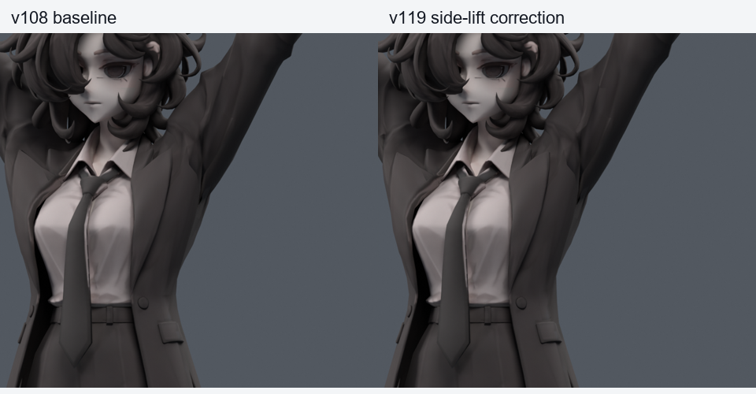
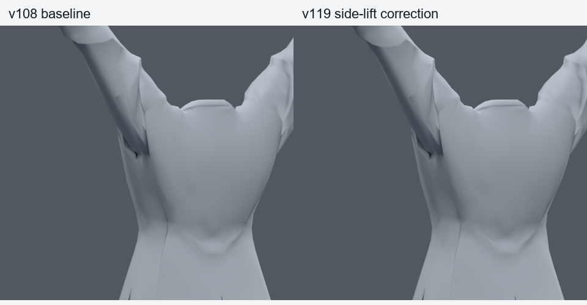
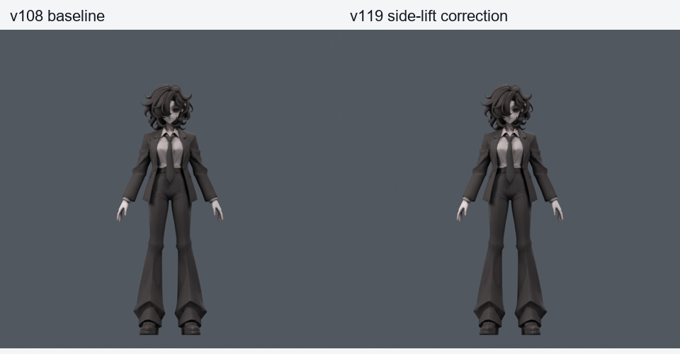
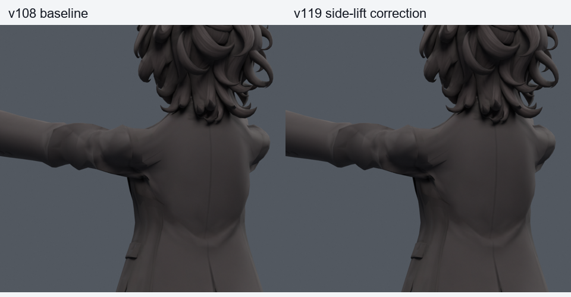
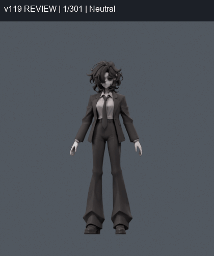

> **기록 시점 안내:** 아래는 해당 단계 당시의 보고서입니다. 후속 결정은 [최신 상태](../../STATUS.md)를 기준으로 읽어주세요. 모델·원본 텍스처·검증 원시 데이터는 이 문서 공유본에 포함하지 않습니다.

# v119 — 옷의 늘어남 후속 작업 종합 검수

**현재는 옆으로 팔을 드는 일부 자세의 늘어남을 줄인 검수 후보다. 옷 전체·앞들기·모든 관절·Unity/VRChat 완성이나 사용자 채택을 뜻하지 않는다.** 기준 v108을 보호하고 별도 파일로 만들었다.

## 먼저 열 파일

- 정적 검수 모델 (공유본 미포함: `bianca_GARMENT_REVIEW.blend`): v108의 기존 두 키에 넓은 옆들기 두 키와 몸통 활성 조건을 추가했다.
- 동작 검수 모델 (공유본 미포함: `bianca_GARMENT_MOTION_REVIEW.blend`): 301프레임·24fps, 기존과 같은26마커.
- [다음 수정 조건과 남은 작업](NEXT_WORK.md).

새 메시·정점·면·본·UV·텍스처·웨이트 변경0. 정지 좌표와 기존 v108 두 키도 동일하다. 새로운 보정은 기존 코트 정점에만 들어간다. 큰 몸통 비틀림에서는 새 보정이 꺼지므로 그 자세의 기존 문제를 해결했다고 볼 수 없다.

## 옷의 절대 형태 측정

기존 면적 경고 외에 삼각형의 방향별 늘어남/눌림을 측정했다. 표는 코트 전체 정지 면적에 대한 비율이다. 아주 작은 면의 최댓값만 보지 않고 분포도 함께 표시한다. 1.2/1.5/2배는 진단 기준이며 원단 물성 한계가 아니다. mm는 이 Blender 모델의 월드 좌표 기준이다.

| 옆들기120 명령 | v108 | v119 |
|---|---:|---:|
| 최대 방향 배율 | 4.571 | 4.136 |
| 면적가중95% 배율 | 2.691 | 2.546 |
| 1.2배 초과 넓이 % | 21.719 | 26.423 |
| 1.5배 초과 넓이 % | 15.866 | 15.760 |
| 2배 초과 넓이 % | 9.965 | 8.192 |
| 0.5배 미만 눌림 넓이 % | 0.997 | 1.073 |

**심한 늘어남을 줄이는 대신 가벼운 늘어남이 주변으로 분산되는 부분이 있다. 눌림과 큰 홈도 남는다. 모든 수치가 좋아졌다고 표현하지 않는다.** 실제 전후를 함께 보고 채택할 후보이며, 원단의 물리적 정확성이나 모든 연속 자세를 보장하지 않는다.

앞들기 수정은 새 접촉이 남아 제외했다. 아래 앞들기 그림의 원래 문제는 그대로 남는다.

컬러와 단색 기하를 실제 비교했다. 소매뿌리와 옆 몸판의 넓은 영역이 함께 이동하며 앞 여밈/라펠 곡선도 달라진다. 큰 겨드랑이 홈은 남아 있다. 목표 자세의 최대 이동은30.514mm이므로, 작은 홈 하나만 움직인 사본으로 설명하지 않는다. 별도 검수 후보로 유지한다.

## 실제 수행한 검증

| 검사 | 표본 | 새/해소 면적 | 새/해소 코트 접촉 |
|---|---:|---:|---:|
| 이전 실패 표본 재검증 | 542 (활성76) | 0/3 | 0/0 |
| 수정에 쓰지 않은 새 난수500+기본42 | 542 (활성75) | 0/3 | 0/0 |
| 전신 회전·관절 회귀 | 1377 | 0/0 | 코트–바지/소매 새0 |
| 실제 저장 동작 정수/반프레임 | 601 | 0/0 | 0/0 |

전신1377의 무릎 항목은 기준과 모두 같다. 저장 동작 재로드 오차 0m. 중립 600000픽셀 중 변화0. 기준 v038/v046/v083/v089/v108 SHA 재확인 PASS. 90개 이미지와 모든 GIF 프레임 디코드 PASS. 표본군의 반복 기본자세를 독립 합산하지 않는다. 접촉은 원래면 쌍이며 관통 깊이나 천 두께 보장을 뜻하지 않는다.

새 키별 기존 점 수: {'V112_side.L': 377, 'V112_side.R': 372}. 22자세에서 코트 밖 좌표 차이 최대 0.000000mm. 같은 검사에서 소매 끝 측정 구간 최대 0.000000mm, 옷깃 상단 측정 구간 최대 0.101586mm. 구간은 원시 스크립트의 위치 마스크이며 봉제선 전체를 보장하는 판정은 아니다.

코트와 목·셔츠·타이·손·바지·작은 옷 부품의22자세 추가 검사에서도 새 접촉0이었다. 작은 옷 부품10군의220개 자세/군 조합에서 표면까지 거리 증가 최대0.001632mm, 절대 거리 변화 최대0.056916mm였다. 가장 가까운 표면에 대한 거리이며 봉제 부착이나 실제 천 두께를 보장하지 않는다.

## 활성 조건과 동작 보기

상완/쇄골 목표 주변30도/10도 범위에 더해 chest/spine이 각각 중립15도 범위일 때 감소 가중치를 곱한다. 실제0/7.5/14.9/15/25도와 쿼터니언 배율0.6/1.3 검사를 수행했다. 대각선 팔 회전·큰 몸통 비틀림용 보정은 별도 과제다. 새 본은 없고 Blender armature 사용자 속성 driver1개를 추가했다.

동작 제작 시 armature 전체 animation data를 지우던 옛 도구 동작을 이 실행에서 수정해 action만 교체했다. 저장 전후 torso driver가 유지되는지 검사했다. Blender의 성공을 Unity 자동 활성 완료로 표현하지 않는다.

| 프레임 | 마커 |
|---:|---|
| 1 | Neutral |
| 13 | Side 60 |
| 25 | Side 120 |
| 37 | Side twist |
| 49 | Arms down |
| 61 | Front 45 |
| 73 | Front 90 |
| 85 | Front twist |
| 97 | Relax |
| 109 | Open hands |
| 121 | Fists |
| 133 | Point |
| 145 | Victory |
| 157 | Thumbs up |
| 169 | Wrist rotate |
| 181 | Neck and torso |
| 193 | Return neutral |
| 205 | coat_sit_90 |
| 217 | coat_leg_L_105 |
| 229 | coat_leg_R_105 |
| 241 | coat_sidebend_L |
| 253 | coat_sidebend_R |
| 265 | Back neck compound |
| 277 | L_independent_151 |
| 289 | L_independent_221 |
| 301 | Final neutral |

## 이번 연속 작업 지도

| 단계 | 결과 |
|---|---|
| [v109](../v109_garment_strain/REVIEW.md) | 원문 조사·22자세 절대 변형률과 색 표시 |
| [v110](../v110_cloth_metric/REVIEW.md) | 기존점 넓은 metric 목표6개, 압축/접촉으로 제외 |
| [v111](../v111_cloth_guard/REVIEW.md) | 목표 한 자세 보호 성공, 일반 자세 통과 의미 아님 |
| [v112](../v112_garment_pose/REVIEW.md) | 앞/옆4키 혼합 회전222에서 실패 |
| [v113](../v113_garment_range/REVIEW.md) | 누적 보호5회, 선별584통과 |
| [v114](../v114_garment_lift/REVIEW.md) | 전체 몸판/자락 들림4개, 큰 형태 찌그러짐으로 제외 |
| [v115](../v115_garment_review/START_HERE.md) | 새402의 앞들기 새 접촉4, 앞2키 제외 |
| [v116](../v116_garment_review/START_HERE.md) | 옆만 새442에서8681 새 면적1 |
| [v117](../v117_garment_review/START_HERE.md) | 새542에서 큰 몸통 회전과5235 잔여 |
| [v118](../v118_garment_review/START_HERE.md) | 몸통 gate 실제검사,5235 새 면적1 잔여 |
| v119 | 5235 추가 보호·최종 별도 검증·비교 |

앞 단계의 준비 스크립트 존재를 실제 실행으로 보지 않는다. 각 문서에 미실행 범위를 표시했다. 실패한 전체 들림·앞들기 보정은 이 후보에 포함하지 않았다. 큰 옷 형태 문제와 다른 관절 잔여는 [다음 작업](NEXT_WORK.md)에 구체적으로 남겼다.
