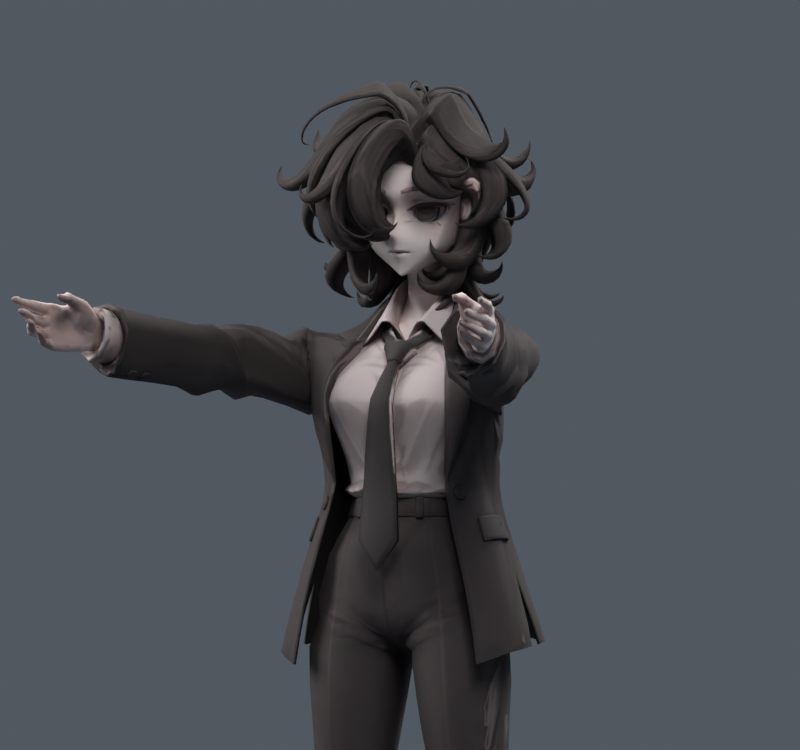
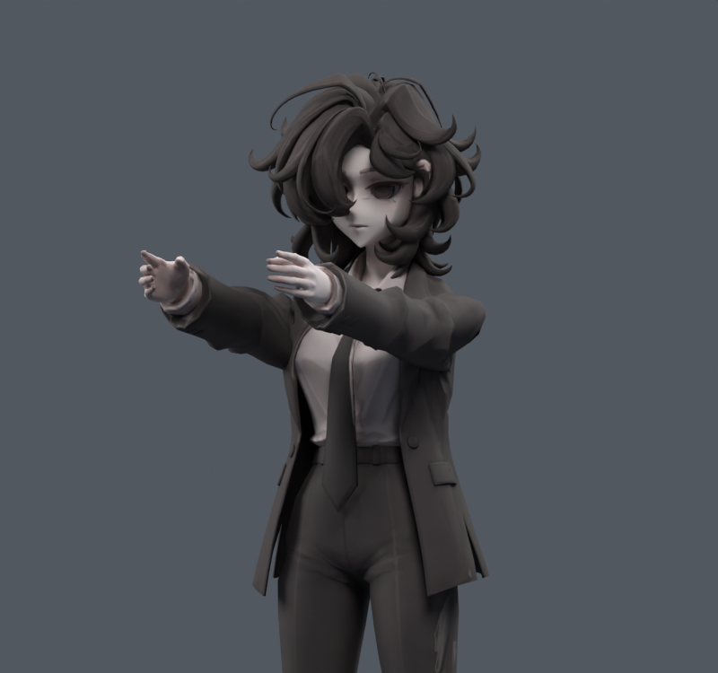
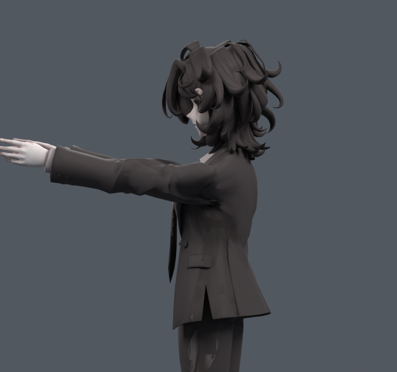

> **기록 시점 안내:** 아래는 해당 단계 당시의 보고서입니다. 후속 결정은 [최신 상태](../../STATUS.md)를 기준으로 읽어주세요. 모델·원본 텍스처·검증 원시 데이터는 이 문서 공유본에 포함하지 않습니다.

# v120 — 앞뒤 회전 경로 진단

원본 레퍼런스와 v119를 직접 확인하고 두 종류의 실험을 수행했다. 실제 수정 파일은 다음 v121에서 만든다. 이 단계는 원인 분리이며 전체 관절 합격이 아니다.

## 확인된 원인

1. A 포즈의 상완은 수직이 아니라 바깥으로 기울어져 있다. 기존 앞들기의 월드 X 축은 이 상완과 직교하지 않아 앞으로 들어도 팔이 바깥으로 벌어진 성분과 축 비틀림이 남는다. 앞으로90 입력에서 양팔을 평행하게 내미는 경로와 다르다.
2. 쇄골에도 같은 X 회전을 20% 적용한다. 이 리그의 쇄골은 좌우 방향이므로 대부분 길이축 회전이다. 어깨 끝은 앞으로90에서 뒤로4.017mm·아래로0.636mm 이동한다. 실제 쇄골 후방회전과 후인은 존재하므로 이 부호만으로 인간에게 불가능한 동작이라고 결론내리지 않는다. 다만 견갑골 움직임을 표현하지 않은 현재 단순화와 옷 웨이트가 합쳐져 중앙 몸판을 불필요하게 끌어간다.
3. 직접 측정에서 셔츠와 타이는 이동0, 목은 float 오차 수준이다. 실제 흉곽 본이 팔을 따라 도는 문제가 아니라 **주로 코트의 위 몸판·카라와 소매 뿌리가 따라가는 문제**다.

## 실제 비교

`01_trials.py`는 상완 최종 방향을 그대로 유지하며 쇄골만 바꿨다. `02_axis_trials.py`는 A 포즈에서 정면으로 향하는 평면을 계산해 상완 경로 자체를 바꿨다. 각5/4종×4자세,36평가. 처음 네 분리 자세는 별도이며 중복 중립을 독립 표본으로 합산하지 않는다.

앞90의 중앙 코트(|x|<55mm,z>690mm) 평균 이동: 기존2.400mm, 쇄골 고정1.159mm, 평면 수정+쇄골 고정1.119mm, 평면 수정+작은 쇄골 분담1.362mm. 이 영역은 기하학적 진단 마스크이며 전체 라펠의 봉제 경계가 아니다. 셔츠·타이 이동은 모두0.

축 수정으로 팔이 평행해지고 중앙 코트 끌림은 줄지만, 소매의 기존 겹침/압축은 남거나 증가했다. 기존 앞90 면적경고7/원래면접촉180, 평면고정5/366, 작은분담6/361. 2배 늘어남 코트면적은5.593%→5.330%(평면고정), 반이하 눌림2.744%→3.321%. **접촉 쌍 수는 관통 깊이가 아니며 다른 손 위치의 자세끼리 동일 형상 보정을 비교하는 것도 아니다.** 단순 쇄골 분담 감소를 모든 옷 문제의 해결로 채택하지 않는다.

## 다음 구현

기존 deform 본의 위치·부모·웨이트를 옮기는 대신, 앞뒤 평면에 맞는 별도 FK 조작 본을 추가한다. 기존 본 회전과 정확히 대응하는 quaternion 변환을 사용해 기존 옆들기와 보정키를 재현한다. 새 앞뒤 동작은 그 조작 본으로 만들고, 회전축 개선과 남은 소매 곡면 문제를 따로 표시한다. 기존 파일을 덮어쓰거나 메시를 재생성하지 않는다. 연구 원문과 해석은 [조사 계획](RESEARCH_PLAN.md)에 기록했다.
