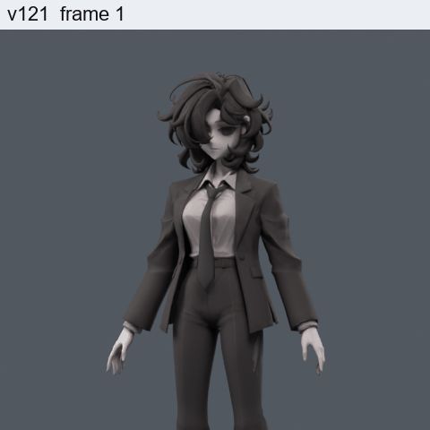
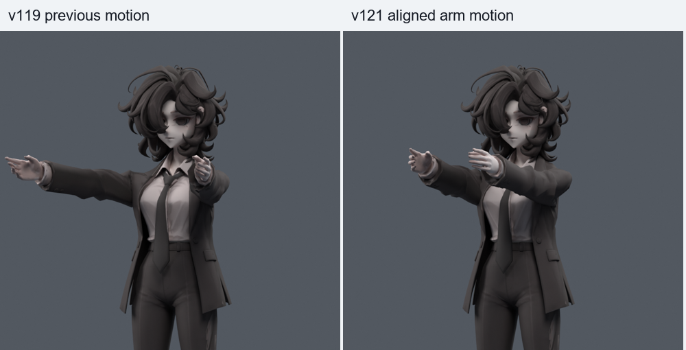
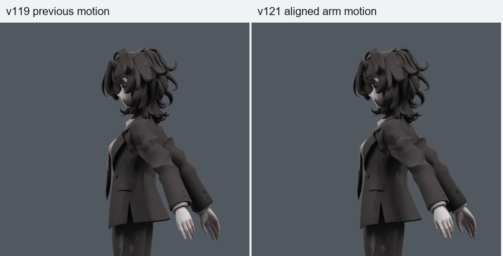
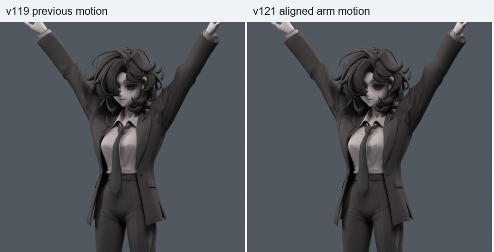

> **기록 시점 안내:** 아래는 해당 단계 당시의 보고서입니다. 후속 결정은 [최신 상태](../../STATUS.md)를 기준으로 읽어주세요. 모델·원본 텍스처·검증 원시 데이터는 이 문서 공유본에 포함하지 않습니다.

# v121 — 팔 앞뒤 회전축 검수

**앞뒤로 팔을 돌리는 경로와 조작 축을 수정한 별도 검수 후보다. 원형과 기존 옆들기는 보존했다. 소매 안쪽의 겹침·늘어남은 남아 있으며, 일부 구간은 기존 경로보다 증가하므로 옷 전체의 최종 채택본으로 보지는 않는다.**

## 먼저 열 파일

- 앞뒤 동작 검수 모델 (공유본 미포함: `bianca_ARM_AXIS_MOTION_REVIEW.blend`): 397프레임,24fps,34마커. 재생하며 어깨·카라·팔 방향을 비교한다.
- 직접 조작할 정적 모델 (공유본 미포함: `bianca_ARM_AXIS_REVIEW.blend`): 기존 v119를 보호한 별도 사본. 새 FK 조작 본을 사용한다.
- [자료 조사와 계획](../v120_front_axis/RESEARCH_PLAN.md), [9종 원인 분리 실험](../v120_front_axis/REVIEW.md).

| 프레임 | 확인할 동작 |
|---|---|
|13 /25 /37|기존 옆들기60 /120 /비틀기 재현|
|61 /73 /85|수정한 앞45 /앞90 /앞들며 비틀기|
|109–169|기존 손·손목 동작 유지|
|181–301|기존 목·몸통·무릎·자락 검수 동작 유지|
|313 /325|한쪽 /양쪽 팔 뒤35|
|349 /361 /373|왼팔 /오른팔 /양팔 앞으로90|
|385|앞120 스트레스 자세 — 옷 접힘 잔여를 확인|
|397|중립 복귀|

마커의 각도는 이 캐릭터의 A 포즈에서 정의한 검수 입력이다. 사람의 관절가동범위 실측 각도가 아니다. 앞90은 상완이 흉곽 기준 정면을 향하도록 보정했다.

GIF는 전체34동작 중 상체의 앞뒤·옆들기 구간만 발췌한50프레임이다. 목·무릎·손 검수는 blend의 해당 마커에서 본다.

## 원인과 수정

기존에는 A 포즈로 벌어진 상완을 월드 X 축으로 회전시켰다. 이 축은 기울어진 상완과 직교하지 않아, 팔을 앞으로 들어도 옆으로 벌어진 성분과 길이축 회전이 남았다. 쇄골에도 같은 축의20%를 적용하면서 코트의 위 몸판·카라가 함께 끌려갔다. 상완 시작점이 틀렸다고 확정한 것이 아니므로 기존 관절 중심을 옮기지 않았다.

실제 흉곽 본, 셔츠, 타이는 앞들기에서 따라 움직이지 않았다. 진단에서는 셔츠·타이 이동0, 목은 float 오차 수준이었다. 사용자가 느낀 불필요한 움직임은 주로 코트 표면에서 확인했다.

새 조작 본의 Local X를 A 포즈 상완과 정면 방향이 이루는 평면에 맞췄다. 이 축으로 앞으로 돌리면 양팔이 정면을 향한다. Local Y는 팔 길이축 비틀기에 남겨두었다. 기존 deform 본의 위치·부모·roll은 그대로 두고, 새 조작 본에서 기존 본으로 회전값을 변환한다. 따라서 기존 옆들기와 기존 보정키도 재현할 수 있다.

검수 애니메이션에서는 쇄골을 완전히 고정하지 않고 앞들기에 작은 앞 이동·상승·축회전을 별도로 주었다. 이후 상완의 상대 회전을 보상해 목표 방향을 유지한다. 앞90에서 어깨 중심은 기존 뒤4.017mm·아래0.636mm에서, 앞3.721mm·위2.575mm로 바뀐다. **이 값은 캐릭터에 맞춰 비교한 저작 선택이며 논문의 인체 측정값을 복제한 값은 아니다.** 뒤들기는 별도 경로이며 쇄골 앞들기 분담을 반대로 강제하지 않았다.

## 실제로 줄어든 부분과 남은 문제

아래 중앙 코트는 |x|<55mm,z>690mm인 진단 영역이다. 전체 카라의 봉제 경계와 같다는 뜻은 아니다. mm는 높이 약1m인 현재 모델의 월드 단위다.

| 동작 | 중앙 코트 평균 이동, 기존→수정 |
|---|---|
|뒤35|0.975→0.478mm|
|앞30|0.849→0.520mm|
|앞60|1.663→0.985mm|
|앞90|2.400→1.362mm,약43.2% 감소|
|앞120|3.024→1.632mm|

팔이 정면으로 향하고 몸판의 불필요한 끌림은 줄었다. 하지만 표면 전체가 좋아졌다는 뜻은 아니다. 팔 위치와 비틀림이 달라지면서 기존 소매의 불리한 면 흐름과 겹친 주름도 다른 방식으로 드러난다.

| 동작 | 면적경고 기존→수정 | 코트 원래면 접촉쌍 기존→수정 | 2배 초과 늘어남 면적 기존→수정 |
|---|---|---|---|
|뒤35|0→0|56→79|0→0.015%|
|앞30|0→2|69→75|0→0.042%|
|앞60|3→7|106→240|0.795→1.409%|
|앞90|7→6|180→361|5.593→6.103%|
|앞120|16→15|222→328|7.958→7.888%|

앞90의 반 이하 눌림 면적도2.744%→3.135%로 증가한다. **이 표 때문에 v121을 전체 옷 품질 개선 완료로 채택하지 않는다.** 원래 메시를 같은 수정 자세로 직접 돌리면 조작 본을 사용할 때와 좌표가 정확히 같았으므로, 새 조작 본이 메시를 추가로 찌그러뜨리는 문제와 기존 메시가 새 자세를 충분히 견디지 못하는 문제를 구분했다. 그 구분이 실제 외관 문제를 없애주는 것은 아니다. 접촉쌍 수는 관통 깊이가 아니며, 비교 양쪽의 팔 방향이 달라 동일 자세의 메시 수정 회귀시험과도 다르다.

## 기존 작업 보존과 검증

- 기존32773정점·17647면, 좌표·면·UV·텍스처·노멀·웨이트·기존4보정키는 그대로다. 새 메시/리메시/정점 추가0.
- 기존102본의 rest 행렬과 부모 정확히 동일. 비변형 조작 본4개만 추가해106본이 됐다. 기존 본에 전달하는 드라이버16개와 기존 몸통 드라이버1개, 기존 보정키 드라이버4개를 사용한다.
- 기존 기본36+새 난수90+기존 검수26=152자세 재현. 최대 표면 차이0.000369mm, 키 값 차이5.96e-8. 완전한 비트 동일성으로 표현하지 않는다.
- 좌우·앞뒤·흉곽 회전을 조합한 축 검사30개. 앞90에서 흉곽 기준 상완 방향이 (0,-1,0)인지 실제 평가했다.
- 앞뒤 기본63+새 난수100=163자세. 뒤35~앞120,좌우 독립,상완 비틀림,흉곽 yaw±25·척추 pitch±15를 평가했다. 같은 수정 자세에서 조작 드라이버를 끄고 기존 본에 직접 회전을 준 결과와 좌표차0.
- 저장 동작34마커 재로드 오차0. 정수/반 프레임793표본의 유한 좌표·팔 본 길이·드라이버 유효성 검사 통과. 수정하지 않은23마커의 실제 v119 저장 동작 대비 최대 차이0.000141mm이며, 나머지22마커는0이다. 여기에는 손·목·무릎·자락 동작도 포함된다. `MOTION_SAMPLES.json`에 기록했다.
- 중립과 옆120 전후 렌더는 각각600000픽셀 전부 동일했다. 정면/측면의 앞45·앞90·뒤35도 별도로 렌더하고 확인했다.
- 이미지75개와 GIF 전체50프레임을 디코드 검사했다. 숫자 통과가 모든 연속 자세/옷 접촉의 무결함을 보장하지 않는다.
- 마지막 두 모델의 실제 재로드 검사에서 기존 기하·웨이트·키·102본 rest/부모를 다시 확인하고, 보호 모델8개의 SHA256이 모두 그대로임을 확인했다. 최종 Blender 화면은 동작 파일의73프레임으로 열어 실제 뷰포트를 확인했다.

초기 드라이버의 기본 Bezier 전달 곡선이 작은 회전값을0/1 근처로 당겨 한 복합 자세에서0.02722mm 차이가 났다. 기본 키를 제거하고 y=x 전달로 수정한 후152검사를 재실행해 위 결과를 얻었다. 초기 실패는 `RETARGET_INITIAL_FAILURE.json`과 MCP 로그에 남겼다. 동작 생성의 첫 시도에서는 기존 손 동작의 native thumb 옵션이 빠졌으며, 기존 검수 파일과 같은 옵션으로 다시 생성·검사했다.

## 직접 조작하기

정적 파일에서 Pose Mode의 `V121 Arm Controls` 컬렉션에 있는 `CTRL_upper_arm.L/R`를 사용한다. 회전 방향은 **Local** 기준이며, Local X의 음수 방향이 앞들기, 양수가 뒤들기다. Local Y는 길이축 비틀기다. 어깨의 따라가는 움직임은 `CTRL_clavicle.L/R`에서 별도로 조절한다. 기존 `upper_arm`·`clavicle`의 quaternion은 전달 드라이버가 있으므로 직접 수정하지 않는다. 팔꿈치·손·손가락은 기존 본으로 조작한다.

새 조작 본은 일반 FK 조작 기능이다. 상완 하나를 돌렸을 때 인간 견갑골 움직임이 자동으로 계산되는 생체역학 리그는 아니다. 검수 동작의 쇄골 분담은 애니메이션으로 기록되어 있다. Blender 드라이버가 Unity/VRChat으로 자동 이전되는 것도 아니며, 게임 내 애니메이션에 이 축 변경이 자동 적용됐다고 주장하지 않는다. 엔진 이전 때는 조작 결과를 기존 deform 본에 베이크하고 Humanoid/실제 동작을 별도 검증해야 한다.

## 이어서 해결할 부분

앞뒤 축 후보를 옷 전체의 최종본으로 승격하기 전에, 수정한 동작에서 소매 앞·뒤 암홀과 안쪽 주름의 면 흐름/웨이트/접촉을 함께 수정해야 한다. 특히 앞30~60의 새 면적경고와 앞90의 안쪽 겹침 증가를 해결 대상으로 삼는다. 중앙 코트를 더 고정하는 것만으로 수치를 낮추면 소매가 더 늘 수 있으므로 단독 고정은 해법으로 확정하지 않는다. v119에서 개선한 옆들기, 원형 및 v038 SMALL 무릎은 계속 보호한다.
