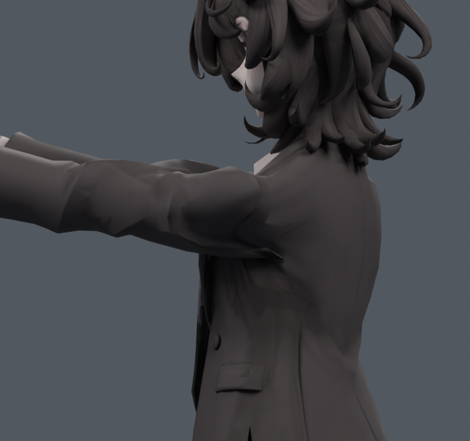
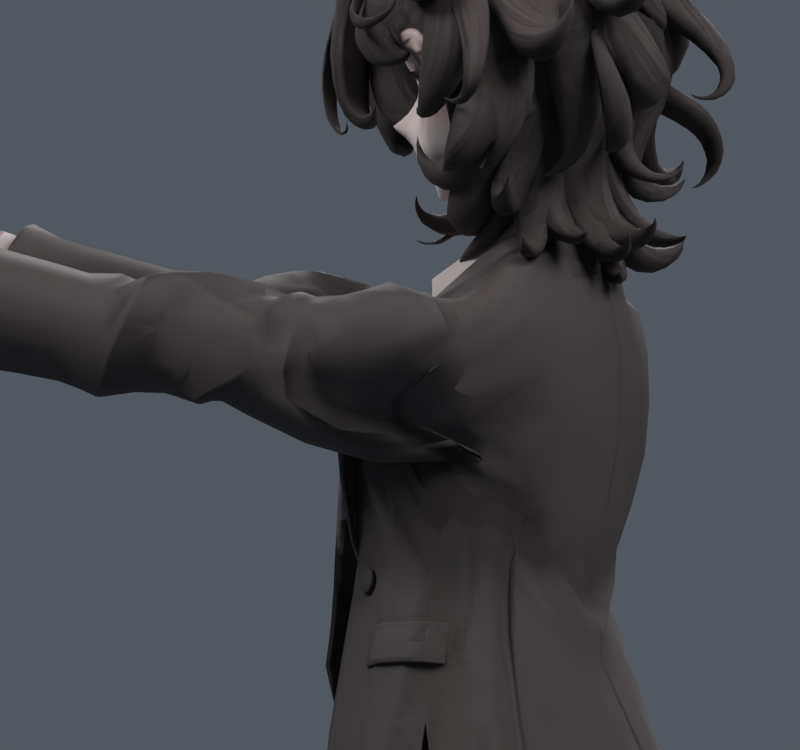

> **기록 시점 안내:** 아래는 해당 단계 당시의 보고서입니다. 후속 결정은 [최신 상태](../../STATUS.md)를 기준으로 읽어주세요. 모델·원본 텍스처·검증 원시 데이터는 이 문서 공유본에 포함하지 않습니다.

# v122 — 앞들기 수축 보간 진단

새 전방 경로0~120의9자세에서 원래LBS와DQS 좌표를 수집했다. 코트1314점 범위보다 좁은 어깨/소매 마스크로 기존 곡면을 보간하고, 앞30/60/90/120에서25/50/100%의12수정목표를 실제 평가했다. 새 메시·저장된 새 변형 리그는 없다. 조사는 [계획](PLAN.md)에 연결했다.

| 각도 | 방식 | 면적 경고 | 원래면 접촉쌍 | 2배 늘어남 면적 | 반 이하 눌림 면적 |
|---|---|---|---|---|---|
|30|기존→50%|2→1|75→71|.042→.042%|.151→.115%|
|60|기존→50%|7→3|240→219|1.409→1.741%|1.539→1.300%|
|90|기존→25%|6→7|361→340|6.103→5.696%|3.135→2.729%|
|120|기존→25%|15→18|328→369|7.888→7.595%|4.989→4.254%|

눌림 감소만 보면 좋아 보이지만 면적·접촉·늘어남은 함께 좋아지지 않는다. 전체 동작에 DQS를 켜는 방식은 채택하지 않는다. 앞30~60의 국소 목표는 후속 비교 재료이며 독립회전 검증을 마친 후보가 아니다. 실제 원단 길이와 접촉을 같이 계산하는 v123을 이어서 시험한다.

원본파일은 v121을 보호한다. 진단의 실제 결과는 DQ_TRIALS.json과 MCP_CALLS.jsonl. 원래정점 목표에만 의미가 있으며, 통합 파일을 생성했다고 주장하지 않는다.
