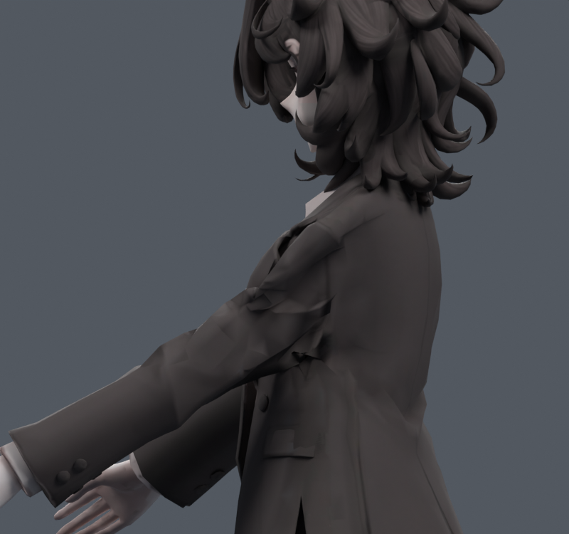
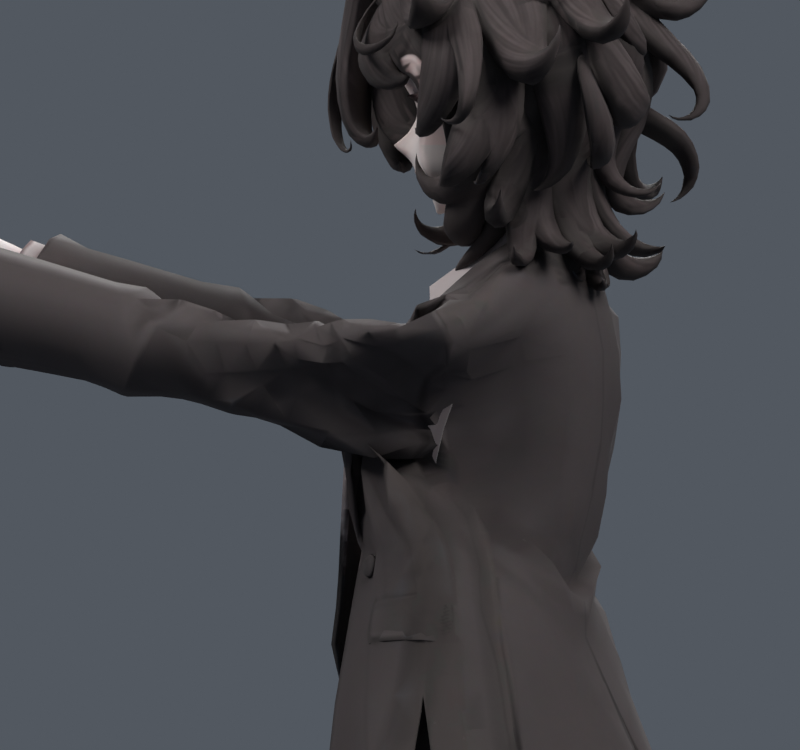
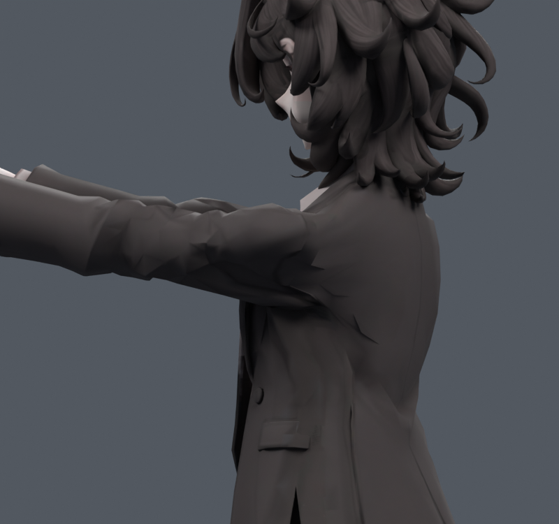

> **기록 시점 안내:** 아래는 해당 단계 당시의 보고서입니다. 후속 결정은 [최신 상태](../../STATUS.md)를 기준으로 읽어주세요. 모델·원본 텍스처·검증 원시 데이터는 이 문서 공유본에 포함하지 않습니다.

# v123 — 기존 코트의 자기 충돌 포함 물리 목표 실험

메시를 새로 만들거나 분리하지 않았다. 기존 v121 한 메시에서 코트 밖을 전부 고정하고 코트1314정점에 부분 자유도(완전 자유434정점)를 주었다. 코트 밖 면은 자기 충돌 제외 그룹에 지정했다. Cloth 모디파이어로 중립→앞90까지61프레임,이후20프레임 정지하여 총81프레임을 실제 계산했다. 중력0,새외부collision객체0,기존 vertex pin,원래 길이/굽힘과자기충돌을사용했다. 설정은 SETUP.json,프레임별기존정점좌표는 frame*.npz.

**시뮬레이션 전체 결과를 최종 모델로 채택하지 않는다.** 앞90에 도달한61프레임은2배늘어남 면적6.103%→1.445%였지만 면적경고6→21,최대방향배율10.08의경계가생겼다. 정지후81프레임에는접촉361→65로줄었지만면적경고22,2배늘어남6.158%,최대이동39.159mm였다. 어깨의 각진 주름과몸판의 새로운접힘이실제렌더에도보인다.

옷의 기존 형태와pin경계가강하게제약하는구간이라물리시뮬레이션을켠것만으로품질이해결되지않는다. 이결과는새게임런타임cloth구현이아닌저작용목표다. v124에서결과의25/50%만기존정점보정으로전환하고새문제가생긴면을보호하는비교를계속했다. 다른부품의실제물리충돌검증이나모든연속동작합격으로표현하지않는다. 원형v121/v119보호.
