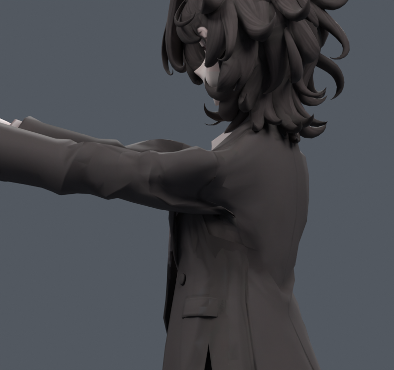

> **기록 시점 안내:** 아래는 해당 단계 당시의 보고서입니다. 후속 결정은 [최신 상태](../../STATUS.md)를 기준으로 읽어주세요. 모델·원본 텍스처·검증 원시 데이터는 이 문서 공유본에 포함하지 않습니다.

# v124 — 원단 계산에서 얻은 앞들기 보정 목표 선별

v123 실제 Cloth 계산 결과의 25%/50%만 기존 코트 정점의 상대 shape key로 옮겼다. 새 면이나 메시를 만들지 않았다. v121 정지 원형·UV·웨이트·본은 유지한다. 이 파일들은 **한 자세용 실험 목표**이며 자동 보정 채택본이 아니다. 키 값 0으로 저장했다.

앞90도에서 새 면적 경고나 원래면 자기 접촉이 생기는 점과 주변 3 ring의 보정을 줄였다. 면적 경고는 정지 대비 0.2배 미만/3배 초과, 접촉은 비인접 삼각형 교차의 원래면 쌍이다. 접촉 수가 관통 깊이를 뜻하지 않는다.

| 후보 | 반복 후 새 면적/새 접촉 | 해소 면적/접촉 | 2배 초과 늘어남 면적 | 반 이하 압축 면적 | 최대 표면 이동 |
|---|---:|---:|---:|---:|---:|
| v121 기준 | — | — | 6.103% | 3.135% | — |
| SIM81_QUARTER | 0 / 0 | 0 / 18 | 6.074% | 3.281% | 7.16mm |
| SIM81_HALF | 0 / 0 | 0 / 26 | 5.946% | 3.243% | 13.22mm |
| SIM61_QUARTER | 0 / 0 | 1 / 18 | 5.116% | 3.418% | 8.75mm |

SIM61_QUARTER를 다음 v125 자동 키 실험의 입력으로 사용했다. 늘어남 감소와 압축 악화가 함께 존재한다. 저작 자세 한 개에서 새 경고가 없다는 결과를 전 구간 통과로 확대하지 않는다. 전체 반복 기록 (공유본 미포함: `GUARD.json`), 코드 (공유본 미포함: `00_guard.py`).

