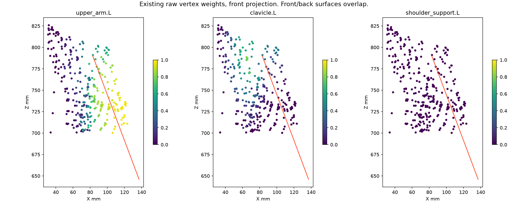

> **기록 시점 안내:** 아래는 해당 단계 당시의 보고서입니다. 후속 결정은 [최신 상태](../../STATUS.md)를 기준으로 읽어주세요. 모델·원본 텍스처·검증 원시 데이터는 이 문서 공유본에 포함하지 않습니다.

# v126 — 앞으로 드는 팔의 관절 중심·쇄골·웨이트 점검

사용자가 지적한 현상은 이미지의 착시만으로 보기 어렵다. **정지 관절 중심이 코트 어깨 단면의 앞쪽에 있고, v121 검수 동작은 그 중심을 추가로 앞으로 이동시킨다.** 여기에 상완·쇄골 웨이트로 움직이는 소매 뿌리가 겹친다. 세 요소를 실제 Blender MCP 평가로 분리했다.

이번 결과는 원인 진단과 비교용 사본이다. 관절 중심의 새 정답 위치를 확정하거나 어깨 전체가 해결되었다고 판정한 단계는 아니다. v121 원본과 무릎 등 기존 채택 구조를 변경하지 않았다.

## 먼저 볼 것

- [본과 표면의 위·옆 투영](BONE_PATHS.png): 실선은 앞90도, 점선은 정지 본. 왼쪽은 v121 동작, 가운데는 쇄골 고정, 오른쪽은 쇄골의 앞으로 도는 성분만 제거.
- [웨이트 지도](WEIGHT_MAP.png): 기존 정점에 상완·쇄골·어깨 보조 본이 얼마나 적용되는지 표시.
- [기존 앞90도 측면](FOLLOW_90_100.png), [쇄골 고정 측면](FIXED_90_100.png), [앞으로 도는 성분 제거 측면](NO_FORWARD_YAW_90_100.png).
- 직접 조작: 쇄골 고정 비교 파일 (공유본 미포함: `bianca_SHOULDER_FIXED_DIAGNOSTIC.blend`). 앞90도 자세이며 원형·웨이트를 수정한 완성본이 아니다. 기존 동작 파일 (공유본 미포함: `bianca_SHOULDER_FOLLOW_DIAGNOSTIC.blend`), 앞 회전 성분 제거 파일 (공유본 미포함: `bianca_SHOULDER_NO_FORWARD_YAW_DIAGNOSTIC.blend`)도 보존했다.

## 1. 정지 관절 중심이 앞쪽에 있는가

현재 왼쪽 상완 head는 월드 좌표 **(83, 0, 790)mm**, 오른쪽은 X만 반대다. 캐릭터 앞은 Y 음수다. 모델 높이는 약999.5mm이므로 아래 mm는 이 모델 좌표 기준이다.

이 head를 통과하는 Y 방향 선과 실제 코트 삼각형을 교차시켰다. X=83mm, Z=790mm에서 앞 표면은 Y=-5.137mm, 뒤 표면은 Y=41.265mm였다. 즉 관절 head는 앞 표면에서 약5.1mm, 뒤 표면에서 약41.3mm 떨어진 곳에 있다. 주변 X=70/96mm, Z=770/800mm의 9개 단면도 기록했다. 단순 정점 5개의 평균 대신 실제 면 교차를 사용했다. 원시 수치 (공유본 미포함: `DETAIL.json`).

**이것은 옷 단면에 대해 앞쪽이라는 근거이지, 실제 상완골두가 반드시 옷 두께의 가운데에 있어야 한다는 뜻은 아니다.** 코트의 두께·여유·등판 형태, 인체의 견갑골과 상완골두 위치는 같은 기준이 아니다. 현재 외형에는 팔의 맨살 해부학 표면이 없고, 원본 이미지도 정지 정면에 가까워 관절 깊이를 직접 확정할 수 없다. 무작정 옷 단면 중앙인 뒤18mm로 옮기는 방식은 채택하지 않는다.

이 위치는 v121에서 새로 옮긴 것이 아니다. [v025 기록](../v025_rotation_review/REVIEW.md)에 따르면 옆들기 함몰을 줄이려고 상완 head 높이를768→790mm로 올리고 웨이트를 함께 조정했다. v121은 그 기존 rest 위치를 유지했다. 옆들기 개선을 지키려면 높이를 바로 되돌리는 것도 적절하지 않다.

## 2. 어깨까지 앞으로 나가는가

그렇다. v121의 `work.py`에서 앞90도 검수 동작은 쇄골에 앞 회전3.15도, 상승 성분1.8도, roll3.6도를 직접 준다. 이는 사람이 움직인 실측 데이터나 자동 견갑골 리그가 아니라 당시 만든 검수 경로의 계수다. 상완 최종 방향은 따로 보상한다.

| 같은 앞90도 방향의 비교 | 관절 중심 앞뒤 이동 | 관절 중심 높이 이동 | 중앙 코트 평균 이동 |
|---|---:|---:|---:|
| FOLLOW: v121 경로 | 앞으로3.721mm | 위2.575mm | 1.362mm |
| FIXED: 쇄골 고정 | 0 | 0 | 1.119mm |
| NO_FORWARD_YAW: 앞 회전만 제거 | 뒤로0.816mm | 위2.575mm | 1.406mm |

상완의 최종 방향 차이는 18개 평가 전체에서 최대4.14e-7(단위벡터 차이)였다. 따라서 팔 방향을 달리해서 개선처럼 보이게 한 비교가 아니다. 다만 관절 중심이 달라지므로 손의 최종 위치는 조금 달라진다.

쇄골 고정은 원인을 분리하는 대조군이다. 실제 사람이 팔을 들 때 견갑골·쇄골은 움직이므로, 모든 각도에서 쇄골을 완전히 고정하는 것을 최종 인간형 동작으로 추천하지 않는다. 또한 ‘앞 회전만 제거’해도 중앙 코트 평균 이동은 오히려 조금 증가했다. 본 한 성분 제거가 옷 전체 해법은 아니다.

## 3. 웨이트와 보조 본은 어떤 상태인가

- 전체32773 정점의 웨이트 합 범위는0.999999914–1.000000104, 음수0, 미할당0. 정규화가 무너져 표면이 튀는 문제는 확인되지 않았다.
- 좌우 상완 웨이트를 가진 점은419/415개, 쇄골은296/287개이며 이 영향은 모두 코트에 있다. 셔츠·타이는 앞들기에서 실제 이동0이다. 흉곽 자체가 팔을 따라 회전하는 현상으로 해석하면 안 된다.
- 왼쪽 어깨 주변 진단 마스크의127개 점은 평균 상완62.2%, 쇄골25.1%, 가슴7.0%, 척추5.7%다. **소매 뿌리도 포함한 기하학적 마스크**라서87.3%가 잘못 칠해졌다고 단정할 수는 없다. 몸판 쪽과 실제 소매 쪽을 나누어 재설정해야 하는 근거로 사용한다.
- 중앙 코트263점에도 쇄골 영향이 평균9.92%, 좌우 상완 합계1.65% 남는다. 일부 점은 상완 약21.8%, 쇄골 약48.5%에 달한다. 여밈 전체의 정확한 봉제 경계 마스크는 아니며, 이동을 줄일 대상점 선정에 사용해야 한다.
- `shoulder_support.L/R`는 clavicle의 자식이고 상완 회전을50% 복사하는 제약이 있지만, **현재 전 정점 웨이트가0**이다. 어깨 부피를 지지하는 기능은 실제로 작동하지 않는다. 이는 새로 발견한 고장이라고 단정하지 않는다. [v047](../v047_coat_support/REVIEW.md), [v058](../v058_shoulder_volume/REVIEW.md)에서 적용 실험이 악화되어 제외되었고, [v068 인계](../v068_upper_delivery/RUNTIME_HANDOFF.md)에도0이 기록되어 있다.
- 별도 견갑골 변형 체인은 없으며 흉곽→쇄골→상완의 단순 구조다. Armature modifier는1개, 선형 스키닝, Preserve Volume 꺼짐이다. v121의 기존4개 shape key를 모두 껐다 켜도 이번18개 앞뒤 평가 표면 차이는0이었다. 따라서 이 비교의 끌림을 기존 옆들기 보정키 탓으로 볼 근거는 없다.

## 4. 왜 지금 본만 옮기거나 웨이트를 다시 칠하지 않았는가

이번 분리 결과에서 쇄골 고정만으로도 앞90도의 2배 초과 늘어남 면적은6.103%→5.330%로 줄었지만 코트 접촉 쌍은361→366으로 늘었다. 앞 회전 성분만 제거한 경우는5.327%,363쌍이었다. 큰 뒤쪽 소매 뿌리의 접힘도 세 렌더에 모두 남는다. 단순 추종 감소는 이동 인상을 줄여도 면의 접힘까지 해결하지 않는다.

또한 [v082](../v082_shoulder_pivot/REVIEW.md)에서는 기존 경로에서 뒤5mm 중심 이동만 한 후보가 새 면적 경고21건을 만들었다. 현재는 앞들기 경로가 바뀌었으므로 옛 결과가 모든 새 조합의 실패를 증명하지는 않지만, 똑같이 중심만 옮겨 해결됐다고 할 근거도 없다.

현재 방향은 다음과 같다.

1. 검수용 ‘팔 앞으로 들기’와 ‘어깨를 내밀어 뻗기’를 구분한다. 팔 방향과 쇄골/견갑골 분담을 별도 조절하며, 앞90도에 일률적으로 넣은 앞 회전 계수를 최종 기준으로 고정하지 않는다.
2. 기존 메시 사본에서 관절 깊이·몸판/소매 웨이트를 함께 비교한다. 몸판을 붙잡는 영역, 소매가 상완을 따라가는 영역, 어깨 캡의 중간 영역을 실제 면 연결과 앞/뒤 단면으로 나눈다. 앞뒤 옷 표면을 한 덩어리 구형 마스크로 다시 칠하지 않는다.
3. 중심을 바꾸는 실험은 쇄골 끝·상완 head·기존 보조 본·v121 조작 본과 quaternion 기준을 함께 맞춘다. 기존 포즈키 활성 기준과 팔꿈치/손목 방향도 다시 검사한다. 인체 중심을 옷의 가운데로 단순 추정하지 않는다.
4. 앞30/60/90/120, 뒤35, 옆90/120, 축 비틀림, 단측/양측, 몸통 회전을 같은 실루엣·면적·접촉 기준으로 비교한다. 원형·UV·텍스처와 v038 SMALL 무릎은 보호한다. 면적 합계만 줄고 새 접촉이나 옷의 판 같은 변형이 생기면 제외한다.
5. 그 경로와 기본 웨이트가 정해진 뒤 남는 국소 접힘에만 자세 보정을 추가한다. 경로 자체가 의심되는 동안 v125 보정을 확대하지 않는다.

## 5. 자료와 실제 비교의 범위

이번에는 [Ludewig 등의 뼈 고정 센서 연구 초록](https://pubmed.ncbi.nlm.nih.gov/19181982/)을 재확인했다. 쇄골 상승·후인·후방 축회전과 견갑골의 복합 회전이 관찰되며, 굴곡과 옆들기는 같은 경로가 아니다. 이 자료는 단순 쇄골 앞 회전을 생체역학 정답으로 취급하지 않아야 한다는 근거다. 논문의 수치를 이 캐릭터에 그대로 복사한 것이 아니며, 이번 PMC 본문 열기는 접근 확인 화면으로 막혔다. 새 영상을 전체 시청했다고 주장하지 않는다. 이전 자세한 조사와 출처는 [v120 연구](../v120_front_axis/RESEARCH_PLAN.md).

원본 `avator_references/ref_char.png`도 실제로 다시 열어 비교했다. 레퍼런스의 어깨 외형과 코트 구조를 보존하되, 해당 한 장으로 내부 관절 깊이와 전방 동작의 정답을 확정할 수 없다는 한계를 유지한다.

## 6. 실제 완료한 검증과 현재 상태

6개 각도×3분리조건,18평가(중립/뒤 자세 중복 포함), 실제 표면·본·웨이트 검사,9개 면 단면, 컬러6렌더, 진단 도표2개를 만들었다. 세 측면 렌더와 두 도표를 실제 열람했다. 저장한3개 진단 파일 모두 원래 기하·UV·웨이트·기존 키 좌표·본 구조가 같고, 재로드 자세 좌표차0이다. v121 정적/동작 원본 SHA도 동일하다. 저장 검사 (공유본 미포함: `SAVED_AUDIT.json`), 전체 진단 (공유본 미포함: `AUDIT.json`), 면적·접촉·단면 (공유본 미포함: `DETAIL.json`), 웨이트 상세 (공유본 미포함: `WEIGHT_DETAIL.json`).

직전에 진행한 v122–125는 별도 실패/실험 이력으로 보존한다. [v122 DQS 비교](../v122_forward_surface/REVIEW.md), [v123 Cloth](../v123_cloth_targets/REVIEW.md), [v124 국소 목표](../v124_front_guard/REVIEW.md), [v125 자동 키](../v125_front_pose/REVIEW.md). v125는184표본에서 새 면적6·새 접촉47로 통합 보류다. 이번 v126 진단 파일에는 이 미통과 키가 들어 있지 않다.

아직 새로운 최종 리그 채택, 전신/저장 애니메이션의 새 전수검사, Unity/VRChat 런타임 검증까지 완료한 것은 아니다. 이번 새 문서와 모델은 작업 저장소에 기록하며 별도 공개 공유 문서 저장소는 v119 상태다.
