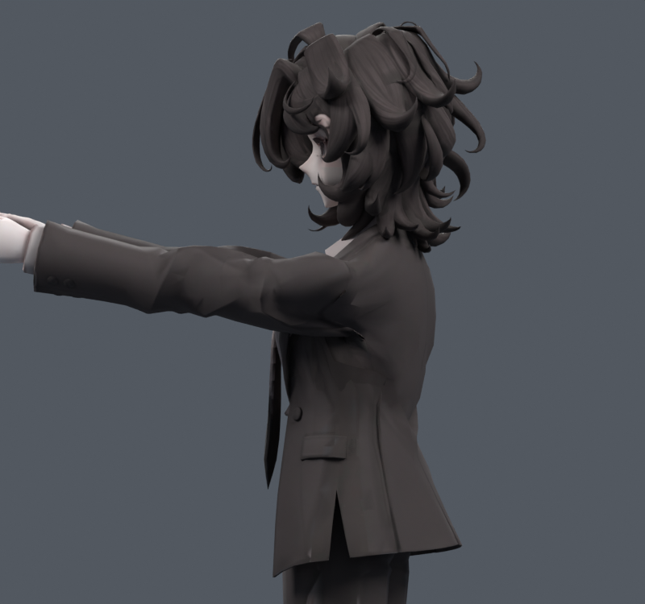
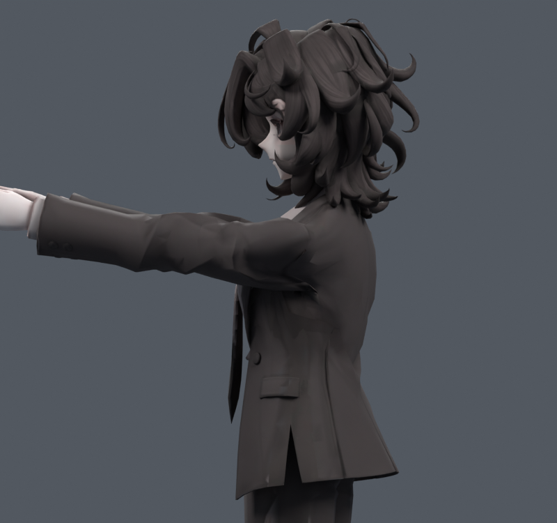
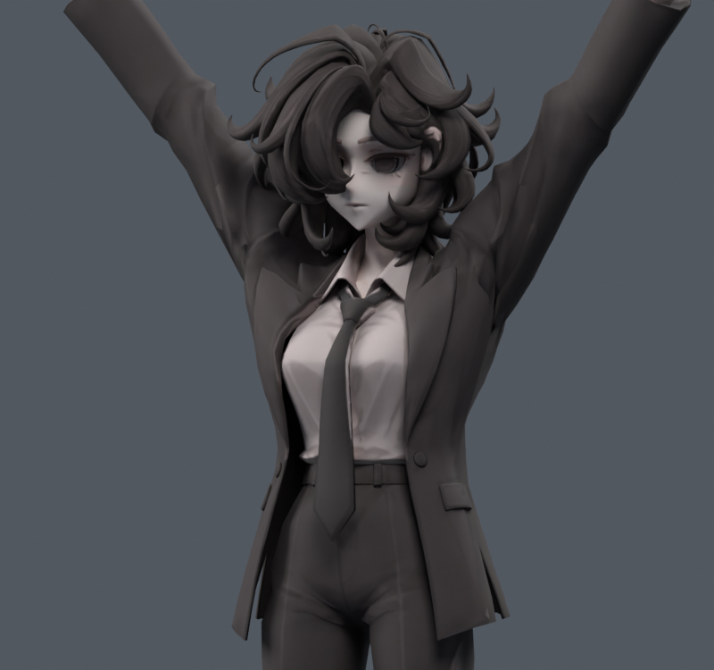

> **기록 시점 안내:** 아래는 해당 단계 당시의 보고서입니다. 후속 결정은 [최신 상태](../../STATUS.md)를 기준으로 읽어주세요. 모델·원본 텍스처·검증 원시 데이터는 이 문서 공유본에 포함하지 않습니다.

# v128 — 기존 옆·뒤 표면을 목표로 한 웨이트 적합

v127 뒤3mm 관절 사본에서 기존 코트931개 대표점을 적합했다. 실제 Blender skin 행렬 예측과 평가 메시의 최대 오차2.95e-7m를 확인한 뒤, 앞들기는 D3W15 목표, 옆/뒤는 기존v121 목표를 사용했다. 옆/뒤 오차 가중치는앞의12배, 기존웨이트와의차이에정규화항과5/15/30%p 상한을주었다. 원래정점및UV/텍스처변경0,최대4영향슬롯이다.

1600회 반복 예산에서 세 후보를 만들었다. 최종 변화량이 설정된1e-9 수렴기준보다 커 **완전수렴했다고 주장하지 않는다**. 실제 최대 웨이트 변경은5.00/9.08/9.55%p였다.

기본24자세 재검사에서 세후보모두 면적경고109(기준117)이지만 **새경고17건**, 접촉누적3256–3259(기준3225)가 남는다. 옆들기 전체표면최대차약2.10mm. 실제앞/옆렌더를 비교했고 큰소매뿌리접힘은 해소되지 않았다. 따라서 뒤3mm구조와이웨이트를기본리그로채택하지않는다.

기존4개 pose key 좌표를 유지한 초기적합이다. 원래rest기준과달라진기준의key활성기준재저작,전신/엔진검수까지끝낸파일이아니다. 후속은위치변경안과검수경로수정을분리하고,기존리그를보호한작은앞들기코트경계보정에한정한다. 뒤로옮긴안이합계에서낮다고채택하지않는다.
