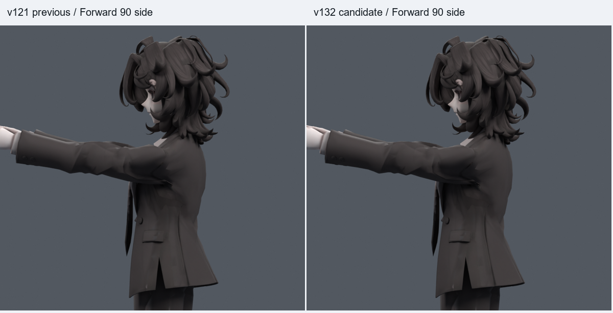

> **기록 시점 안내:** 아래는 해당 단계 당시의 보고서입니다. 후속 결정은 [최신 상태](../../STATUS.md)를 기준으로 읽어주세요. 모델·원본 텍스처·검증 원시 데이터는 이 문서 공유본에 포함하지 않습니다.

# v132 — 어깨 전진 동작 수정과 코트 경계 보정 검수

**앞으로 팔을 들 때 어깨가 함께 앞으로 밀리던 검수 동작을 수정했고, 기존 옆들기를 보존한 코트 국소 보정을 묶었다.** 본 중심을 뒤로 옮긴 실험은 다른 회전에서 문제가 생겨 제외했다. 따라서 정지 관절 깊이와 큰 소매 뿌리의 접힘까지 해결된 최종 리그는 아니다.

## 바로 확인하기

- 동작 검수 파일 (공유본 미포함: `bianca_SHOULDER_MOTION_REVIEW.blend`): 397프레임, 24fps, 34개 이름 있는 자세.
- 정적 검수 파일 (공유본 미포함: `bianca_SHOULDER_REVIEW.blend`): 원래 중립 상태. 앞들기 보정은 실제 본 회전값에 따라 작동한다.
- [앞90도 측면 비교](BOARD_front90_100.png), [앞90도 사선 비교](BOARD_front90_25.png).
- [옆120도 보존 비교](BOARD_side120_25.png), [중립 비교](BOARD_neutral0_25.png).
- [동작 미리보기 GIF](SHOULDER_PREVIEW.gif). 전체397프레임을 모두 담은 영상은 아니며, 선택한34개 프레임이다.

| 프레임 | 확인 내용 |
|---|---|
| 1 | 중립 |
| 25 / 37 | 옆120도 / 옆들기+비틀림 |
| 61 / 73 / 85 | 앞45도 / 앞90도 / 앞들기+비틀림 |
| 313 / 325 | 한쪽 / 양쪽 뒤35도 |
| 349 / 361 / 373 | 왼팔 / 오른팔 / 양팔 앞90도 |
| 385 | 앞120도 스트레스 자세 |
| 397 | 중립 복귀 |

## 실제 반영한 변경

v121 검수 동작은 앞90도에 쇄골의 앞으로 도는 회전3.15도를 넣어 관절 head를 앞으로3.721mm 이동시켰다. 이번 검수 동작에서는 그 성분을 제거했다. 같은 상완 방향에서 head는 뒤0.816mm, 위2.575mm로 움직인다. 위로 올라가고 축이 도는 나머지 분담은 남겨 두었다. 이는 **검수 동작의 경로 수정**이며 모든 사용자 조작에 자동으로 개입하는 새로운 생체역학 IK가 아니다. 어깨를 내밀어 손을 더 뻗는 동작은 쇄골 조작으로 별도로 표현할 수 있다.

기본 웨이트를 바꾼 실험에서 얻은 앞90도 표면 차이 중, 다른 자세와 모션에서 문제가 없었던 부분만 기존 코트 정점의 상대 shape key로 옮겼다. 왼쪽114점·오른쪽127점, 총241개 기존 점이다. 새 정점/면이나 대체 메시를 만들지 않았다. 코트 밖 실제 평가 좌표 차이는0, 앞90도에서 신설 보정만의 최대 변위는4.370mm다.

기존 본106개와 rest 구조, 기본 웨이트, Basis/UV/텍스처/노멀, 기존4개 키를 유지한다. 앞 보정2개를 추가해 Basis 외6개 키다. 새 키 이름은 재현을 위해 `V129_front.L/R`을 유지했다. 상완30도/쇄골8도 범위의 정규화 quaternion 가중치와 기존 몸통15도 gate를 사용한다. 옆/뒤 동작과 중립에서 신설 보정이 영향을 주지 않는지 별도로 확인했다.

## 외형 변화와 수치의 의미

앞90도 중앙 코트 진단 영역의 평균 이동은 v121 **1.362mm**, 경로만 수정했을 때 **1.406mm**, 최종 후보 **1.379mm**다. 같은 마스크를 사용했으며 전체 라펠 봉제 경계를 뜻하지 않는다. 최종 값도 v121보다 조금 크므로 중앙 몸판의 전체 끌림까지 개선됐다고 말하지 않는다. 신설 키는 수정 경로만 썼을 때의 이동을 조금 줄이는 범위다.

코트의2배 초과 늘어남 면적은 v121 경로6.103%에서 최종 **5.346%**다. 다만 경로만 바꾸면5.327%이므로 **새 코트 키 자체가 전체 늘어남을 줄였다고 해석하면 안 된다**. 새 키 적용으로 이 값은 소폭 증가했다. 반 이하 압축은최종3.255%다.

앞90도 원래면 접촉 쌍은 v121 경로361, 이번 경로와 최종 후보363다. 경로가 바뀌었을 때 접촉 쌍 수가 증가했다는 한계를 그대로 남긴다. 서로 다른 경로끼리의 쌍 교체와 같은 본자세에서 신설 보정 때문에 생기는 교차는 구분해서 검사했다. 쌍 수는 관통 깊이 지표가 아니다. 큰 겨드랑이/뒤쪽 소매 뿌리 접힘은 여전히 남는다.

## 검증 결과

아래 검사는 **같은 수정된 본자세에서 새 코트 키만 끄고 켠 비교**다. 기존부터 있던 옷 결함0을 뜻하지 않는다.

| 난수 seed | 난수 + 기본 자세 | 보정 활성 표본 | 새 면적 / 새 접촉 |
|---|---:|---:|---:|
| 1290911 | 220 + 24 | 75 | 0 / 0 |
| 1300912 | 400 + 24 | 125 | 0 / 0 |
| 1320913 | 400 + 24 | 126 | 0 / 0 |

처음220개 난수와 두 번째400개는 이전 선별/검증 표본을 재사용했다. 마지막400개는 이번 추가 수정 후 새로 만든 표본이다. 기본24개는 매번 반복하므로 독립 표본으로 합산하지 않는다. 면적 기준은 정지 대비0.2배 미만 또는3배 초과이며, 실제 평가 삼각형과 원래면 ID를 사용했다.

- 실제 저장 모션의 정수/반프레임 **793개**에서 새 코트 키로 인한 새 면적/새 접촉0. 좌표 유한성·팔 본 길이·드라이버 유효성도 확인했다.
- 앞 버전 v131에서 발견한74프레임 접촉을 추가 보호한 뒤 전체를 다시 검사했다.
- 최종 GIF 검수에서373→385 구간의 quaternion 부호가 반대여서379프레임 팔이 뒤로 크게 도는 문제를 추가 발견했다. 같은 회전의 q/-q 표현을 인접 키마다 같은 쪽으로 맞춘 뒤 모션을 다시 저장했다. 모든 인접 회전값의 내적이 양수이며, 해당 구간25개 정수/반프레임에서 팔이 앞쪽을 유지하는지 검사했다. 793개 표면 검사도 새 파일 SHA에 연결해 다시 실행했다. 회전 경로 검사 (공유본 미포함: `MOTION_PATH_CHECK.json`), 제외한 초기 경로 진단 (공유본 미포함: `MOTION_PATH_DIAGNOSIS.json`).
- 저장34개 주요 자세의 재로드 표면 좌표차0. 변경하지 않은 기존v121 주요 자세23개도좌표차0이다.
- 별도 옆/뒤21개 조건도좌표차0. 중립/옆120도 컬러 렌더는 각각600000픽셀이 동일하다.
- 몸통 각도0/7.5/14.9/15/25도의 gate, 회전 quaternion 배율0.6/1.3 및 부호 반전까지 실제 평가했다. 최대 좌표차2.46e-7m 이하이다.
- 최종 정적/동작파일의 원래 기하·웨이트·기존 키·본 동일성, 기존 보호파일10개의 SHA 일치를 확인했다. 새 전신1377개 검사를 했다고 확대하지 않는다.

근거: 원형/위치 검사 (공유본 미포함: `INVARIANTS.json`), 모션 앞부분 (공유본 미포함: `MOTION_CHECK_0_400.json`), 모션 뒷부분 (공유본 미포함: `MOTION_CHECK_400_793.json`), 저장 자세 비교 (공유본 미포함: `PRESERVED_SAVED_MARKERS.json`), gate 검사 (공유본 미포함: `GATE_CHECK.json`), 최종 파일 감사 (공유본 미포함: `FINAL_AUDIT.json`), 이미지 검사 (공유본 미포함: `ARTIFACT_CHECK.json`).

## 제외한 수정과 남은 작업

| 단계 | 실제 수행 | 판단 |
|---|---|---|
| [v127](../v127_shoulder_trials/REVIEW.md) | 관절뒤3/6/9mm와 몸판/어깨캡 웨이트8사본 | 다른 회전의 새 경고/접촉으로 제외 |
| [v128](../v128_shoulder_fit/REVIEW.md) | 기존 옆·뒤 표면을 우선한 제한 웨이트 적합3사본 | 새 경고17건 및 소매 형태 문제로 제외 |
| [v129](../v129_front_boundary/REVIEW.md) | 앞들기에만 켜지는 경계 보정 초기안 |244표본 새 면적8/접촉120으로 제외 |
| [v130](../v130_boundary_guard/REVIEW.md) | 실패 면과 주변 보정 감쇠 | 자세 표본 통과, 모션 추가 검사로 이동 |
| [v131](../v131_shoulder_review/REVIEW.md) | 실제 저장 모션 검사 |74프레임 새 접촉1건 발견, 제외 |
| v132 | 해당 경계 추가 보호와 모든 관련 검사 재실행 | 이번 검수 후보 |

**정지 관절 깊이는 여전히 이전 값이다.** 코트 단면 앞쪽에 있다는 v126 진단을 해결 완료로 바꾸지 않는다. 이번 위치 변경·웨이트 결합 후보들은 옆들기 품질을 유지하면서 채택할 만큼 좋지 않았다. 큰 소매 뿌리의 면 흐름과 관절 깊이/어깨 캡 웨이트의 공동 수정은 후속 과제로 남는다. 검증을 통과한 국소 보정과 미해결 구조 문제를 구분한다.

Unity/VRChat에서 Blender 드라이버가 자동으로 재현되는 것은 아니다. 기존 보조본 제약과 함께 베이크/런타임 구현을 검증해야 한다. 이번은 PC 아바타의 Blender 검수 단계이며 Quest 작업은 하지 않았다. 모델 재생성이나 원형 교체도 하지 않았다.

이번 새 파일과 문서는 작업 Git 저장소에 기록한다. 별도 공개 공유문서 저장소는 v119 상태를 유지한다.
