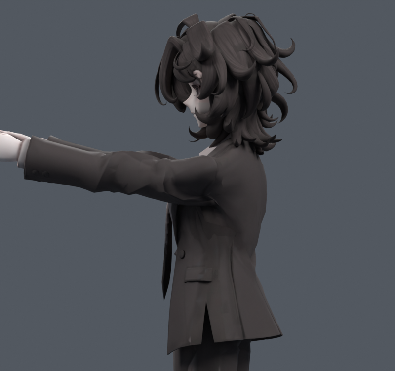

> **기록 시점 안내:** 아래는 해당 단계 당시의 보고서입니다. 후속 결정은 [최신 상태](../../STATUS.md)를 기준으로 읽어주세요. 모델·원본 텍스처·검증 원시 데이터는 이 문서 공유본에 포함하지 않습니다.

# v133 — 표면 세부 운반 목표 6종

**모두 수동 진단 사본. 최종 통합 아님.** 앞90 자세의 새 교차/면적 경고가 남아 v134에서 별도 자동키/경계 검증을 진행한다. 원형/Basis, 실제 메시 연결, UV, 텍스처, 웨이트, 본 및 v132의 기존 키는 보존했다.

[조사와 구현 근거](RESEARCH_PLAN.md). `01_targets.py`는 수치 목표 계산, `02_trials.py`는 실제 Blender MCP 적용/평가/저장/렌더이다.

|후보|최대 이동 mm|2배 초과 늘어남 %|반 이하 압축 %|새/해소 면적 경고|새/해소 교차 쌍|
|---|---:|---:|---:|---|---|
|v132 기준|0|5.346|3.255|—|—|
|DM5_35|4.514|4.897|2.866|3/2|20/37|
|DM5_70|9.028|4.708|2.285|5/5|32/54|
|DM15_35|6.789|4.984|2.614|4/2|24/51|
|DM15_70|13.578|4.436|2.092|7/5|34/80|
|DM35_35|8.321|5.062|2.422|4/3|33/63|
|DM35_70|16.641|4.124|2.195|10/4|61/111|

DM15_70은 늘어남과 압축을 함께 줄이고 교차 순수 개수도 감소했지만, 새 교차34쌍과 새 면적7개가 있으므로 그대로 채택하지 않는다. DM35_70은 더 크게 움직이고 새 경고가 많다. 실제 측면 컬러 렌더 DM5_70/DM35_70을 열람했고, 큰 어깨캡 윤곽 문제까지 해결했다고 볼 수 없다.

수동 키는 현재 앞90 자세에서만 의도한 형태다. 이 사본에서 중립 자세로 돌리면서 수동 키를 1에 두면 중립이 달라진다. 키를 끄면 원형이 복원된다. 자동으로 중립0/목표1이 되는 후보는 v134에서 따로 만든다. 접촉은 삼각형 교차의 원래 면 ID 쌍이며 관통 깊이/물리 충돌 해결을 뜻하지 않는다.
