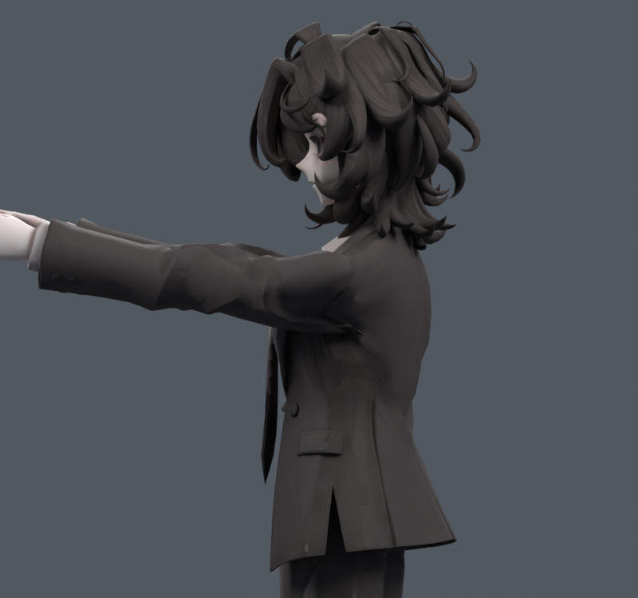
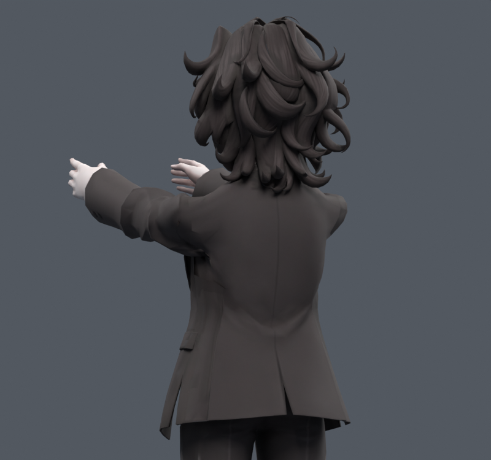

> **기록 시점 안내:** 아래는 해당 단계 당시의 보고서입니다. 후속 결정은 [최신 상태](../../STATUS.md)를 기준으로 읽어주세요. 모델·원본 텍스처·검증 원시 데이터는 이 문서 공유본에 포함하지 않습니다.

# v134 — 앞들기 표면 보정의 적용 범위 제한

v133 DM15_70 목표를 좌우 독립 자동 자세키 `V134_front.L/R`로 옮겼다. v132의 두 앞들기 키를 포함해 기존 6개 키는 보존한다. 상완30도/쇄골8도/기존 몸통15도 범위의 정규화 quaternion gate를 사용한다. 단순 quaternion 부호/크기 변경에 의미가 바뀌지 않도록 기존 식을 재사용한다.

RAW는 넓은 목표의 새 경고 때문에 제외한다. 해당 면의 canonical 정점을 고정하고, 이웃 3줄에서 강도를 .2/.55/.85로 줄인 G1을 검증했다. 새 메시/실제 점 합치기/UV 변경은 없다. 기존 코트 L206/R225, 총431개 정점의 자세 좌표만 바뀐다.

|후보|검사 수|실제로 활성화된 자세|새/해소 면적 경고|새/해소 교차 쌍|
|---|---:|---:|---|---|
|RAW|244|67|40/40|300/532|
|G1 same cases|244|67|0/3|0/5|
|G1 fresh cases|424|125|0/13|8/8|

같은 기본24각도는 검사별 반복이며 서로 독립 표본으로 합산하지 않는다. 새 난수400개는 첫220개와 다른 seed를 사용했다. 이 결과만으로 모든 동작/관통 깊이가 해결됐다고 할 수 없다.

G1 앞90의 늘어남>2 면적은 5.3456→5.0710%, 반이하압축은3.2549→3.0944%. 실제 측면/후측면 컬러 렌더를 열람했다. 겨드랑이의 작은 접힘과 일부 소매 왜곡이 완화되지만, 큰 어깨캡의 모양과 소매뿌리의 깊은 접힘은 여전히 남는다. 원래 넓은 목표보다 개선량이 작아진 것은 새 문제를 만들던 영역을 제외했기 때문이다.

정지 관절 깊이/본/W는 바꾸지 않았다. 이번 결과를 해부학적 회전 중심 수정이라고 부르지 않는다. 검수 통합/저장 애니메이션 검사는 다음 버전에 별도 기록한다.

## 두 번째 제한 G2

G1은 새 424자세에서 교차8건이 발견되어 최종 통합하지 않았다. 해당 원래 면9개/계산 정점24개를 추가 보호하고 이웃45/67/87개에 완만한 제한을 적용한 G2를 만들었다. 기존 코트 L197/R220, 총417점이다.

|검사|표본|활성|새/해소 면적|새/해소 교차|
|---|---:|---:|---|---|
|G2_ORIGINAL|244|67|0/1|0/2|
|G2_PRIOR|424|125|0/9|0/2|
|G2_FRESH|424|120|0/8|0/6|

최종 G2의 렌더/정지 원형/실제 저장 모션/관절 보존 결과는 [v135 종합 문서](../v135_transport_review/START_HERE.md)에 기록한다. G1의 수치와 그림을 G2의 최종 수치라고 혼동하지 않는다.

