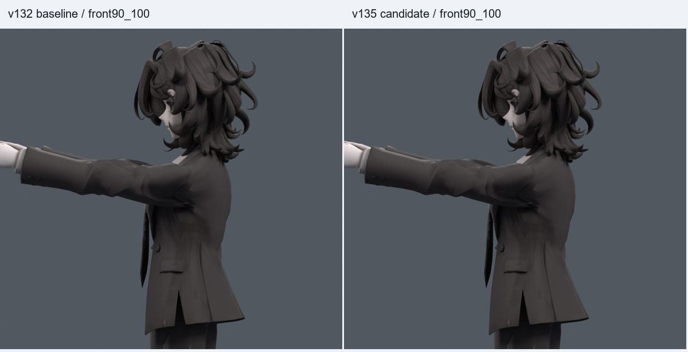
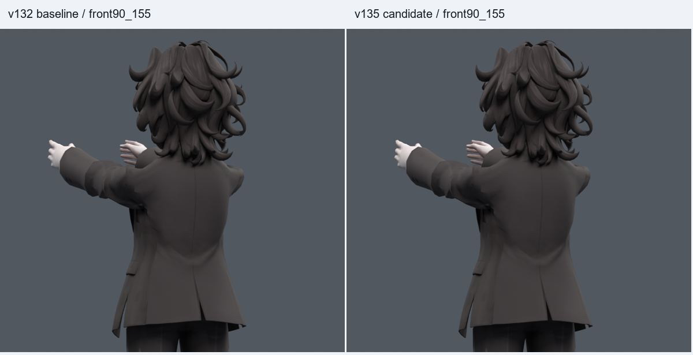
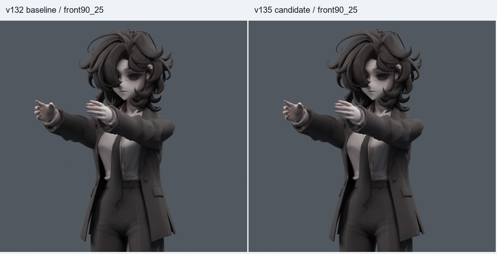

> **기록 시점 안내:** 아래는 해당 단계 당시의 보고서입니다. 후속 결정은 [최신 상태](../../STATUS.md)를 기준으로 읽어주세요. 모델·원본 텍스처·검증 원시 데이터는 이 문서 공유본에 포함하지 않습니다.

# v135 — 소매 찌그러짐 추가 보정 검수

**v132를 보존한 별도 검수 후보다. 일부 소매 변형을 줄였지만 큰 어깨캡/소매뿌리 접힘과 관절 깊이 문제는 남아 있다. 사용자 채택이나 전체 관절 완성본으로 해석하지 않는다.**

## 한 번에 확인하기

- 정적 검수 모델 (공유본 미포함: `bianca_SHOULDER_REVIEW.blend`): 중립에서 시작. 기존 원형 유지.
- 동작 검수 모델 (공유본 미포함: `bianca_SHOULDER_MOTION_REVIEW.blend`): 397프레임, 24fps, 34개 표식.
- 아래 전후 비교와 [모션 미리보기](SHOULDER_PREVIEW.gif)를 함께 본다.

|확인 프레임|확인할 내용|
|---|---|
|25 / 37|좋아진 옆들기와 비틀림 보존|
|61–85|앞45→90→비틀림의 중간 변형|
|73 / 373|양팔 앞90, 작은 소매 찌그러짐 완화|
|349 / 361|좌우 독립 앞들기|
|379 / 385|앞90→120 보간과 큰 들기. 뒤로 뒤집히는 보간 오류가 없어야 함|
|397|중립 복귀|

## 이번에 바꾼 것

정지 표면을 평활화한 뒤 원래 주름의 차이를 저장하고, 앞90 표면에서 계산한 국소 회전으로 그 차이를 다시 운반하는 목표를 만들었다. 실제 메시를 합치거나 새로 생성하지 않았다. UV 분리점은 계산 그래프에서만 묶었다. 넓은 목표는 다른 자세의 새 교차 때문에 제외했고, 실패 면과 그 이웃의 보정량을 제한한 결과를 옮겼다.

추가 자동키는 `V134_front.L/R` 2개다. 기존 코트의 제한된 정점에만 작동한다. 기존 v132의 6개 보정키/표현식, 정지 정점·면·UV·텍스처·노멀·웨이트·106개 본은 그대로다. 총 shape key는 Basis를 제외하고8개다. 중립/옆/뒤 보호를 위해 상완30도, 쇄골8도, 몸통15도 범위로 제한했다. 기존 v132 보정과 함께 동작한다.

추가 키의 변경 정점 수는 왼쪽 184개 / 오른쪽 209개, 총 393개이다. 앞90에서 이번 키가 추가로 움직이는 최대 표면 거리는 **4.577mm**, 코트 밖 최대 차이는 **0m**다. 관절 중심을 옮긴 수정이 아니다.

## 같은 앞90에서의 전후 수치

|항목|v132|v135|
|---|---:|---:|
|2배 초과 늘어남 면적 %|5.345614|5.323210|
|반 이하로 눌린 면적 %|3.254858|3.152550|
|평균 최대 늘어남|1.143026|1.140225|
|95백분위 늘어남|2.028095|2.029152|
|최대 늘어남|3.867826|3.787779|
|최소 축 비율|0.049044|0.049044|
|면적 경고 수|6|6|
|원래 코트 면 교차 쌍|363|363|

코트 전체의 정지 면적으로 가중한 수치다. 넓은 초안의 개선량을 최종 후보의 성과로 사용하지 않았다. 새 교차를 막기 위해 적용 범위를 줄여 최종 개선은 작다. 교차 쌍 수는 관통 깊이가 아니다.

[앞75 비교](BOARD_front75_100.png) · [앞105 비교](BOARD_front105_100.png) · [옆120 비교](BOARD_side120_25.png) · [중립 비교](BOARD_neutral0_25.png)

## 검증

|난수 seed|기본+난수 자세|실제 활성|새/해소 면적 경고|새/해소 교차|
|---|---:|---:|---|---|
|1340910|24+220=244|67|0/0|0/0|
|1340911|24+400=424|125|0/2|0/0|
|1350910|24+400=424|123|0/2|0/2|

각 검사의 기본24자세는 반복되므로 독립 표본으로 합산하지 않는다. 새 키만 off/on하고 나머지는 같은 자세/같은 v132 상태로 비교했다.

- 최종 저장 모션의 정수/반 프레임 **793개**: 새 키에 의한 새 면적 경고0, 새 교차0, 유한 좌표/팔 본 길이/드라이버 유효성 검사. 검사 JSON의 SHA와 최종 모션 SHA를 대조했다.
- 34개 저장 표식의 목표 재현 좌표 차이0. 실제 v132 저장 모션의 비전방23개 표식도 차이0. 별도 옆/뒤21자세도 보존.
- 중립과 옆120 렌더는 각각 전체600000픽셀이 v132와 동일.
- 몸통 게이트10조건과 quaternion 배율.6/1.3/−1 검사. 이전373→385의 부호 연속화 수정도 유지하고25개 중간 샘플에서 팔이 앞에 남는지 확인.
- 보호된 이전 파일12개 SHA가 그대로다. v038 SMALL 무릎을 포함한다. 새 전신1377자세 검사를 했다고 주장하지 않는다.

## 주름 자체는 얼마나 달라졌나

면적/교차 검사와 별도로 암홀 주변 원래 면 사이 모서리1778개의 법선 각도를 계산했다. 앞90에서 정지 대비 추가 꺾임의 길이 가중 평균은 7.78988→7.70636도다. 90도 초과 모서리는 97→98개, 150도 초과는 26→26개다. **모든 주름이 개선된 것은 아니다.** 이 각도는 해부학적 홈 깊이도 아니다. 자세별 원자료는 FOLD_AUDIT.json (공유본 미포함: `FOLD_AUDIT.json`).

## 남은 문제와 다음 방향

1. 큰 어깨캡의 형태와 깊은 소매뿌리 접힘. 이번 국소 보정으로 덮었다고 볼 수 없다. 같은 강도를 넓히면 새 교차가 생겼다. 이후에는 이 잔여 면군의 단면/면 연결과 몸판-소매 웨이트 경계를 함께 검토해야 한다.
2. 정지 상완 관절 깊이는 Y0, Z.790m 그대로다. 코트 겉면 중앙이 실제 어깨 관절 중앙이라는 증거는 없으며, 이전 깊이 이동 사본들은 다른 자세를 악화시켰다. 기존 키 기준과 손/팔꿈치 경로까지 재보정한 별도 구조 실험이 필요하다.
3. Blender 드라이버/보조 제약을 Unity/VRChat PC에서 실행하는 경로와 실제 런타임 검증은 미완료다. Quest는 범위 밖이다.

## 실패 후보와 재현 자료

- [v133 조사·방법](../v133_surface_transport/RESEARCH_PLAN.md), [수동 목표6종 결과](../v133_surface_transport/REVIEW.md).
- [v134 자동키와 두 차례 제한](../v134_transport_keys/REVIEW.md): RAW 새40/300, G1 새 난수 검사에서 교차8건으로 제외.
- 정지/기존 상태 검사 (공유본 미포함: `INVARIANTS.json`), 게이트 검사 (공유본 미포함: `GATE_CHECK.json`), 모션 경로 (공유본 미포함: `MOTION_PATH_CHECK.json`), 최종 파일 감사 (공유본 미포함: `FINAL_AUDIT.json`).

영상 튜토리얼 전체를 시청했다고 주장하지 않는다. 이번 자료는 Autodesk/SideFX 공식 설명과 ARAP 원문 검색 내용을 확인했고, 실제 적용/검사는 Blender MCP로 수행했다. 공유 문서 저장소는 v119 상태이며 이번 문서는 작업 저장소에 기록한다.

## 저장 모션에서 발견한 추가 실패와 수정

v134 G2의 검사 통과 후 만든 첫 v135 모션은 793프레임 샘플에서 새 면적 경고1개, 새 교차11건이 발견되었다. 이를 무시하지 않고 초기 파일과 검사 결과 (공유본 미포함: `MOTION_CHECK_0_400.json`)를 `rejected_motion/`에 보존했다. 실패한 원래 면과 주변을 추가 제한하고 모션을 재생성했다. 위 수치와 검사 표는 그 뒤의 최종 사본에 관한 것이다. 초기 사본은 검수용으로 사용하지 않는다. 이 추가 제한 후 기존 두 자세군을 재검사하고, 새 seed1350910의400난수 자세와 최종 저장 모션793샘플을 다시 검사했다.

최종 모델에서 가장 심하게 눌린 원래 면15406/2383/15403/12683/5222는 신규 키의 좌표 이동이0이었다. 보정을 제한한 결과 큰 문제 구간이 그대로 남은 사실을 확인했다. 상세 위치·본 웨이트와 후속 수정 범위는 [남은 문제와 다음 작업](NEXT_WORK.md), 실제 면 진단 (공유본 미포함: `RESIDUAL_AUDIT.json`)에 정리했다.

