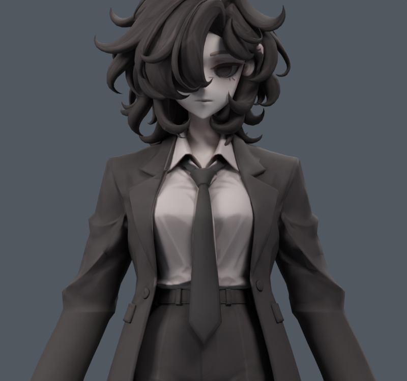
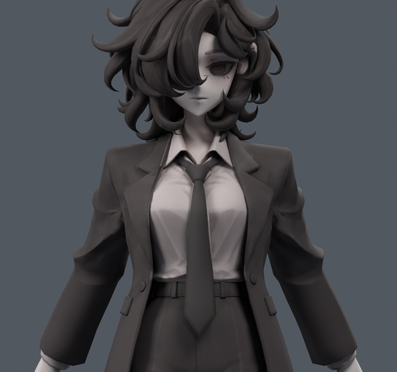
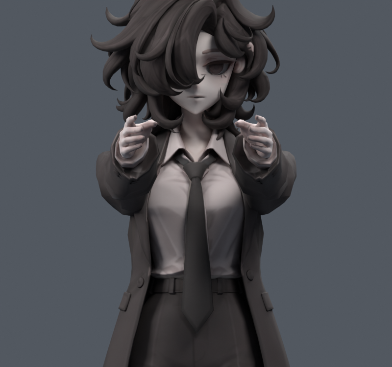

> **기록 시점 안내:** 아래는 해당 단계 당시의 보고서입니다. 후속 결정은 [최신 상태](../../STATUS.md)를 기준으로 읽어주세요. 모델·원본 텍스처·검증 원시 데이터는 이 문서 공유본에 포함하지 않습니다.

# v136 — 기본/앞/뒤 어깨 폭 진단

**코트 어깨·소매 연결부의 가로 폭이 줄어드는 현상을 확인했다.** 골격 간격과 표면의 가로 폭을 구분해야 한다. v135를 명시적으로 로드해 동일 정점 ID, 동일 카메라/배율로 비교했다. 원본 `avator_references/ref_char.png`도 실제 열람했다.

## 24조건 측정

|앞/뒤 각도 표식|상완 관절 간격 mm|윗부분 폭 mm|소매 연결부 폭 mm|
|---|---:|---:|---:|
|-60|166.000|200.193|202.673|
|-35|166.000|201.096|212.121|
|-15|166.000|202.371|216.840|
|0|166.000|203.613|220.215|
|30|165.719|206.863|222.276|
|60|165.420|209.837|219.777|
|90|165.103|209.668|210.598|
|120|164.769|208.883|208.883|

음수는 뒤들기다. 숫자는 이 프로젝트의 A포즈 기반 조작 각도이며 임상 관절 가동범위와 같다고 주장하지 않는다. 머리/팔/손이 포함된 전체 bounding box는 사용하지 않았다.

- 윗부분: 정지 코트 |X|65–125mm, Z785–825mm에 속하는 고정 정점.
- 연결부: 정지 코트 |X|65–130mm, Z755–825mm에 속하는 고정 정점.
- 실제 정점 목록/원래 좌표/평가 좌표는 `CAPTURE.npz`, 수치는 `WIDTH_AUDIT.json`. 폭은 해당 고정 점군의 maxX−minX다. 점군이 회전하면서 이동하므로 해부학적 쇄골 폭이나 실시간 피부 횡단면으로 해석하지 않는다.

앞90의 관절 간격은166.0→165.103mm, 연결부는220.215→210.598mm(약4.37%감소). 윗부분203.613→209.668mm는 오히려 넓어진다. 뒤35에서는 관절간격166mm 그대로, 연결부212.121mm(약3.68%감소). 따라서 어깨 전체가 균일하게 축소된 것이 아니라 소매 연결부의 윤곽이 바뀐 것이다.

## 원인 분리

기존 앞 보정키(V129/V134)를 끄면 앞90 연결부는211.788mm다. 보정키가 줄이는 폭은약1.189mm이고 나머지 변화는 기존 스키닝/회전에서 생긴다. 쇄골을 고정해도211.904mm여서 쇄골 위치 변화만으로 설명되지 않는다. 뒤35는 앞 보정키 off/on이 동일하다.

정지 가장 바깥쪽 점932/5427은 X±110.1,Y14.4,Z762.7mm 부근이며 상완 웨이트가약94.3%다. 앞90에서 폭의 최외곽이 되는 점은934/6733으로 바뀐다. 상완을 회전하면서 기존 바깥점이 안쪽/앞쪽으로 이동하는 것이다. 이 웨이트 하나가 틀렸다는 증명은 아니지만 소매캡 가로 윤곽의 저작 보정이 필요한 위치를 보여 준다.

## 자료와 적용 판단

[어깨 복합체의 실제3D 움직임 연구](https://pubmed.ncbi.nlm.nih.gov/19181982/)의 저자 초록은 쇄골/견갑골/상완이 여러 회전을 함께 한다고 설명한다. 따라서 사람의 어깨 폭은 항상 수학적으로 일정해야 한다는 규칙을 만들지 않는다. 여기서는 원본 재킷 인상을 위한 저작 목표로 연결부 폭을 비교한다.

[Blender Armature 공식 설명](https://docs.blender.org/manual/en/4.1/modeling/modifiers/deform/armature.html)은 Preserve Volume의 quaternion 변형을 설명한다. 이 프로젝트는 이미v048/v122에서 DQS의 팽창과 새 접힘을 확인했기 때문에 옵션 하나를 다시 켠 채 해결로 처리하지 않는다. 이번엔 기존 LBS/원형/본/W를 유지한 국소 자세 보정이다. 문서는 검색 제공 본문을 확인했으며 영상을 시청했다고 주장하지 않는다.

## 시험 사본

기존 각 점의 X를 정지 위치로 직접 되돌리는 FRONT100은 최대15.874mm 이동하고 새 교차를 만들었다. 이 방식은 제외한다. 개별 점의 원래 X를 강제하는 대신 소매캡 윤곽을 약4.808mm(앞)/4.047mm(뒤) 부드럽게 바깥쪽으로 이동하는 ENVELOPE 목표를 만들었다. 정지에서 키를 끄면 원형을 유지한다. 두 목표의 폭은220.215mm로 복구된다.

앞 목표는 새면적3/새교차10이 있어 그대로 채택하지 않는다. 뒤 목표는 해당 뒤35자세에서 새면적/교차0/0이나 아직 다른 자세 검증이 필요하다. [v137의 자동키와 회귀 검사](../v137_width_correction/REVIEW.md)로 이어진다.

